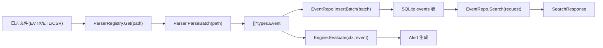

# 事件模型

本文档描述 Winalog-Go 中的 Event 数据结构及其从解析到存储的完整生命周期。

## 目录

- [EventLevel 等级体系](#eventlevel-等级体系)
- [Event 核心数据结构](#event-核心数据结构)
- [SearchRequest 与 SearchResponse](#searchrequest-与-searchresponse)
- [事件生命周期](#事件生命周期)
- [辅助方法与字段提取](#辅助方法与字段提取)

## EventLevel 等级体系

事件等级定义在 `internal/types/event.go` 中,采用字符串类型枚举:

```go
type EventLevel string

const (
    EventLevelCritical EventLevel = "Critical"
    EventLevelError    EventLevel = "Error"
    EventLevelWarning  EventLevel = "Warning"
    EventLevelInfo     EventLevel = "Info"
    EventLevelVerbose  EventLevel = "Verbose"
)
```

等级与整数的映射关系 (`EventLevelFromInt`):

| 整数值 | EventLevel   | 含义         |
|--------|--------------|--------------|
| 1      | Critical     | 严重         |
| 2      | Error        | 错误         |
| 3      | Warning      | 警告         |
| 4      | Info         | 信息         |
| 5      | Verbose      | 详细         |

## Event 核心数据结构

Event 结构体是系统中最核心的数据模型,定义在 `internal/types/event.go:52`:

```go
type Event struct {
    ID              int64                  `json:"id" db:"id"`
    Timestamp       time.Time              `json:"timestamp" db:"timestamp"`
    EventID         int32                  `json:"event_id" db:"event_id"`
    Level           EventLevel             `json:"level" db:"level"`
    Source          string                 `json:"source" db:"source"`
    LogName         string                 `json:"log_name" db:"log_name"`
    Computer        string                 `json:"computer" db:"computer"`
    User            *string                `json:"user,omitempty" db:"user"`
    UserSID         *string                `json:"user_sid,omitempty" db:"user_sid"`
    Message         string                 `json:"message" db:"message"`
    RawXML          *string                `json:"raw_xml,omitempty" db:"raw_xml"`
    SessionID       *string                `json:"session_id,omitempty" db:"session_id"`
    IPAddress       *string                `json:"ip_address,omitempty" db:"ip_address"`
    ImportTime      time.Time              `json:"import_time" db:"import_time"`
    ImportID        int64                  `json:"import_id,omitempty" db:"import_id"`
    WindowsRecordID uint64                 `json:"-" db:"-"`
    ExtractedFields map[string]interface{} `json:"extracted_fields,omitempty" db:"-"`
}
```

### 字段说明

| 字段 | 类型 | 说明 |
|------|------|------|
| `ID` | int64 | 数据库自增主键 |
| `Timestamp` | time.Time | 事件发生时间 |
| `EventID` | int32 | Windows 事件 ID (如 4624=登录成功, 4625=登录失败) |
| `Level` | EventLevel | 事件等级 |
| `Source` | string | 事件来源 (Provider Name) |
| `LogName` | string | 日志名称 (Security, System, Application 等) |
| `Computer` | string | 计算机名 |
| `User` | *string | 用户名 (可选) |
| `UserSID` | *string | 用户 SID (可选) |
| `Message` | string | 事件消息文本 |
| `RawXML` | *string | 原始 XML 数据 (用于深度解析) |
| `SessionID` | *string | 会话 ID (可选) |
| `IPAddress` | *string | IP 地址 (可选) |
| `ImportTime` | time.Time | 导入时间 |
| `ImportID` | int64 | 关联的导入批次 ID |
| `ExtractedFields` | map[string]interface{} | 从 RawXML 解析出的扩展字段 |

## SearchRequest 与 SearchResponse

定义在 `internal/types/result.go` 中,用于事件查询:

```go
type SearchRequest struct {
    Keywords    string     `json:"keywords"`
    KeywordMode string     `json:"keyword_mode"`
    Regex       bool       `json:"regex"`
    EventIDs    []int32    `json:"event_ids"`
    Levels      []int      `json:"levels"`
    LogNames    []string   `json:"log_names"`
    Sources     []string   `json:"sources"`
    Users       []string   `json:"users"`
    Computers   []string   `json:"computers"`
    StartTime   *time.Time `json:"start_time"`
    EndTime     *time.Time `json:"end_time"`
    Page        int        `json:"page"`
    PageSize    int        `json:"page_size"`
    SortBy      string     `json:"sort_by"`
    SortOrder   string     `json:"sort_order"`
    Highlight   bool       `json:"highlight"`
}

type SearchResponse struct {
    Events     []*Event `json:"events"`
    Total      int64    `json:"total"`
    Page       int      `json:"page"`
    PageSize   int      `json:"page_size"`
    TotalPages int      `json:"total_pages"`
    QueryTime  int64    `json:"query_time_ms"`
}
```

## 事件生命周期



### 1. 文件识别与解析

Importer 通过 `ParserRegistry` 根据文件扩展名和内容识别文件类型 (`internal/engine/importer.go:67-88`):

```go
func (im *Importer) IdentifyFile(path string) (string, error) {
    ext := strings.ToLower(filepath.Ext(path))
    switch ext {
    case ".evtx":
        return FileTypeEVTX, nil
    case ".etl":
        return FileTypeETL, nil
    case ".csv", ".log", ".txt":
        if im.isIISLog(path) {
            return FileTypeIIS, nil
        }
        if im.isSysmonLog(path) {
            return FileTypeSysmon, nil
        }
        return FileTypeCSV, nil
    }
}
```

支持的文件类型:
- `evtx` - Windows 事件日志
- `etl` - Windows 事件跟踪日志
- `csv` - 逗号分隔值
- `iis` - IIS 日志
- `sysmon` - Sysmon 日志

### 2. 解析为 Event 对象

Parser 将原始数据解析为 `*types.Event` 数组 (`internal/engine/importer.go:298-314`):

```go
func (im *Importer) ImportFile(ctx context.Context, path string, batchSize int) (*types.ImportResult, error) {
    parser := im.parserRegistry.Get(path)
    if parser == nil {
        return nil, fmt.Errorf("no parser found for %s", path)
    }
    events, parseErr := parser.ParseBatch(path)
    // ...
}
```

### 3. 批量存储

事件通过 `EventRepo.InsertBatch` 批量写入 SQLite 数据库 (`internal/engine/importer.go:366-385`):

```go
for _, event := range events {
    batch = append(batch, event)
    if len(batch) >= batchSize {
        if err := im.eventRepo.InsertBatch(batch); err != nil {
            // 错误处理
        }
        totalEvents += int64(len(batch))
        batch = batch[:0]
    }
}
```

### 4. 查询与检索

通过 `EventRepo.Search` 方法,支持多维度过滤和分页查询 (`internal/types/result.go:23-49`)。

### 5. 规则评估

事件流入告警引擎进行规则匹配 (`internal/alerts/engine.go:102-146`),详见告警系统文档。

## 辅助方法与字段提取

### ExtractedFields 操作

Event 支持从 RawXML 中提取扩展字段 (`internal/types/event.go:223-235`):

```go
func (e *Event) SetExtractedField(key string, value interface{}) {
    if e.ExtractedFields == nil {
        e.ExtractedFields = make(map[string]interface{})
    }
    e.ExtractedFields[key] = value
}

func (e *Event) GetExtractedField(key string) interface{} {
    if e.ExtractedFields == nil {
        return nil
    }
    return e.ExtractedFields[key]
}
```

### RawXML 解析

从 XML 格式日志中提取键值对 (`internal/types/event.go:318-342`):

```go
func (e *Event) ParseRawXML() error {
    if e.RawXML == nil || *e.RawXML == "" {
        return nil
    }
    decoder := xml.NewDecoder(strings.NewReader(*e.RawXML))
    for {
        token, err := decoder.Token()
        if err == io.EOF {
            break
        }
        switch elem := token.(type) {
        case xml.StartElement:
            var data string
            if err := decoder.DecodeElement(&data, &elem); err == nil {
                e.SetExtractedField(elem.Name.Local, data)
            }
        }
    }
    return nil
}
```

### 常用字段快捷访问

Event 提供了一系列快捷方法来获取常用字段 (`internal/types/event.go:237-304`):

| 方法 | 返回类型 | 说明 |
|------|----------|------|
| `GetLogonType()` | int | 登录类型 |
| `GetTargetUserName()` | string | 目标用户名 |
| `GetSubjectUserName()` | string | 主体用户名 |
| `GetProcessId()` | string | 进程 ID |
| `GetProcessName()` | string | 进程名称 |
| `GetCommandLine()` | string | 命令行 |
| `GetServiceName()` | string | 服务名称 |
| `GetDestPort()` | int | 目标端口 |

### 外部 IP 判断

提供判断 IP 是否为外部地址的工具函数 (`internal/types/event.go:370-402`):

```go
func IsExternalIP(ip string) bool {
    // 排除 127.0.0.1, ::1, 10.x.x.x, 192.168.x.x, 172.16-31.x.x
    // 其余视为外部 IP
}
```

### ToMap 转换

Event 支持转换为 map 结构,用于规则评估和 JSON 序列化 (`internal/types/event.go:72-107`):

```go
func (e *Event) ToMap() map[string]interface{} {
    m := map[string]interface{}{
        "timestamp":   e.Timestamp,
        "event_id":    e.EventID,
        "level":       e.Level,
        "source":      e.Source,
        // ...
    }
    // 处理可选字段
    if e.ExtractedFields != nil {
        for k, v := range e.ExtractedFields {
            m[k] = v
        }
    }
    return m
}
```
