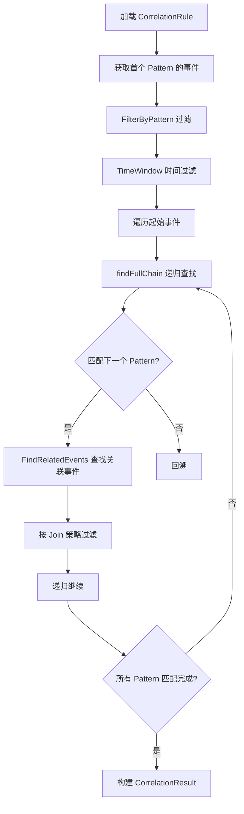

# 关联分析

本文档描述 Winalog-Go 的关联分析引擎,包括多事件关联、攻击链检测的实现机制。

## 目录

- [关联引擎架构](#关联引擎架构)
- [事件索引 (EventIndex)](#事件索引-eventindex)
- [Matcher 模式匹配器](#matcher-模式匹配器)
- [关联分析流程](#关联分析流程)
- [攻击链构建 (ChainBuilder)](#攻击链构建-chainbuilder)
- [关联窗口与时间过滤](#关联窗口与时间过滤)
- [Join 策略详解](#join-策略详解)

## 关联引擎架构

关联引擎定义在 `internal/correlation/engine.go:14-20`:

```go
type Engine struct {
    mu      sync.RWMutex
    index   *EventIndex
    matcher *Matcher
    chain   *ChainBuilder
    maxAge  time.Duration
}
```

### 组件职责

| 组件 | 职责 |
|------|------|
| EventIndex | 事件内存索引,支持多维快速查询 |
| Matcher | 模式匹配,验证事件是否满足规则条件 |
| ChainBuilder | 攻击链构建,基于预定义转换规则 |

### 引擎初始化

```go
func NewEngine(maxAge time.Duration) *Engine {
    return &Engine{
        index:   NewEventIndex(maxAge),
        matcher: NewMatcher(),
        chain:   NewChainBuilder(),
        maxAge:  maxAge,
    }
}
```

## 事件索引 (EventIndex)

EventIndex 是关联分析的核心数据结构,提供高效的事件查询能力,定义在 `internal/correlation/engine.go:27-37`:

```go
type EventIndex struct {
    mu              sync.RWMutex
    eventRepo       *storage.EventRepo
    eventsCache     map[int64]*types.Event
    byID            map[int64]time.Time
    byTime          []indexEntry
    byEID           map[int32][]int64
    maxAge          time.Duration
    lastCleanup     time.Time
    cleanupInterval time.Duration
}

type indexEntry struct {
    ID        int64
    Timestamp time.Time
}
```

### 索引结构

| 索引 | 类型 | 用途 |
|------|------|------|
| `eventsCache` | map[int64]*Event | 按数据库 ID 缓存完整事件 |
| `byID` | map[int64]time.Time | 按 ID 索引时间戳 |
| `byTime` | []indexEntry | 按时间排序的条目列表 |
| `byEID` | map[int32][]int64 | 按 EventID (Windows) 索引 |

### 添加事件

```go
func (idx *EventIndex) Add(event *types.Event) {
    idx.eventsCache[event.ID] = event
    idx.byID[event.ID] = event.Timestamp
    idx.byTime = append(idx.byTime, indexEntry{ID: event.ID, Timestamp: event.Timestamp})
    idx.byEID[event.EventID] = append(idx.byEID[event.EventID], event.ID)
}
```

### 查询方法

```go
// 按数据库 ID 查询
func (idx *EventIndex) GetByID(id int64) (*types.Event, bool)

// 按 Windows EventID 查询
func (idx *EventIndex) GetByEventID(eid int32) []*types.Event

// 按时间范围查询
func (idx *EventIndex) GetByTimeRange(start, end time.Time) []*types.Event
```

### 自动清理机制

索引支持自动清理过期数据 (`internal/correlation/engine.go:71-113`):

```go
func (idx *EventIndex) Cleanup() {
    cutoff := time.Now().Add(-idx.maxAge)
    // 二分查找分割点
    splitIdx := 0
    for i, entry := range idx.byTime {
        if entry.Timestamp.After(cutoff) {
            break
        }
        splitIdx = i + 1
    }
    // 删除过期条目
    oldEntries := idx.byTime[:splitIdx]
    idx.byTime = idx.byTime[splitIdx:]
    for _, entry := range oldEntries {
        delete(idx.byID, entry.ID)
        delete(idx.eventsCache, entry.ID)
    }
    // 清理 byEID 中的过期引用
}
```

## Matcher 模式匹配器

Matcher 负责验证事件是否满足 Pattern 定义的条件,定义在 `internal/correlation/matcher.go:13`:

```go
type Matcher struct{}
```

### 模式匹配

```go
func (m *Matcher) matchPattern(pattern *rules.Pattern, event *types.Event) bool {
    // 1. EventID 匹配
    if pattern.EventID != 0 && event.EventID != pattern.EventID {
        return false
    }
    // 2. Conditions 匹配
    if len(pattern.Conditions) > 0 {
        if !m.matchConditions(pattern.Conditions, event) {
            return false
        }
    }
    return true
}
```

### 条件匹配

支持多种字段和操作符 (`internal/correlation/matcher.go:57-115`):

| 字段 | 数据来源 |
|------|----------|
| source | event.Source |
| log_name | event.LogName |
| computer | event.Computer |
| user | event.User |
| message | event.Message |
| ip_address | event.IPAddress |
| destination_port | ExtractedFields["DestinationPort"] |
| logon_type | ExtractedFields["LogonType"] |
| process_name | ExtractedFields["NewProcessName"] |
| command_line | ExtractedFields["CommandLine"] |
| service_name | ExtractedFields["ServiceName"] |
| provider_name | event.Source |
| workstation | ExtractedFields["WorkstationName"] |
| domain | ExtractedFields["TargetDomainName"] |
| target_username | ExtractedFields["TargetUserName"] |
| task_name | ExtractedFields["TaskName"] |

### 字符串比较操作符

```go
func (m *Matcher) compareString(fieldValue, condValue, op string) bool {
    switch op {
    case "==", "=", "equals":
        return strings.EqualFold(fieldValue, condValue)
    case "!=", "not_equals":
        return !strings.EqualFold(fieldValue, condValue)
    case "contains":
        return contains(strings.ToLower(fieldValue), strings.ToLower(condValue))
    case "startswith":
        return strings.HasPrefix(strings.ToLower(fieldValue), strings.ToLower(condValue))
    case "endswith":
        return strings.HasSuffix(strings.ToLower(fieldValue), strings.ToLower(condValue))
    case "regex":
        matched, err := regexp.MatchString(condValue, fieldValue)
        return err == nil && matched
    }
}
```

### 整数比较操作符

支持 `==`, `!=`, `>`, `>=`, `<`, `<=` 操作符。

### 模式过滤

FilterByPattern 支持 MinCount 和 MaxCount 限制 (`internal/correlation/matcher.go:209-227`):

```go
func (m *Matcher) FilterByPattern(events []*types.Event, pattern *rules.Pattern) []*types.Event {
    filtered := make([]*types.Event, 0)
    for _, event := range events {
        if m.matchPattern(pattern, event) {
            filtered = append(filtered, event)
        }
    }
    // MinCount 限制
    if pattern.MinCount > 0 && len(filtered) < pattern.MinCount {
        return []*types.Event{}
    }
    // MaxCount 限制
    if pattern.MaxCount > 0 && len(filtered) > pattern.MaxCount {
        return filtered[:pattern.MaxCount]
    }
    return filtered
}
```

## 关联分析流程



### 分析入口

```go
func (e *Engine) Analyze(ctx context.Context, rules []*rules.CorrelationRule) ([]*types.CorrelationResult, error) {
    for _, rule := range rules {
        if !rule.Enabled { continue }
        ruleResults := e.analyzeRule(rule)
        results = append(results, ruleResults...)
    }
    return results, nil
}
```

### 规则分析

```go
func (e *Engine) analyzeRule(rule *rules.CorrelationRule) []*types.CorrelationResult {
    patterns := rule.Patterns
    if len(patterns) < 2 {
        return allResults  // 至少需要 2 个 Pattern
    }

    // 获取首个 Pattern 的事件作为起点
    initialEvents := e.index.GetByEventID(patterns[0].EventID)
    initialEvents = e.matcher.FilterByPattern(initialEvents, patterns[0])

    // 遍历每个起始事件,查找完整链
    for _, startEvent := range initialEvents {
        e.findFullChain(startEvent, nil, patterns, 0, rule, seenChains, &allResults)
    }
    return allResults
}
```

### 递归链查找

`findFullChain` 是核心递归方法 (`internal/correlation/engine.go:296-337`):

```go
func (e *Engine) findFullChain(baseEvent *types.Event, chainEvents []*types.Event,
    patterns []*rules.Pattern, patternIndex int, rule *rules.CorrelationRule,
    seenChains map[string]bool, results *[]*types.CorrelationResult) {

    // 将当前事件加入链
    currentChain := make([]*types.Event, len(chainEvents)+1)
    copy(currentChain, chainEvents)
    currentChain[len(chainEvents)] = baseEvent

    // 所有 Pattern 匹配完成
    if patternIndex == len(patterns)-1 {
        chainKey := e.chainKey(currentChain)
        if seenChains[chainKey] { return }  // 去重
        seenChains[chainKey] = true
        result := e.chain.Build(baseEvent, currentChain[:len(currentChain)-1], rule)
        if result != nil {
            *results = append(*results, result)
        }
        return
    }

    // 查找下一个 Pattern 的关联事件
    nextPattern := patterns[patternIndex+1]
    nextEvents := e.findRelatedEventsWithRule(baseEvent, nextPattern, rule)
    nextEvents = e.matcher.FilterByPattern(nextEvents, nextPattern)

    // 时间窗口过滤
    if timeWindow > 0 {
        nextEvents = e.filterByTimeWindowWithBase(baseEvent.Timestamp, nextEvents, timeWindow)
    }

    // 递归处理
    for _, nextEvent := range nextEvents {
        e.findFullChain(nextEvent, currentChain, patterns, patternIndex+1, rule, seenChains, results)
    }
}
```

## 攻击链构建 (ChainBuilder)

ChainBuilder 基于预定义的转换规则构建攻击链,定义在 `internal/correlation/chain.go:39-42`:

```go
type ChainBuilder struct {
    eventRepo *storage.EventRepo
    config    *ChainConfig
}
```

### 默认链配置

```go
var DefaultChainConfig = &ChainConfig{
    StartEventIDs: map[int32]bool{
        4624: true,  // 登录成功
        4625: true,  // 登录失败
        4634: true,  // 注销
        4648: true,  // 显式凭证登录
        4672: true,  // 特殊权限登录
        4688: true,  // 进程创建
        4698: true,  // 计划任务创建
        4697: true,  // 服务安装
    },
    Transitions: map[int32][]int32{
        4624: {4634, 4672, 4688},  // 登录后可能: 注销/特权登录/进程创建
        4625: {4624},              // 登录失败后可能: 登录成功
        4648: {4624, 4672},        // 显式凭证后可能: 登录成功/特权登录
        4688: {4698, 4697},        // 进程创建后可能: 计划任务/服务安装
    },
    TimeWindow: 1 * time.Hour,
}
```

### 攻击链查找

```go
func (cb *ChainBuilder) FindChains(startEvent *types.Event, maxDepth int) ([]*types.CorrelationResult, error) {
    if !cb.config.StartEventIDs[startEvent.EventID] {
        return chains, nil  // 不是起始事件
    }

    depth := 0
    currentEvents := []*types.Event{startEvent}

    for depth < maxDepth {
        nextEvents, _ := cb.findNextEvents(currentEvents)
        if len(nextEvents) == 0 { break }

        for _, nextEvent := range nextEvents {
            chain := &types.CorrelationResult{
                StartTime: startEvent.Timestamp,
                EndTime:   nextEvent.Timestamp,
                Events:    append([]*types.Event{startEvent}, nextEvent),
                Severity:  types.SeverityHigh,
            }
            chains = append(chains, chain)
        }

        currentEvents = nextEvents
        depth++
    }
    return chains, nil
}
```

### 查找后续事件

```go
func (cb *ChainBuilder) findNextEvents(events []*types.Event) ([]*types.Event, error) {
    // 根据转换规则获取下一个 EventID 集合
    nextEventIDs := make(map[int32]bool)
    for _, event := range events {
        if nextIDs, ok := cb.config.Transitions[event.EventID]; ok {
            for _, nextID := range nextIDs {
                nextEventIDs[nextID] = true
            }
        }
    }

    // 在时间窗口内查询后续事件
    endTime := maxTime.Add(cb.config.TimeWindow)
    req := &types.SearchRequest{
        EventIDs:  ids,
        StartTime: &maxTime,
        EndTime:   &endTime,
        PageSize:  1000,
    }
    results, _, _ := cb.eventRepo.Search(req)
    return results, nil
}
```

### CorrelationResult

关联分析结果定义在 `internal/types/alert.go:216-225`:

```go
type CorrelationResult struct {
    ID          string    `json:"id"`
    RuleName    string    `json:"rule_name"`
    Description string    `json:"description"`
    Severity    Severity  `json:"severity"`
    Events      []*Event  `json:"events"`
    StartTime   time.Time `json:"start_time"`
    EndTime     time.Time `json:"end_time"`
    MITREAttack []string  `json:"mitre_attack,omitempty"`
}
```

## 关联窗口与时间过滤

### 时间窗口过滤 (相对于基准事件)

```go
func (e *Engine) filterByTimeWindowWithBase(baseTime time.Time, events []*types.Event, window time.Duration) []*types.Event {
    cutoff := baseTime.Add(window)
    filtered := make([]*types.Event, 0)
    for _, event := range events {
        if event.Timestamp.After(baseTime) && event.Timestamp.Before(cutoff) {
            filtered = append(filtered, event)
        }
    }
    return filtered
}
```

### 全局时间窗口过滤

```go
func (e *Engine) filterByTimeWindow(events []*types.Event, window time.Duration) []*types.Event {
    baseTime := events[0].Timestamp
    for _, event := range events {
        if event.Timestamp.Before(baseTime) {
            baseTime = event.Timestamp  // 取最早时间
        }
    }
    cutoff := baseTime.Add(window)
    // 过滤在 [baseTime, cutoff) 范围内的事件
}
```

## Join 策略详解

Join 策略决定如何关联两个 Pattern 之间的事件 (`internal/correlation/engine.go:387-450`):

```go
func (e *Engine) findRelatedEventsWithRule(base *types.Event, pattern *rules.Pattern, rule *rules.CorrelationRule) []*types.Event {
    join := pattern.Join
    if join == "" {
        join = rule.Join
    }

    events := e.index.GetByEventID(pattern.EventID)

    switch join {
    case "user":
        // 按用户匹配 (User 或 UserSID)
        for _, evt := range events {
            if !evt.Timestamp.After(base.Timestamp) { continue }
            userMatch := false
            if evt.User != nil && base.User != nil {
                userMatch = *evt.User == *base.User
            } else if evt.UserSID != nil && base.UserSID != nil {
                userMatch = *evt.UserSID == *base.UserSID
            }
            if userMatch { filtered = append(filtered, evt) }
        }

    case "computer":
        // 按计算机名匹配
        for _, evt := range events {
            if !evt.Timestamp.After(base.Timestamp) { continue }
            if evt.Computer == base.Computer {
                filtered = append(filtered, evt)
            }
        }

    case "ip":
        // 按 IP 地址匹配
        for _, evt := range events {
            if !evt.Timestamp.After(base.Timestamp) { continue }
            if evt.IPAddress != nil && base.IPAddress != nil && *evt.IPAddress == *base.IPAddress {
                filtered = append(filtered, evt)
            }
        }

    default:
        // 仅按时间顺序匹配
        for _, evt := range events {
            if evt.Timestamp.After(base.Timestamp) {
                filtered = append(filtered, evt)
            }
        }
    }
}
```

### Join 策略对比

| 策略 | 关联维度 | 适用场景 |
|------|----------|----------|
| `user` | 用户名/SID | 检测同一用户的连续攻击行为 |
| `computer` | 计算机名 | 检测同一主机上的事件序列 |
| `ip` | IP 地址 | 检测来自同一 IP 的攻击链 |
| 默认 | 时间顺序 | 通用事件序列检测 |

所有 Join 策略都要求关联事件的时间必须晚于基准事件 (`evt.Timestamp.After(base.Timestamp)`),确保攻击链的时间方向性。
