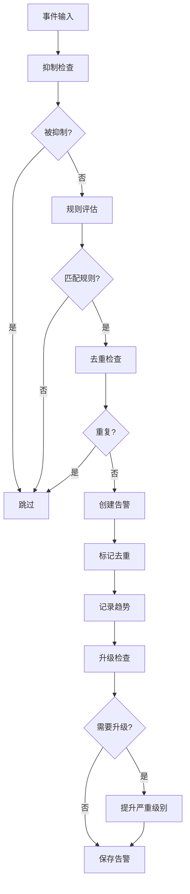

# 告警系统

本文档描述 Winalog-Go 告警系统的完整工作流程,包括告警生成、去重、抑制与升级机制。

## 目录

- [告警引擎架构](#告警引擎架构)
- [Alert 数据结构](#alert-数据结构)
- [告警生命周期](#告警生命周期)
- [规则评估 (Evaluator)](#规则评估-evaluator)
- [去重机制 (DedupCache)](#去重机制-dedupcache)
- [抑制机制 (SuppressCache)](#抑制机制-suppresscache)
- [升级机制 (AlertUpgradeCache)](#升级机制-alertupgradecache)
- [批量评估与并发处理](#批量评估与并发处理)
- [策略模板系统](#策略模板系统)

## 告警引擎架构

告警引擎定义在 `internal/alerts/engine.go:16-27`:

```go
type Engine struct {
    db            *storage.DB
    alertRepo     *storage.AlertRepo
    dedup         *DedupCache
    evaluator     *Evaluator
    stats         *AlertStats
    trend         *AlertTrend
    upgradeRules  *AlertUpgradeCache
    suppressCache *SuppressCache
    mu            sync.RWMutex
    rules         map[string]*rules.AlertRule
}
```

### 引擎初始化

```go
func NewEngine(db *storage.DB, cfg EngineConfig) *Engine {
    if cfg.DedupWindow == 0 {
        cfg.DedupWindow = 5 * time.Minute  // 默认去重窗口
    }
    if cfg.StatsWindow == 0 {
        cfg.StatsWindow = 24 * time.Hour   // 默认统计窗口
    }
    // 初始化各组件...
}
```

## Alert 数据结构

定义在 `internal/types/alert.go:53-73`:

```go
type Alert struct {
    ID            int64      `json:"id" db:"id"`
    RuleName      string     `json:"rule_name" db:"rule_name"`
    Severity      Severity   `json:"severity" db:"severity"`
    Message       string     `json:"message" db:"message"`
    EventIDs      []int32    `json:"event_ids" db:"event_ids"`
    EventDBIDs    []int64    `json:"event_db_ids" db:"event_db_ids"`
    FirstSeen     time.Time  `json:"first_seen" db:"first_seen"`
    LastSeen      time.Time  `json:"last_seen" db:"last_seen"`
    Count         int        `json:"count" db:"count"`
    MITREAttack   []string   `json:"mitre_attack,omitempty" db:"mitre_attack"`
    Resolved      bool       `json:"resolved" db:"resolved"`
    ResolvedTime  *time.Time `json:"resolved_time,omitempty" db:"resolved_time"`
    Notes         string     `json:"notes,omitempty" db:"notes"`
    Explanation   string     `json:"explanation,omitempty" db:"explanation"`
    Recommendation string    `json:"recommendation,omitempty" db:"recommendation"`
    RealCase      string     `json:"real_case,omitempty" db:"real_case"`
    FalsePositive bool       `json:"false_positive" db:"false_positive"`
    LogName       string     `json:"log_name" db:"log_name"`
    RuleScore     float64    `json:"rule_score" db:"rule_score"`
}
```

### Severity 等级

```go
type Severity string

const (
    SeverityCritical Severity = "critical"
    SeverityHigh     Severity = "high"
    SeverityMedium   Severity = "medium"
    SeverityLow      Severity = "low"
    SeverityInfo     Severity = "info"
)
```

## 告警生命周期



### 完整流程说明

1. **抑制检查**: 首先检查是否匹配抑制规则,被抑制的事件直接跳过
2. **规则评估**: 对事件进行 Filter 和 Conditions 匹配
3. **去重检查**: 在去重窗口内,相同规则+事件的告警只生成一次
4. **创建告警**: 生成 Alert 对象,填充规则信息和事件数据
5. **标记去重**: 将该规则+事件标记为已处理
6. **记录趋势**: 更新告警趋势统计
7. **升级检查**: 检查是否满足升级条件 (如触发次数超过阈值)
8. **保存告警**: 将告警持久化到数据库

## 规则评估 (Evaluator)

Evaluator 负责判断事件是否匹配规则,定义在 `internal/alerts/evaluator.go:25-39`:

```go
type Evaluator struct {
    mu          sync.RWMutex
    eventCount  map[eventCountKey]*eventCountEntry
    stopCh      chan struct{}
    filterCache map[*rules.Filter]*rules.FilterMatcher
}
```

### 评估流程

```go
func (e *Evaluator) Evaluate(rule *rules.AlertRule, event *types.Event) (bool, error) {
    // 1. Filter 匹配
    if !e.matchFilter(rule.Filter, event) {
        return false, nil
    }
    // 2. Conditions 匹配
    if rule.Conditions != nil {
        if !e.matchConditions(rule.Conditions, event) {
            return false, nil
        }
    }
    // 3. 阈值检查
    if rule.Threshold > 0 {
        if !e.checkThreshold(rule, event) {
            return false, nil
        }
    }
    return true, nil
}
```

### Filter 匹配项

`matchFilter` 方法检查以下维度:

- EventID 匹配
- Level 匹配
- LogName 匹配
- Source 匹配
- Computer 匹配
- 关键字匹配 (AND/OR 模式)
- 时间范围匹配
- IP 地址匹配
- 排除用户/计算机

### 阈值检查

阈值机制用于检测频率异常 (`internal/alerts/evaluator.go:457-494`):

```go
func (e *Evaluator) checkThreshold(rule *rules.AlertRule, event *types.Event) bool {
    aggKey := e.getAggregationKey(rule, event)
    key := eventCountKey{ruleName: rule.Name, aggKey: aggKey}
    now := event.Timestamp

    entry, exists := e.eventCount[key]
    if !exists {
        entry = &eventCountEntry{count: 1, firstTime: now, lastTime: now}
        e.eventCount[key] = entry
        return entry.count >= rule.Threshold
    }

    if now.Sub(entry.firstTime) > rule.TimeWindow {
        // 超出时间窗口,重置计数
        entry.count = 1
        entry.firstTime = now
        entry.lastTime = now
    } else {
        entry.count++
        entry.lastTime = now
    }

    return entry.count >= rule.Threshold
}
```

### 聚合键

聚合键决定如何分组计数 (`internal/alerts/evaluator.go:496-536`):

```go
func (e *Evaluator) getAggregationKey(rule *rules.AlertRule, event *types.Event) string {
    // 支持的聚合键: user, computer, source, ip
    // 默认使用 UserSID 或 User
}
```

## 去重机制 (DedupCache)

DedupCache 防止在时间窗口内生成重复告警,定义在 `internal/alerts/dedup.go:11-17`:

```go
type DedupCache struct {
    mu      sync.RWMutex
    window  time.Duration
    entries map[string]*dedupEntry
    done    chan struct{}
    wg      sync.WaitGroup
}

type dedupEntry struct {
    EventKey  string
    RuleName  string
    Timestamp time.Time
    Count     int
}
```

### 去重键生成

```go
func (c *DedupCache) generateKey(ruleName string, event *types.Event) string {
    return ruleName + "|" +
        strconv.FormatInt(int64(event.EventID), 10) + "|" +
        event.Computer + "|" +
        event.Source + "|" +
        userStr + "|" +
        ipStr + "|" +
        windowShard
}
```

去重键包含: 规则名 + EventID + Computer + Source + User + IP + 时间分片

### 时间分片机制

```go
func (c *DedupCache) getWindowShard(t time.Time) string {
    windowMinutes := int(c.window.Minutes())
    shard := t.Unix() / int64(windowMinutes*60)
    return strconv.FormatInt(shard, 10)
}
```

时间分片确保去重按窗口滑动,而非绝对时间。

### 自动清理

后台协程定期清理过期条目 (`internal/alerts/dedup.go:100-118`):

```go
func (c *DedupCache) cleanupLoop() {
    ticker := time.NewTicker(c.window / 2)
    for {
        select {
        case <-ticker.C:
            c.cleanup()
        case <-c.done:
            return
        }
    }
}
```

## 抑制机制 (SuppressCache)

SuppressCache 用于临时抑制特定规则的告警,定义在 `internal/alerts/suppress.go:11-13`:

```go
type SuppressCache struct {
    rules []*types.SuppressRule
}
```

### 抑制规则

SuppressRule 定义在 `internal/types/alert.go:199-208`:

```go
type SuppressRule struct {
    ID         int64               `json:"id"`
    Name       string              `json:"name"`
    Conditions []SuppressCondition `json:"conditions"`
    Duration   time.Duration       `json:"duration"`
    Scope      string              `json:"scope"`
    Enabled    bool                `json:"enabled"`
    ExpiresAt  time.Time           `json:"expires_at,omitempty"`
    CreatedAt  time.Time           `json:"created_at"`
}
```

### 抑制判断逻辑

```go
func (c *SuppressCache) IsSuppressed(rule *rules.AlertRule, event *types.Event) bool {
    for _, suppress := range c.rules {
        if !suppress.Enabled {
            continue
        }
        if suppress.Name != "" && suppress.Name != rule.Name {
            continue
        }
        if c.matchesConditions(suppress.Conditions, event) &&
           c.matchesTimeWindow(suppress, event) {
            return true
        }
    }
    return false
}
```

### 支持的条件字段

| 字段 | 匹配方式 |
|------|----------|
| source | 精确匹配 |
| log_name | 精确匹配 |
| computer | 精确匹配 |
| user | 精确匹配 |
| user_sid | 精确匹配 |
| ip_address | 精确匹配 |

### 时间窗口判断

支持两种过期方式:
1. 固定过期时间 (`ExpiresAt`)
2. 从创建时间计算的持续时间 (`CreatedAt + Duration`)

## 升级机制 (AlertUpgradeCache)

AlertUpgradeCache 用于动态提升告警严重级别,定义在 `internal/alerts/upgrade.go:9-12`:

```go
type AlertUpgradeCache struct {
    mu    sync.RWMutex
    rules map[string]*types.AlertUpgradeRule
}
```

### 升级规则

AlertUpgradeRule 定义在 `internal/types/alert.go:189-197`:

```go
type AlertUpgradeRule struct {
    ID          int64    `json:"id"`
    Name        string   `json:"name"`
    Condition   string   `json:"condition"`
    Threshold   int      `json:"threshold"`
    NewSeverity Severity `json:"new_severity"`
    Notify      bool     `json:"notify"`
    Enabled     bool     `json:"enabled"`
}
```

### 升级匹配逻辑

```go
func (c *AlertUpgradeCache) matches(rule *types.AlertUpgradeRule, alert *types.Alert) bool {
    if rule.Name != "" && rule.Name != alert.RuleName {
        return false
    }
    if rule.Threshold > 0 && alert.Count < rule.Threshold {
        return false
    }
    return true
}
```

## 批量评估与并发处理

Engine 支持批量事件评估,使用并发 Worker 处理 (`internal/alerts/engine.go:148-233`):

```go
func (e *Engine) EvaluateBatch(ctx context.Context, events []*types.Event) ([]*types.Alert, error) {
    const maxWorkers = 100
    workerCount := maxWorkers
    if len(events) < workerCount {
        workerCount = len(events)
    }

    for i := 0; i < workerCount; i++ {
        wg.Add(1)
        go func() {
            defer wg.Done()
            for evt := range eventChan {
                for _, rule := range rules {
                    if e.suppressCache.IsSuppressed(rule, evt) { continue }
                    matched, _ := e.evaluator.Evaluate(rule, evt)
                    if !matched { continue }
                    if e.dedup.IsDuplicate(rule.Name, evt) { continue }
                    alert := e.createAlert(rule, evt)
                    alertChan <- alert
                    e.dedup.Mark(rule.Name, evt)
                }
            }
        }()
    }
}
```

### 带进度回调的批量评估

```go
func (e *Engine) EvaluateBatchWithProgress(
    ctx context.Context,
    events []*types.Event,
    callback ProgressCallback,
) ([]*types.Alert, error)
```

ProgressCallback 类型: `func(processed, total int)`

## 策略模板系统

Engine 支持通过策略模板批量配置升级和抑制规则 (`internal/alerts/engine.go:330-426`):

```go
func (e *Engine) ApplyPolicyTemplates() error {
    policyMgr := GetPolicyManager()
    return policyMgr.ApplyToEngine(e)
}
```

### 支持的策略类型

| 类型 | 说明 |
|------|------|
| PolicyTypeUpgrade | 告警升级策略 |
| PolicyTypeSuppress | 告警抑制策略 |

### 升级策略实例化

```go
func (e *Engine) applyUpgradeInstance(template *PolicyTemplate, instance *PolicyInstance) {
    upgradeRule := &types.AlertUpgradeRule{
        Name:        instance.RuleName,
        Condition:   template.Name,
        Threshold:   threshold,      // 默认 5
        NewSeverity: types.Severity(severityStr),
        Notify:      true,
        Enabled:     true,
    }
    e.AddUpgradeRule(upgradeRule)
}
```

### 抑制策略实例化

```go
func (e *Engine) applySuppressInstance(template *PolicyTemplate, instance *PolicyInstance) {
    suppressRule := &types.SuppressRule{
        Name:      instance.RuleName,
        Scope:     sourceComputer,   // 默认 "*"
        Duration:  duration,         // 默认 24 小时
        Enabled:   true,
        CreatedAt: time.Now(),
    }
    e.AddSuppressRule(suppressRule)
}
```

### 带策略的评估

```go
func (e *Engine) EvaluateWithPolicies(ctx context.Context, event *types.Event) ([]*types.Alert, error) {
    alerts, err := e.Evaluate(ctx, event)
    for _, alert := range alerts {
        shouldUpgrade, upgradeRule := e.CheckUpgrade(alert)
        if shouldUpgrade && upgradeRule != nil {
            alert.Severity = upgradeRule.NewSeverity
        }
    }
    return alerts, nil
}
```
