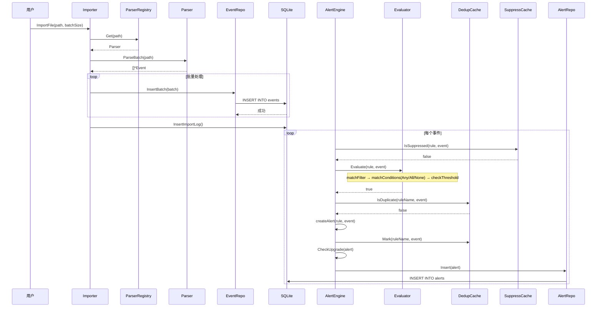

# 数据流

本文档描述 Winalog-Go 从日志导入到告警生成的完整数据流,涵盖文件识别、解析、存储、评估到告警输出的全链路。

## 目录

- [数据流概览](#数据流概览)
- [阶段 1: 文件识别与收集](#阶段-1-文件识别与收集)
- [阶段 2: 日志解析](#阶段-2-日志解析)
- [阶段 3: 事件存储](#阶段-3-事件存储)
- [阶段 4: 规则评估](#阶段-4-规则评估)
- [阶段 5: 告警生成](#阶段-5-告警生成)
- [完整数据流图](#完整数据流图)
- [关键组件交互](#关键组件交互)

## 数据流概览


## 阶段 1: 文件识别与收集

### Importer 初始化

定义在 `internal/engine/importer.go:22-28`:

```go
type Importer struct {
    parserRegistry *parsers.ParserRegistry
    eventRepo      *storage.EventRepo
    db             *storage.DB
    incremental    bool
    skipPatterns   []string
}
```

### 文件类型识别

```go
func (im *Importer) IdentifyFile(path string) (string, error) {
    ext := strings.ToLower(filepath.Ext(path))
    switch ext {
    case ".evtx":
        return FileTypeEVTX, nil
    case ".etl":
        return FileTypeETL, nil
    case ".csv", ".log", ".txt":
        if im.isIISLog(path) {
            return FileTypeIIS, nil
        }
        if im.isSysmonLog(path) {
            return FileTypeSysmon, nil
        }
        return FileTypeCSV, nil
    }
}
```

### 文件信息收集

```go
type FileInfo struct {
    Path        string
    Size        int64
    ModTime     time.Time
    Hash        string
    FileType    string
    IsLocked    bool
    NeedsImport bool
    LastImport  *time.Time
    LastHash    string
}
```

### 增量导入判断

```go
func (im *Importer) GetFileInfo(path string, calcHash bool) (*FileInfo, error) {
    if im.incremental {
        lastImport := im.db.GetLastImportTime(path)
        if lastImport != nil {
            currentHash := info.Hash
            lastLog, _ := im.db.GetImportLog(path)
            if currentHash == lastLog.FileHash && info.ModTime.Before(*lastImport) {
                info.NeedsImport = false  // 无需重新导入
            } else {
                info.NeedsImport = true
            }
        }
    } else {
        info.NeedsImport = true
    }
}
```

### 目录扫描

```go
func (im *Importer) CollectFiles(paths []string, calcHash bool) ([]*FileInfo, error) {
    for _, path := range paths {
        info, _ := os.Stat(path)
        if info.IsDir() {
            dirFiles, _ := im.scanDirectory(path)
            files = append(files, dirFiles...)
        } else {
            if im.shouldSkip(path) { continue }
            fi, _ := im.GetFileInfo(path, false)
            files = append(files, fi)
        }
    }
    return files, nil
}
```

## 阶段 2: 日志解析

### ParserRegistry 解析器注册表

定义在 `internal/parsers/parser.go:27-30`:

```go
type ParserRegistry struct {
    mu       sync.RWMutex
    parsers  map[string]Parser
    priority []Parser
}
```

### Parser 接口

```go
type Parser interface {
    CanParse(path string) bool
    Parse(path string) <-chan *types.Event
    ParseWithError(path string) ParseResult
    ParseBatch(path string) ([]*types.Event, error)
    GetType() string
    Priority() int
}
```

### 解析器匹配逻辑

按优先级降序匹配 (`internal/parsers/parser.go:78-88`):

```go
func (r *ParserRegistry) Get(path string) Parser {
    for _, p := range r.priority {
        if p.CanParse(path) {
            return p
        }
    }
    return nil
}
```

### 批量解析

```go
func (im *Importer) ImportFile(ctx context.Context, path string, batchSize int) (*types.ImportResult, error) {
    parser := im.parserRegistry.Get(path)
    if parser == nil {
        return nil, fmt.Errorf("no parser found for %s", path)
    }

    events, parseErr := parser.ParseBatch(path)
    if parseErr != nil {
        return &types.ImportResult{
            EventsImported: 0,
            Errors: []*types.ImportError{{FilePath: path, Error: parseErr.Error()}},
        }, parseErr
    }
}
```

## 阶段 3: 事件存储

### 数据库连接

SQLite 数据库使用 WAL 模式 (`internal/storage/db.go:54`):

```go
dsn := absPath + "?_journal_mode=WAL&_busy_timeout=120000&_synchronous=NORMAL&_cache_size=-64000"
conn, err := sql.Open("sqlite", dsn)
```

### EventRepo 事件仓库

```go
type EventRepo struct {
    db              *DB
    ftsReady        bool
    pendingImportIDs []int64
    pendingMu       sync.Mutex
}
```

### 单条插入

```go
func (r *EventRepo) Insert(event *types.Event) error {
    query := `INSERT INTO events (timestamp, event_id, level, source, log_name,
        computer, user, user_sid, message, raw_xml, session_id, ip_address,
        import_time, import_id) VALUES (?, ?, ?, ?, ?, ?, ?, ?, ?, ?, ?, ?, ?, ?)`

    result, err := r.db.Exec(query,
        event.Timestamp.Format(time.RFC3339Nano),
        event.EventID,
        event.Level,
        event.Source,
        event.LogName,
        event.Computer,
        event.User,
        event.UserSID,
        event.Message,
        event.RawXML,
        event.SessionID,
        event.IPAddress,
        event.ImportTime.Format(time.RFC3339Nano),
        event.ImportID,
    )
}
```

### 批量插入

```go
for _, event := range events {
    batch = append(batch, event)
    if len(batch) >= batchSize {
        if err := im.eventRepo.InsertBatch(batch); err != nil {
            // 错误处理
        }
        totalEvents += int64(len(batch))
        batch = batch[:0]
    }
}
// 处理剩余事件
if len(batch) > 0 && lastErr == nil {
    im.eventRepo.InsertBatch(batch)
}
```

### 导入日志记录

```go
im.db.InsertImportLog(path, fileHash, int(totalEvents),
    int(duration.Milliseconds()), status, errorMsg)
```

### FTS 全文搜索

事件存储支持 FTS (Full-Text Search) (`internal/storage/events.go:64-71`):

```go
func (r *EventRepo) checkFTS() {
    var count int
    err := r.db.QueryRow("SELECT COUNT(*) FROM events_fts LIMIT 1").Scan(&count)
    if err == nil && count == 0 {
        r.db.Exec(`INSERT INTO events_fts(rowid, event_id, message, source)
            SELECT id, event_id, message, source FROM events`)
    }
    r.ftsReady = err == nil && count > 0
}
```

## 阶段 4: 规则评估

### 引擎加载规则

```go
func (e *Engine) LoadRules(ruleList []*rules.AlertRule) {
    e.mu.Lock()
    defer e.mu.Unlock()
    e.rules = make(map[string]*rules.AlertRule)
    for _, rule := range ruleList {
        if rule.Enabled {
            e.rules[rule.Name] = rule
        }
    }
}
```

### 单事件评估流程

```go
func (e *Engine) Evaluate(ctx context.Context, event *types.Event) ([]*types.Alert, error) {
    for _, rule := range rules {
        // 1. 抑制检查
        if e.suppressCache.IsSuppressed(rule, event) {
            continue
        }

        // 2. 规则匹配
        matched, err := e.evaluator.Evaluate(rule, event)
        if err != nil { continue }

        if matched {
            // 3. 去重检查
            if e.dedup.IsDuplicate(rule.Name, event) {
                continue
            }

            // 4. 创建告警
            alert := e.createAlert(rule, event)
            alerts = append(alerts, alert)

            // 5. 标记去重
            e.dedup.Mark(rule.Name, event)
            // 6. 记录趋势
            e.trend.Record(alert)
        }
    }
    return alerts, nil
}
```

### Evaluator 评估细节

`internal/alerts/evaluator.go:91-109`:

```go
func (e *Evaluator) Evaluate(rule *rules.AlertRule, event *types.Event) (bool, error) {
    // 1. Filter 匹配
    if !e.matchFilter(rule.Filter, event) {
        return false, nil
    }
    // 2. Conditions 匹配
    if rule.Conditions != nil {
        if !e.matchConditions(rule.Conditions, event) {
            return false, nil
        }
    }
    // 3. 阈值检查
    if rule.Threshold > 0 {
        if !e.checkThreshold(rule, event) {
            return false, nil
        }
    }
    return true, nil
}
```

### Conditions 条件组：Any / All / None

`Conditions` 支持三种逻辑子类型，定义在 `internal/rules/rule.go`：

| 子类型 | 逻辑 | 说明 |
|--------|------|------|
| `Any` | OR | 事件匹配**任一**条件即通过 |
| `All` | AND | 事件必须匹配**全部**条件 |
| `None` | NOR（反向） | 事件匹配任一条件即**拒绝**（白名单排除） |

`None` 条件的评估代码（`evaluator.go`）：

```go
// 先检查 Any 条件
if conditions.Any != nil {
    matched := false
    for _, cond := range conditions.Any {
        if e.matchCondition(cond, event) {
            matched = true
            break
        }
    }
    if !matched {
        return false
    }
}

// 再检查 None 条件（白名单排除）
if conditions.None != nil {
    for _, cond := range conditions.None {
        if e.matchCondition(cond, event) {
            return false  // 命中 None → 排除事件
        }
    }
}
```

**None 条件的典型应用**：
- 排除 Defender 驱动路径（如 `WinDefend`、`WdFilter`）
- 排除机器账户（如 `COMPUTER$@DOMAIN` 格式）
- 排除正常系统服务（如兼容性遥测、DISM 等）

### 白名单/抑制检查

完整的 `Evaluate` 流程（`engine.go`）在规则匹配前增加抑制检查：

```
事件
  → 1. 抑制检查 (suppressCache.IsSuppressed) → 命中 → 跳过
  → 2. Filter 匹配
  → 3. Conditions 检查 (Any/All/None)
  → 4. 阈值检查
  → 5. 去重检查 (dedupCache)
  → 6. 创建告警
```

抑制（Suppress）是用户白名单（`winalog whitelist` CLI）的引擎层实现，允许用户手动配置事件过滤条件。

## 阶段 5: 告警生成

### 创建告警

```go
func (e *Engine) createAlert(rule *rules.AlertRule, event *types.Event) *types.Alert {
    return &types.Alert{
        RuleName:    rule.Name,
        Severity:    types.Severity(rule.Severity),
        Message:     rule.BuildMessage(event),
        EventIDs:    []int32{event.EventID},
        EventDBIDs:  []int64{event.ID},
        FirstSeen:   eventTime,
        LastSeen:    eventTime,
        Count:       1,
        MITREAttack: []string{rule.MitreAttack},
        LogName:     event.LogName,
        RuleScore:   rule.Score,
    }
}
```

### 告警升级检查

```go
func (e *Engine) EvaluateWithPolicies(ctx context.Context, event *types.Event) ([]*types.Alert, error) {
    alerts, err := e.Evaluate(ctx, event)
    for _, alert := range alerts {
        shouldUpgrade, upgradeRule := e.CheckUpgrade(alert)
        if shouldUpgrade && upgradeRule != nil {
            alert.Severity = upgradeRule.NewSeverity
        }
    }
    return alerts, nil
}
```

### 告警持久化

```go
func (e *Engine) SaveAlert(alert *types.Alert) error {
    return e.alertRepo.Insert(alert)
}

func (e *Engine) SaveAlerts(alerts []*types.Alert) error {
    return e.alertRepo.InsertBatch(alerts)
}
```

### AlertRepo 插入

```go
func (r *AlertRepo) Insert(alert *types.Alert) error {
    query := `INSERT INTO alerts (rule_name, severity, message, event_ids,
        event_db_ids, first_seen, last_seen, count, mitre_attack, resolved,
        resolved_time, notes, false_positive, log_name, rule_score)
        VALUES (?, ?, ?, ?, ?, ?, ?, ?, ?, ?, ?, ?, ?, ?, ?)`

    eventIDsJSON, _ := json.Marshal(alert.EventIDs)
    eventDBIDsJSON, _ := json.Marshal(alert.EventDBIDs)
    mitreJSON, _ := json.Marshal(alert.MITREAttack)

    _, err := r.db.Exec(query,
        alert.RuleName,
        alert.Severity,
        alert.Message,
        string(eventIDsJSON),
        string(eventDBIDsJSON),
        alert.FirstSeen,
        // ...
    )
}
```

## 完整数据流图



## 关键组件交互

### 组件依赖关系

| 组件 | 依赖 | 被依赖 |
|------|------|--------|
| Importer | ParserRegistry, EventRepo, DB | - |
| ParserRegistry | - | Importer |
| Parser | types.Event | ParserRegistry, Importer |
| EventRepo | DB | Importer, Engine |
| AlertEngine | DB, AlertRepo, DedupCache, Evaluator, SuppressCache, AlertUpgradeCache | - |
| Evaluator | rules.FilterMatcher, rules.AlertRule | AlertEngine |
| DedupCache | - | AlertEngine |
| SuppressCache | - | AlertEngine |
| AlertRepo | DB | AlertEngine |

### 数据流转状态

| 阶段 | 输入 | 输出 | 关键转换 |
|------|------|------|----------|
| 文件识别 | 文件路径 | FileInfo | 类型识别, Hash 计算 |
| 解析 | 原始文件 | []*Event | 格式转换, 字段提取 |
| 存储 | []*Event | 数据库记录 | SQL 插入, FTS 索引 |
| 评估 | Event + Rules | 匹配结果 | Filter → Any/All/None → Threshold |
| 去重 | Alert 候选 | 唯一告警 | Key 生成, 时间窗口 |
| 抑制 | Alert 候选 | 过滤后告警 | 条件匹配, 时间窗口 |
| 升级 | Alert | 升级后 Alert | 阈值检查, Severity 提升 |
| 持久化 | Alert | 数据库记录 | JSON 序列化, SQL 插入 |

### 错误处理

整个数据流中的错误处理策略:

1. **解析错误**: 记录到 ImportResult.Errors, 继续处理其他文件
2. **插入错误**: 记录日志, 跳过当前批次
3. **评估错误**: 记录到 observability, 跳过当前规则
4. **去重/抑制**: 静默跳过, 不视为错误
5. **升级失败**: 使用原始 Severity, 不影响告警生成

### Context 取消支持

批量处理支持 Context 取消 (`internal/engine/importer.go:350-361`):

```go
select {
case <-ctx.Done():
    duration := time.Since(startTime)
    fileHash, _ := im.CalculateFileHash(path)
    im.db.InsertImportLog(path, fileHash, int(totalEvents),
        int(duration.Milliseconds()), "cancelled", ctx.Err().Error())
    return im.makeImportResult(totalEvents, startTime, lastErr), ctx.Err()
default:
}
```
