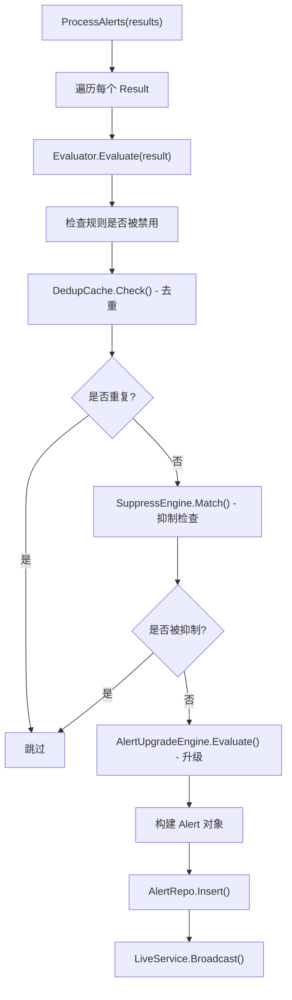

# 告警引擎 (alerts)

告警引擎负责将分析器产生的检测结果转化为可管理的告警记录，包含评估、去重、抑制和严重级别升级。

## 目录

- [文件结构](#文件结构)
- [核心数据结构](#核心数据结构)
- [告警处理流程](#告警处理流程)
- [评估器 Evaluator](#评估器-evaluator)
- [去重缓存 DedupCache](#去重缓存-dedupcache)
- [抑制引擎 SuppressEngine](#抑制引擎-suppressengine)
- [严重级别升级 UpgradeEngine](#严重级别升级-upgradeengine)

## 文件结构

| 文件 | 说明 |
|------|------|
| `engine.go` | Engine 结构体、告警生命周期管理、ProcessAlerts() |
| `evaluator.go` | Evaluator 结构体、规则评估、阈值计算 |
| `dedup.go` | DedupCache 结构体、时间窗口去重 |
| `suppress.go` | SuppressCache 结构体、条件抑制 |
| `upgrade.go` | AlertUpgradeCache 结构体、严重级别自动升级 |

## 核心数据结构

### Engine 结构体

```go
type Engine struct {
    db           *storage.DB
    alertRepo    storage.AlertRepository
    config       *config.AlertsConfig
    evaluator    *Evaluator
    dedup        *DedupCache
    suppress     *SuppressCache
    upgrade      *AlertUpgradeCache
    started      bool
    mu           sync.RWMutex
}
```

### Alert 结构体

```go
type Alert struct {
    ID            int64                  `json:"id" yaml:"id"`
    RuleName      string                 `json:"rule_name"`
    RuleTitle     string                 `json:"rule_title"`
    RuleDescription string              `json:"rule_description"`
    Severity      string                 `json:"severity"`
    Confidence    int                    `json:"confidence"`
    Status        string                 `json:"status"`
    MITRETactic   string                 `json:"mitre_tactic"`
    MITRETechnique string               `json:"mitre_technique"`
    Description   string                 `json:"description"`
    Explanation   string                 `json:"explanation"`
    Recommendation string              `json:"recommendation"`
    RealCase      string                 `json:"real_case"`
    Count         int                    `json:"count"`
    FirstSeen     time.Time              `json:"first_seen"`
    LastSeen      time.Time              `json:"last_seen"`
    EventIDs      []string               `json:"event_ids"`
    EventDBIDs    string                 `json:"event_db_ids"`
    Details       map[string]interface{} `json:"details"`
    ResolvedAt    *time.Time             `json:"resolved_at"`
    ResolvedBy    string                 `json:"resolved_by"`
    ResolvedNotes string                 `json:"resolved_notes"`
}
```

## 告警处理流程



### ProcessAlerts 主流程

```go
func (e *Engine) ProcessAlerts(results []*analyzers.Result) error {
    var alerts []*types.Alert

    for _, result := range results {
        for _, finding := range result.Findings {
            // 1. 评估规则
            alert, shouldAlert := e.evaluator.Evaluate(result, finding)
            if !shouldAlert {
                continue
            }

            // 2. 去重检查
            if e.dedup.IsDuplicate(alert.RuleName, alert.EventIDs) {
                continue
            }

            // 3. 抑制检查
            if e.suppress.IsSuppressed(alert) {
                continue
            }

            // 4. 严重级别升级
            alert = e.upgrade.Evaluate(alert)

            alerts = append(alerts, alert)
        }
    }

    if len(alerts) > 0 {
        if err := e.alertRepo.InsertBatch(alerts); err != nil {
            return err
        }
        // 推送前端
        for _, alert := range alerts {
            e.liveService.Broadcast("new_alert", alert)
        }
    }
    return nil
}
```

## 评估器 Evaluator

### 评估逻辑

```go
type Evaluator struct {
    db       *storage.DB
    config   *config.AlertsConfig
    rules    map[string]*rules.AlertRule
}

func (e *Evaluator) Evaluate(result *analyzers.Result, finding *types.Finding) (*types.Alert, bool) {
    rule := e.rules[result.RuleName]
    if rule == nil {
        return nil, false
    }

    // 检查规则是否被禁用
    if !rule.Enabled {
        return nil, false
    }

    // 阈值检查
    if finding.Count < rule.Threshold {
        return nil, false
    }

    // 时间窗口检查
    if !e.isWithinTimeWindow(finding.Events, rule.TimeWindow) {
        return nil, false
    }

    return e.buildAlert(rule, finding), true
}
```

## 去重缓存 DedupCache

### 时间窗口去重

```go
type DedupCache struct {
    window time.Duration
    items  map[string]*DedupItem
    mu     sync.RWMutex
}

type DedupItem struct {
    firstSeen time.Time
    lastSeen  time.Time
    count     int
}

func (c *DedupCache) generateKey(ruleName string, eventIDs []string) string {
    sort.Strings(eventIDs)
    h := sha256.Sum256([]byte(ruleName + "|" + strings.Join(eventIDs, ",")))
    return fmt.Sprintf("%x", h)
}

func (c *DedupCache) IsDuplicate(ruleName string, eventIDs []string) bool {
    key := c.generateKey(ruleName, eventIDs)
    c.mu.RLock()
    item, exists := c.items[key]
    c.mu.RUnlock()

    if !exists {
        c.add(key)
        return false
    }

    // 检查是否超出时间窗口
    if time.Since(item.lastSeen) > c.window {
        c.add(key)
        return false
    }

    return true
}

func (c *DedupCache) add(key string) {
    c.mu.Lock()
    defer c.mu.Unlock()
    c.items[key] = &DedupItem{
        firstSeen: time.Now(),
        lastSeen:  time.Now(),
        count:     1,
    }
}
```

### 定期清理

```go
func (c *DedupCache) StartCleanup(interval time.Duration) {
    ticker := time.NewTicker(interval)
    go func() {
        for range ticker.C {
            c.cleanup()
        }
    }()
}

func (c *DedupCache) cleanup() {
    c.mu.Lock()
    defer c.mu.Unlock()
    now := time.Now()
    for key, item := range c.items {
        if now.Sub(item.lastSeen) > c.window {
            delete(c.items, key)
        }
    }
}
```

## 抑制引擎 SuppressEngine

### 条件抑制

```go
type SuppressCache struct {
    rules []*rules.SuppressRule
    mu    sync.RWMutex
}

type SuppressRule struct {
    Name        string            `yaml:"name"`
    Enabled     bool              `yaml:"enabled"`
    Conditions  map[string]string `yaml:"conditions"`
    Description string            `yaml:"description"`
}

func (s *SuppressCache) IsSuppressed(alert *types.Alert) bool {
    s.mu.RLock()
    defer s.mu.RUnlock()

    for _, rule := range s.rules {
        if !rule.Enabled {
            continue
        }
        if s.matchConditions(rule.Conditions, alert) {
            return true
        }
    }
    return false
}

func (s *SuppressCache) matchConditions(conditions map[string]string, alert *types.Alert) bool {
    for field, value := range conditions {
        switch field {
        case "rule_name":
            if alert.RuleName != value {
                return false
            }
        case "severity":
            if alert.Severity != value {
                return false
            }
        case "computer":
            // 检查 details 中的 computer 字段
            if v, ok := alert.Details["computer"].(string); !ok || v != value {
                return false
            }
        }
    }
    return true
}
```

## 严重级别升级 UpgradeEngine

### 升级规则

```go
type AlertUpgradeCache struct {
    rules []*rules.AlertUpgradeRule
    mu    sync.RWMutex
}

type AlertUpgradeRule struct {
    Name         string `yaml:"name"`
    Enabled      bool   `yaml:"enabled"`
    Condition    string `yaml:"condition"`
    FromSeverity string `yaml:"from_severity"`
    ToSeverity   string `yaml:"to_severity"`
    Reason       string `yaml:"reason"`
}

func (u *AlertUpgradeCache) Evaluate(alert *types.Alert) *types.Alert {
    u.mu.RLock()
    defer u.mu.RUnlock()

    for _, rule := range u.rules {
        if !rule.Enabled {
            continue
        }
        if alert.Severity == rule.FromSeverity && u.matchCondition(rule.Condition, alert) {
            alert.Severity = rule.ToSeverity
            alert.Recommendation += "\n升级原因: " + rule.Reason
            return alert
        }
    }
    return alert
}
```

### 升级条件

| 条件 | 说明 | 示例 |
|------|------|------|
| `count > N` | 告警数量超过阈值 | `count > 100` |
| `user is admin` | 涉及管理员账户 | 匹配 `Administrator`、`Domain Admins` |
| `computer is DC` | 发生在域控制器 | 检测机器角色为 `domain_controller` |
| `technique contains X` | 包含特定 ATT&CK 技术 | `technique contains T1003` |
