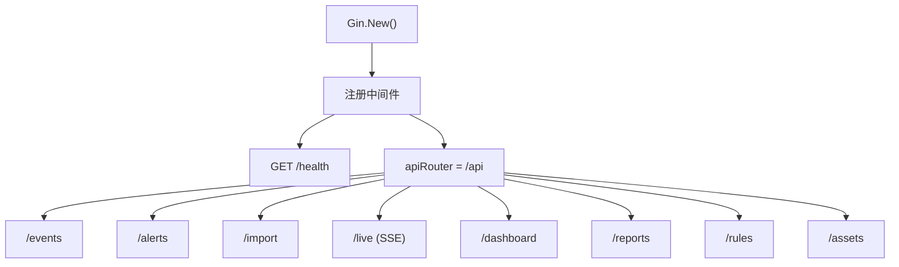

# REST API 服务 (api)

REST API 基于 Gin 框架提供事件查询、告警管理、文件导入、实时监控等 HTTP 接口。

## 目录

- [文件结构](#文件结构)
- [核心数据结构](#核心数据结构)
- [路由注册](#路由注册)
- [中间件](#中间件)
- [API 接口一览](#api-接口一览)
- [关键 Handler 实现](#关键-handler-实现)

## 文件结构

| 文件 | 说明 |
|------|------|
| `server.go` | Server 结构体、Gin 引擎初始化、中间件注册、生命周期管理 |
| `routes.go` | 路由分组注册、所有 API 端点定义 |
| `middleware.go` | 请求日志、CORS、Recovery 中间件 |

## 核心数据结构

### Server 结构体

```go
type Server struct {
    engine      *gin.Engine
    srv         *http.Server
    alertsHandler   *AlertsHandler
    importHandler   *ImportHandler
    liveHandler     *LiveHandler
    dashboardHandler *DashboardHandler
    eventHandler    *EventHandler
    reportHandler   *ReportHandler
    ruleHandler     *RuleHandler
    assetHandler    *AssetHandler
}
```

### 启动配置

```go
type ServerConfig struct {
    Host    string
    Port    int
    Mode    string        // "debug", "release", "test"
    Timeout time.Duration
}
```

## 路由注册



### 路由表

| 分组 | 路径 | 方法 | Handler |
|------|------|------|---------|
| health | `/health` | GET | `healthHandler` |
| events | `/api/events` | GET | `eventHandler.List` |
| events | `/api/events/:id` | GET | `eventHandler.GetByID` |
| events | `/api/events/search` | POST | `eventHandler.Search` |
| events | `/api/events/stats` | GET | `eventHandler.Stats` |
| alerts | `/api/alerts` | GET | `alertsHandler.List` |
| alerts | `/api/alerts/:id` | GET | `alertsHandler.GetByID` |
| alerts | `/api/alerts/:id/resolve` | PUT | `alertsHandler.Resolve` |
| alerts | `/api/alerts/:id/false-positive` | PUT | `alertsHandler.MarkFalsePositive` |
| alerts | `/api/alerts/stats` | GET | `alertsHandler.Stats` |
| alerts | `/api/alerts/trend` | GET | `alertsHandler.Trend` |
| import | `/api/import` | POST | `importHandler.Import` |
| import | `/api/import/history` | GET | `importHandler.History` |
| import | `/api/import/status` | GET | `importHandler.Status` |
| live | `/api/live` | GET | `liveHandler.SSE` (SSE) |
| live | `/api/live/channels` | GET | `liveHandler.ListChannels` |
| live | `/api/live/channels` | POST | `liveHandler.CreateChannel` |
| dashboard | `/api/dashboard/overview` | GET | `dashboardHandler.Overview` |
| dashboard | `/api/dashboard/mitre` | GET | `dashboardHandler.MITRE` |
| reports | `/api/reports` | POST | `reportHandler.Create` |
| reports | `/api/reports` | GET | `reportHandler.List` |
| reports | `/api/reports/:id` | GET | `reportHandler.GetByID` |
| rules | `/api/rules` | GET | `ruleHandler.List` |
| rules | `/api/rules/:name` | GET | `ruleHandler.GetByName` |
| rules | `/api/rules/:name/disable` | PUT | `ruleHandler.Disable` |
| rules | `/api/rules/:name/enable` | PUT | `ruleHandler.Enable` |
| assets | `/api/assets` | GET | `assetHandler.List` |
| assets | `/api/assets` | POST | `assetHandler.Create` |
| assets | `/api/assets/:id` | PUT | `assetHandler.Update` |

## 中间件

### 请求日志中间件

```go
func requestLogger() gin.HandlerFunc {
    return func(c *gin.Context) {
        start := time.Now()
        c.Next()
        logrus.WithFields(logrus.Fields{
            "method":   c.Request.Method,
            "path":     c.Request.URL.Path,
            "status":   c.Writer.Status(),
            "duration": time.Since(start),
            "client":   c.ClientIP(),
        }).Info("request completed")
    }
}
```

### CORS 中间件

```go
func corsMiddleware(allowedOrigins []string) gin.HandlerFunc {
    return func(c *gin.Context) {
        origin := c.GetHeader("Origin")
        for _, o := range allowedOrigins {
            if o == "*" || o == origin {
                c.Header("Access-Control-Allow-Origin", o)
                c.Header("Access-Control-Allow-Methods", "GET, POST, PUT, DELETE, OPTIONS")
                c.Header("Access-Control-Allow-Headers", "Content-Type, Authorization")
                break
            }
        }
        if c.Request.Method == "OPTIONS" {
            c.AbortWithStatus(204)
            return
        }
        c.Next()
    }
}
```

### Recovery 中间件

```go
func recoveryMiddleware() gin.HandlerFunc {
    return gin.CustomRecovery(func(c *gin.Context, recovered interface{}) {
        logrus.WithError(fmt.Errorf("panic: %v", recovered)).Error("recovered from panic")
        c.JSON(500, gin.H{"error": "Internal Server Error"})
    })
}
```

## API 接口一览

### 事件查询

```
GET /api/events?page=1&page_size=20&level=Error&log_name=Security
GET /api/events/:id
POST /api/events/search {"keyword": "failed", "start_time": "...", "end_time": "..."}
GET /api/events/stats
```

### 告警管理

```
GET /api/alerts?page=1&severity=Critical&resolved=false
GET /api/alerts/:id
PUT /api/alerts/:id/resolve {"notes": "investigated"}
PUT /api/alerts/:id/false-positive {"reason": "known activity"}
GET /api/alerts/stats
GET /api/alerts/trend?days=30
```

### 文件导入

```
POST /api/import {"file_paths": ["/path/to/file.evtx"]}
GET /api/import/history
GET /api/import/status
```

### 实时监控（SSE）

```
GET /api/live  (Server-Sent Events 流)
```

### 仪表盘

```
GET /api/dashboard/overview
GET /api/dashboard/mitre
```

## 关键 Handler 实现

### 事件搜索 Handler

```go
func (h *EventHandler) Search(c *gin.Context) {
    var req types.SearchRequest
    if err := c.ShouldBindJSON(&req); err != nil {
        c.JSON(400, gin.H{"error": err.Error()})
        return
    }

    // 默认分页
    if req.Page == 0 {
        req.Page = 1
    }
    if req.PageSize == 0 {
        req.PageSize = 20
    }

    events, total, err := h.eventRepo.Search(&req)
    if err != nil {
        c.JSON(500, gin.H{"error": "search failed"})
        return
    }

    c.JSON(200, gin.H{
        "events": events,
        "total":  total,
        "page":   req.Page,
    })
}
```

### SSE 实时推送 Handler

```go
func (h *LiveHandler) SSE(c *gin.Context) {
    c.Header("Content-Type", "text/event-stream")
    c.Header("Cache-Control", "no-cache")
    c.Header("Connection", "keep-alive")
    c.Header("X-Accel-Buffering", "no")

    ch := make(chan *types.LiveEvent, 64)
    h.service.Subscribe(ch)
    defer h.service.Unsubscribe(ch)

    ctx := c.Request.Context()
    for {
        select {
        case <-ctx.Done():
            return
        case event := <-ch:
            data, _ := json.Marshal(event)
            fmt.Fprintf(c.Writer, "data: %s\n\n", data)
            c.Writer.Flush()
        }
    }
}
```

### 服务生命周期

```go
func (s *Server) Start() error {
    gin.SetMode(s.mode)
    s.engine = gin.New()
    s.engine.Use(requestLogger(), corsMiddleware(), recoveryMiddleware())
    s.registerRoutes()

    addr := fmt.Sprintf("%s:%d", s.host, s.port)
    s.srv = &http.Server{
        Addr:         addr,
        Handler:      s.engine,
        ReadTimeout:  15 * time.Second,
        WriteTimeout: 15 * time.Second,
        IdleTimeout:  60 * time.Second,
    }

    return s.srv.ListenAndServe()
}

func (s *Server) Shutdown(ctx context.Context) error {
    return s.srv.Shutdown(ctx)
}
```
