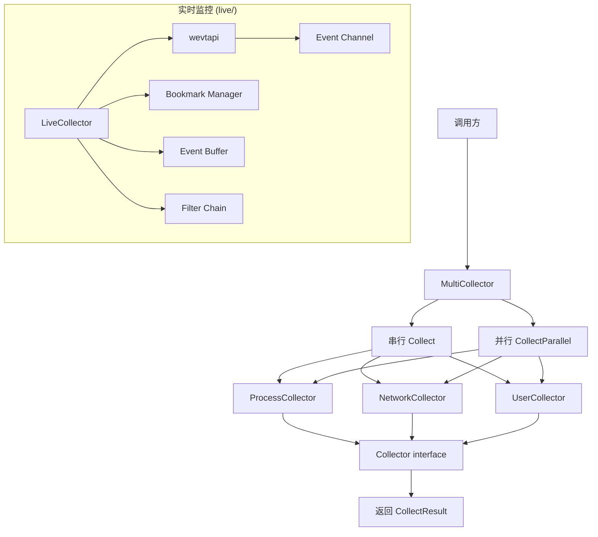

# 日志收集器模块 (Collectors)

## 概述

日志收集器模块提供系统信息收集能力,用于获取 Windows/Linux 系统的进程、网络、用户、软件、补丁等系统状态数据。模块支持批量收集和并行收集两种模式。

## 目录

- [核心接口](#核心接口)
- [主要收集器](#主要收集器)
- [实时监控收集器 (live/)](#实时监控收集器)
- [多收集器编排](#多收集器编排)
- [架构设计](#架构设计)

## 核心接口

### Collector 接口

```go
// internal/collectors/collector.go
type Collector interface {
    Name() string                          // 收集器名称
    Collect(ctx context.Context) ([]interface{}, error) // 执行收集
    RequiresAdmin() bool                   // 是否需要管理员权限
}
```

### BaseCollector

提供基础实现的抽象基类:

```go
type BaseCollector struct {
    info CollectorInfo
}

type CollectorInfo struct {
    Name          string
    Description   string
    RequiresAdmin bool
    Version       string
}
```

### CollectResult

单次收集操作的封装结果:

```go
type CollectResult struct {
    Collector string
    Data      []interface{}
    Duration  time.Duration
    Error     error
    Timestamp time.Time
}
```

## 主要收集器

| 收集器 | 文件 | 权限 | 说明 |
|--------|------|------|------|
| 进程信息 | `process_info.go` | 否 | 当前系统运行进程列表 |
| 网络信息 | `network_info.go` | 否 | 网络连接状态 |
| 用户信息 | `user_info.go` | 否 | 系统用户账户 |
| 软件信息 | `software_collector.go` | 否 | 已安装软件清单 |
| 补丁信息 | `patch_collector.go` | 否 | 系统已安装补丁 |
| 驱动信息 | `driver_info.go` | 否 | 已安装驱动 |
| DLL 信息 | `dll_info.go` | 否 | 系统 DLL 信息 |
| 注册表信息 | `registry_info.go` | 是 | 关键注册表项 |
| 任务信息 | `task_info.go` | 是 | 计划任务 |
| 环境变量 | `env_info.go` | 否 | 系统环境变量 |
| 系统信息 | `system_info.go` | 否 | OS 版本、架构等 |
| 通道信息 | `channels.go` | 否 | 日志通道和日志文件列表 |
| 取证构件 | `forensics_artifacts.go` | 是 | 取证相关系统构件 |
| 一键收集 | `one_click.go` | 是 | 一键全量收集入口 |

### 日志通道收集 (`channels.go`)

```go
type LogChannelInfo struct {
    Name         string `json:"name"`
    LogPath      string `json:"log_path"`
    IsEVTX       bool   `json:"is_evtx"`
    FileExists   bool   `json:"file_exists"`
    FileSize     int64  `json:"file_size"`
    LastWriteTime string `json:"last_write_time"`
}

type LogFileInfo struct {
    Name         string `json:"name"`
    LogPath      string `json:"log_path"`
    FileSize     int64  `json:"file_size"`
    LastWriteTime string `json:"last_write_time"`
}
```

核心函数:

- `GetLogFiles()` - 获取系统日志文件列表 (PowerShell + 回退方案)
- `GetLogFilesDetailed()` - 获取详细日志文件信息 (含注册表查询)
- `GetChannelFilePaths()` - 获取通道文件路径映射
- `GetRegisteredChannels()` - 获取已注册且有记录的通道名称列表
- `CategorizeChannel(name string) string` - 将通道分类 (Windows Event Logs / Sysmon / PowerShell / WMI / Task Scheduler / Microsoft Windows / Other)

## 实时监控收集器

位于 `collectors/live/` 目录,提供 Windows 事件日志的实时监控能力。

### 核心文件

| 文件 | 说明 |
|------|------|
| `collector.go` | 主收集器实现 |
| `collector_interface.go` | 接口定义 |
| `collector_windows.go` | Windows 平台实现 |
| `collector_poll.go` | 轮询模式收集器 |
| `collector_stub.go` | 非 Windows 平台 stub |
| `evt_collector.go` | EVT/EVTX 事件收集 |
| `evt_render.go` | 事件渲染 |
| `evt_bookmark.go` | 书签管理 |
| `bookmark.go` | 书签接口 |
| `buffer.go` | 事件缓冲区 |
| `channel.go` | 通道管理 |
| `filtered.go` | 过滤收集器 |
| `stats.go` | 统计信息 |
| `wevtapi_windows.go` | Windows Event API 绑定 |

### 工作方式

实时监控收集器通过 Windows `wevtapi` API 订阅事件日志通道,支持:

- 实时事件流订阅
- 书签持久化 (断点续传)
- 事件过滤
- 缓冲区管理
- 轮询和推送两种模式

## 多收集器编排

### MultiCollector

支持多收集器串行和并行编排:

```go
type MultiCollector struct {
    collectors []Collector
}

func NewMultiCollector(collectors ...Collector) *MultiCollector
func (mc *MultiCollector) Add(c Collector)
func (mc *MultiCollector) Collect(ctx context.Context) ([]*CollectResult, error)
func (mc *MultiCollector) CollectParallel(ctx context.Context, workers int) ([]*CollectResult, error)
func (mc *MultiCollector) List() []CollectorInfo
```

### CollectParallel

使用 semaphore 控制并发度的并行收集:

```go
func (mc *MultiCollector) CollectParallel(ctx context.Context, workers int) ([]*CollectResult, error) {
    resultChan := make(chan result, len(mc.collectors))
    sem := make(chan struct{}, workers)  // 并发控制
    
    for _, c := range mc.collectors {
        go func(collector Collector) {
            sem <- struct{}{}
            defer func() { <-sem }()
            // 执行收集...
        }(c)
    }
    // 收集结果...
}
```

## 架构设计


