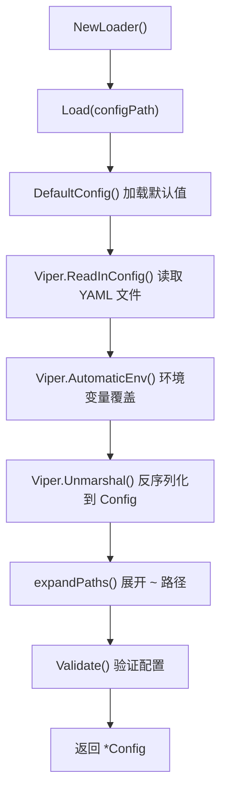

# 配置管理模块 (config)

配置管理模块负责 WinLog 的全局配置加载、验证、热重载和持久化。

## 目录

- [文件结构](#文件结构)
- [核心数据结构](#核心数据结构)
- [配置加载流程](#配置加载流程)
- [配置验证](#配置验证)
- [环境变量映射](#环境变量映射)
- [配置热重载](#配置热重载)

## 文件结构

| 文件 | 说明 |
|------|------|
| `config.go` | Config 结构体定义、子配置结构体、DefaultConfig()、Validate() |
| `loader.go` | Loader 结构体、Load()、Watch()、Save()、环境变量绑定 |

## 核心数据结构

### Config 结构体

```go
type Config struct {
    Database    DatabaseConfig    `yaml:"database"`
    Import      ImportConfig      `yaml:"import"`
    Parser      ParserConfig      `yaml:"parser"`
    Search      SearchConfig      `yaml:"search"`
    Alerts      AlertsConfig      `yaml:"alerts"`
    Correlation CorrelationConfig `yaml:"correlation"`
    Report      ReportConfig      `yaml:"report"`
    Forensics   ForensicsConfig   `yaml:"forensics"`
    API         APIConfig         `yaml:"api"`
    Auth        AuthConfig        `yaml:"auth"`
    Audit       AuditConfig       `yaml:"audit"`
    Log         LogConfig         `yaml:"log"`
    TUI         TUIConfig         `yaml:"tui"`
    Monitor     MonitorConfig     `yaml:"monitor"`
    Webhook     WebhookConfig     `yaml:"webhook"`
    Poll        PollConfig        `yaml:"poll"`
}
```

### 子配置结构体

```go
type DatabaseConfig struct {
    Path         string `yaml:"path"`
    WALMode      bool   `yaml:"wal_mode"`
    PoolSize     int    `yaml:"pool_size"`
    MaxOpenConns int    `yaml:"max_open_conns"`
}

type ImportConfig struct {
    Workers             int      `yaml:"workers"`
    BatchSize           int      `yaml:"batch_size"`
    MaxImportFileSizeMB int      `yaml:"max_import_file_size_mb"`
    SkipPatterns        []string `yaml:"skip_patterns"`
    Incremental         bool     `yaml:"incremental"`
    CalculateHash       bool     `yaml:"calculate_hash"`
    ProgressCallback    bool     `yaml:"progress_callback"`
}

type APIConfig struct {
    Host           string        `yaml:"host"`
    Port           int           `yaml:"port"`
    Mode           string        `yaml:"mode"`
    CORS           CORSConfig    `yaml:"cors"`
    RequestTimeout time.Duration `yaml:"request_timeout"`
}

type AlertsConfig struct {
    Enabled          bool                `yaml:"enabled"`
    DedupWindow      time.Duration       `yaml:"dedup_window"`
    UpgradeRules     []*AlertUpgradeRule `yaml:"upgrade_rules,omitempty"`
    SuppressRules    []*SuppressRule     `yaml:"suppress_rules,omitempty"`
    StatsRetention   time.Duration       `yaml:"stats_retention"`
    EnableCollection bool                `yaml:"enable_collection"`
}
```

## 配置加载流程

配置加载通过 `Loader` 结构体实现，基于 **Viper** + **YAML** + **环境变量** 三层优先级：



### 配置文件搜索路径

当未指定配置文件路径时，Viper 按以下顺序搜索：

1. 当前目录 (`.`)
2. `$HOME/.winalog`
3. `/etc/winalog`

文件名为 `config.yaml`（或 `.yml`）。

### 加载器实现

```go
type Loader struct {
    configPath string
    viper      *viper.Viper
}

func (l *Loader) Load(configPath string) (*Config, error) {
    cfg := DefaultConfig()
    l.bindAllEnvs()
    if err := l.viper.ReadInConfig(); err != nil {
        if _, ok := err.(viper.ConfigFileNotFoundError); !ok {
            return nil, fmt.Errorf("failed to read config: %w", err)
        }
    }
    if err := l.viper.Unmarshal(cfg); err != nil {
        return nil, fmt.Errorf("failed to unmarshal config: %w", err)
    }
    expandPaths(cfg)
    if _, err := cfg.Validate(); err != nil {
        return nil, fmt.Errorf("config validation failed: %w", err)
    }
    return cfg, nil
}
```

## 配置验证

`Validate()` 方法对关键字段进行校验，并支持自动修正：

| 字段 | 规则 | 自动修正 |
|------|------|----------|
| `database.path` | 必填 | 否 |
| `import.workers` | 1-32 | 是（超出范围自动修正） |
| `api.port` | 1-65535 | 否 |
| `api.cors.allowed_origins` | 警告 `*` | 是（仅警告） |

```go
func (c *Config) Validate() ([]*ValidationResult, error) {
    // 校验 database.path
    if c.Database.Path == "" {
        results = append(results, &ValidationResult{
            Field:   "database.path",
            Message: "database.path is required",
            Fixed:   false,
        })
    }
    // 自动修正 import.workers
    if c.Import.Workers <= 0 {
        c.Import.Workers = 1
    }
    if c.Import.Workers > 32 {
        c.Import.Workers = 32
    }
    // ...
}
```

## 环境变量映射

环境变量以 `WINALOG_` 为前缀，使用 `_` 替代 `.`：

| 配置键 | 环境变量 |
|--------|----------|
| `database.path` | `WINALOG_DATABASE_PATH` |
| `database.wal_mode` | `WINALOG_DATABASE_WAL_MODE` |
| `import.workers` | `WINALOG_IMPORT_WORKERS` |
| `import.batch_size` | `WINALOG_IMPORT_BATCH_SIZE` |
| `api.host` | `WINALOG_API_HOST` |
| `api.port` | `WINALOG_API_PORT` |
| `log.level` | `WINALOG_LOG_LEVEL` |
| `alerts.enabled` | `WINALOG_ALERTS_ENABLED` |
| `correlation.enabled` | `WINALOG_CORRELATION_ENABLED` |

## 配置热重载

Loader 支持通过 `fsnotify` 监听配置文件变更：

```go
func (l *Loader) Watch(onChange func(*Config)) error {
    l.viper.WatchConfig()
    l.viper.OnConfigChange(func(e fsnotify.Event) {
        cfg := DefaultConfig()
        if err := l.viper.Unmarshal(cfg); err != nil {
            return
        }
        onChange(cfg)
    })
    return nil
}
```

## 配置保存

```go
func (l *Loader) Save(cfg *Config, path string) error {
    v := viper.New()
    v.Set("database", cfg.Database)
    v.Set("import", cfg.Import)
    // ...
    return v.WriteConfigAs(path)
}
```
