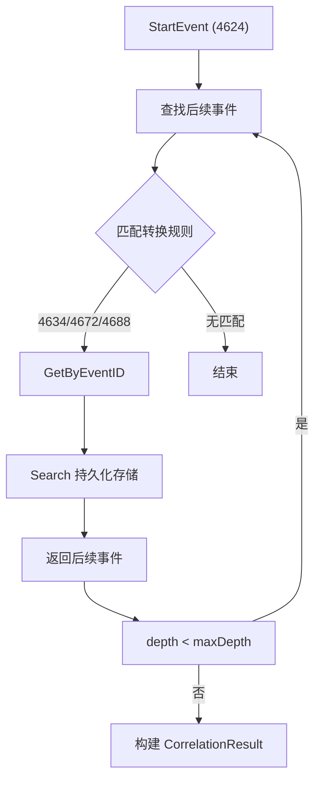
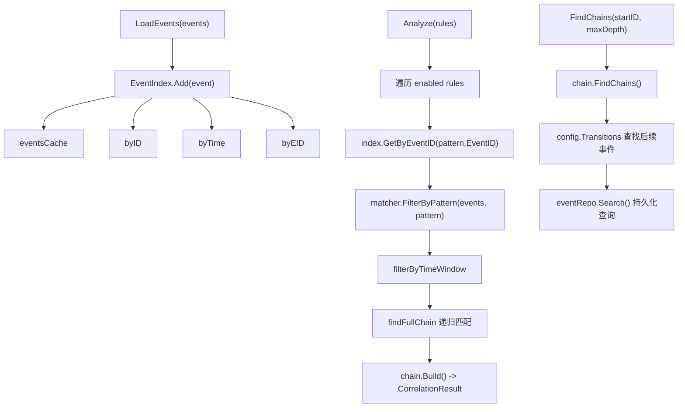

# 事件关联分析模块 (Correlation)

## 概述

事件关联分析模块通过分析 Windows 事件日志中的事件序列,识别潜在的安全威胁链。模块使用规则引擎、事件索引和攻击链构建器,将分散的日志事件关联为完整的安全事件链。

## 目录

- [核心组件](#核心组件)
- [EventIndex](#eventindex)
- [Engine](#engine)
- [Matcher](#matcher)
- [ChainBuilder](#chainbuilder)
- [关联规则](#关联规则)
- [架构设计](#架构设计)

## 核心组件

```go
// internal/correlation/engine.go
type Engine struct {
    mu      sync.RWMutex
    index   *EventIndex     // 事件索引
    matcher *Matcher         // 模式匹配器
    chain   *ChainBuilder    // 攻击链构建器
    maxAge  time.Duration    // 事件最大存活时间
}
```

## EventIndex

事件索引用于高效查询和缓存已加载的事件。

### 数据结构

```go
type EventIndex struct {
    mu              sync.RWMutex
    eventRepo       *storage.EventRepo    // 持久化存储仓库 (可选)
    eventsCache     map[int64]*types.Event // ID -> 事件
    byID            map[int64]time.Time    // ID -> 时间戳 (快速查找)
    byTime          []indexEntry           // 按时间排序的索引
    byEID           map[int32][]int64      // EventID -> 事件ID列表
    maxAge          time.Duration          // 最大存活时间
    lastCleanup     time.Time              // 上次清理时间
    cleanupInterval time.Duration          // 清理间隔 (默认 5 分钟)
}

type indexEntry struct {
    ID        int64
    Timestamp time.Time
}
```

### 多维度索引

| 索引 | 用途 |
|------|------|
| `eventsCache` | 事件对象缓存 |
| `byID` | 按 ID 快速查找 |
| `byTime` | 按时间范围查询 |
| `byEID` | 按 EventID (如 4624, 4688) 查询 |

### 核心方法

| 方法 | 说明 |
|------|------|
| `Add(event *types.Event)` | 添加事件到索引,触发定时清理 |
| `Cleanup()` | 清除超过 `maxAge` 的过期事件 |
| `GetByID(id int64)` | 按 ID 获取事件 (缓存 + 持久化回退) |
| `GetByEventID(eid int32)` | 按 EventID 获取事件列表 |
| `GetByTimeRange(start, end)` | 按时间范围获取事件 |
| `GetAllEvents()` | 获取所有缓存事件 |
| `SetEventRepo(repo)` | 设置持久化存储,支持索引未命中时回查 |

### 清理机制

`Add()` 方法每 5 分钟异步触发一次 `Cleanup()`,清除超过 `maxAge` 的事件:

```go
func (idx *EventIndex) Add(event *types.Event) {
    if time.Since(idx.lastCleanup) > idx.cleanupInterval {
        idx.lastCleanup = time.Now()
        go idx.Cleanup()
    }
    // 更新各索引...
}
```

## Engine

### 构造函数

| 方法 | 说明 |
|------|------|
| `NewEngine(maxAge)` | 创建空引擎 |
| `NewEngineWithEventRepo(eventRepo, maxAge)` | 创建带持久化存储的引擎 |

### 核心方法

| 方法 | 说明 |
|------|------|
| `LoadEvents(events)` | 批量加载事件到索引 |
| `Analyze(ctx, rules)` | 执行关联规则分析 (支持上下文取消) |
| `FindChains(ctx, startEventID, maxDepth)` | 从指定事件开始查找攻击链 |
| `GetEvents()` | 获取索引中的所有事件 |
| `Clear()` | 清空索引 |
| `SetEventRepo(repo)` | 设置持久化存储 |

### 关联分析流程

```go
func (e *Engine) Analyze(ctx context.Context, rules []*rules.CorrelationRule) ([]*types.CorrelationResult, error) {
    for _, rule := range rules {
        if !rule.Enabled { continue }
        ruleResults := e.analyzeRule(rule)
        results = append(results, ruleResults...)
    }
    return results, nil
}
```

### 攻击链查找 (findFullChain)

使用递归深度优先搜索匹配事件链:

1. 从第一个 pattern 的 EventID 获取初始事件
2. 按 pattern 条件过滤
3. 按时间窗口过滤
4. 对每个初始事件,递归查找后续事件
5. 使用 `chainKey` 去重 (基于事件 ID 序列)

### Join 策略

在 `findRelatedEventsWithRule` 中支持多种关联策略:

| Join 类型 | 关联条件 |
|-----------|---------|
| `"user"` | 相同用户 (User 或 UserSID) |
| `"computer"` | 相同计算机 |
| `"ip"` | 相同 IP 地址 |
| 默认 | 时间顺序匹配 |

## Matcher

模式匹配器负责将规则中的条件应用于事件。

```go
type Matcher struct{}
```

### 支持的字段

| 字段 | 数据源 |
|------|--------|
| `source` | `event.Source` |
| `log_name` | `event.LogName` |
| `computer` | `event.Computer` |
| `user` | `event.User` |
| `message` | `event.Message` |
| `ip_address` | `event.IPAddress` |
| `process_name` | `event.ExtractedFields["NewProcessName"]` |
| `command_line` | `event.ExtractedFields["CommandLine"]` |
| `service_name` | `event.ExtractedDataStr(event, "ServiceName")` |
| `logon_type` | `event.ExtractedFields["LogonType"]` |
| `destination_port` | `event.ExtractedFields["DestinationPort"]` |
| `workstation` | `event.ExtractedFields["WorkstationName"]` |
| `domain` | `event.ExtractedFields["TargetDomainName"]` |
| `target_username` | `event.ExtractedFields["TargetUserName"]` |
| `task_name` | `event.ExtractedFields["TaskName"]` |

### 比较操作符

| 操作符 | 字符串 | 整数 |
|--------|--------|------|
| `==`, `=`, `equals` | 相等 (不区分大小写) | 相等 |
| `!=`, `not_equals` | 不相等 | 不相等 |
| `contains` | 包含子串 | - |
| `not_contains` | 不包含子串 | - |
| `startswith` | 前缀匹配 | - |
| `endswith` | 后缀匹配 | - |
| `regex` | 正则匹配 | - |
| `>`, `>=`, `<`, `<=` | - | 数值比较 |

### 过滤方法

| 方法 | 说明 |
|------|------|
| `Match(rule, events)` | 验证事件列表是否匹配规则 |
| `FilterByTimeRange(events, start, end)` | 按时间范围过滤 |
| `FilterByPattern(events, pattern)` | 按模式条件过滤 (支持 MinCount/MaxCount) |
| `CountMatches(events, pattern)` | 统计匹配数量 |
| `CheckOrderedSequence(events, pattern)` | 检查时间顺序 |

## ChainBuilder

攻击链构建器负责将匹配的事件序列组装为 `CorrelationResult`。

### ChainConfig

```go
type ChainConfig struct {
    StartEventIDs map[int32]bool    // 起始事件 ID 集合
    Transitions   map[int32][]int32 // 事件转换规则
    TimeWindow    time.Duration     // 时间窗口
}
```

### 默认攻击链配置

```go
var DefaultChainConfig = &ChainConfig{
    StartEventIDs: map[int32]bool{
        4624: true,  // 登录成功
        4625: true,  // 登录失败
        4634: true,  // 注销
        4648: true,  // 使用显式凭据登录
        4672: true,  // 特权分配
        4688: true,  // 创建新进程
        4697: true,  // 安装服务
        4698: true,  // 创建计划任务
    },
    Transitions: map[int32][]int32{
        4624: {4634, 4672, 4688},
        4625: {4624},
        4648: {4624, 4672},
        4688: {4698, 4697},
    },
    TimeWindow: 1 * time.Hour,
}
```

### 核心方法

| 方法 | 说明 |
|------|------|
| `Build(startEvent, relatedEvents, rule)` | 构建关联结果 |
| `BuildFromRule(rule, events)` | 从规则和事件构建结果 |
| `FindChains(startEvent, maxDepth)` | 从起始事件开始查找攻击链 |
| `SetEventRepo(repo)` | 设置持久化存储 |

### FindChains 深度搜索



## 关联规则

关联规则定义在 `rules` 包中 (`rules/` 模块详见 types.md):

```go
type CorrelationRule struct {
    ID          string
    Name        string
    Description string
    Severity    string
    Enabled     bool
    Patterns    []*Pattern      // 事件模式列表
    TimeWindow  time.Duration   // 时间窗口
    Join        string          // 关联策略 (user/computer/ip)
}

type Pattern struct {
    EventID    int32
    Conditions []*Condition
    TimeWindow time.Duration
    Join       string
    MinCount   int
    MaxCount   int
    Ordered    bool
}

type Condition struct {
    Field    string
    Value    string
    Operator string
}
```

## 架构设计


