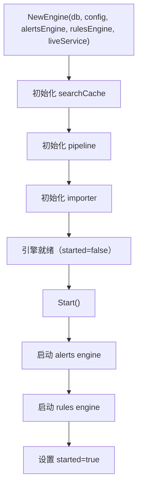
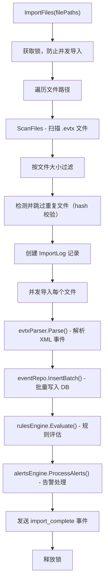
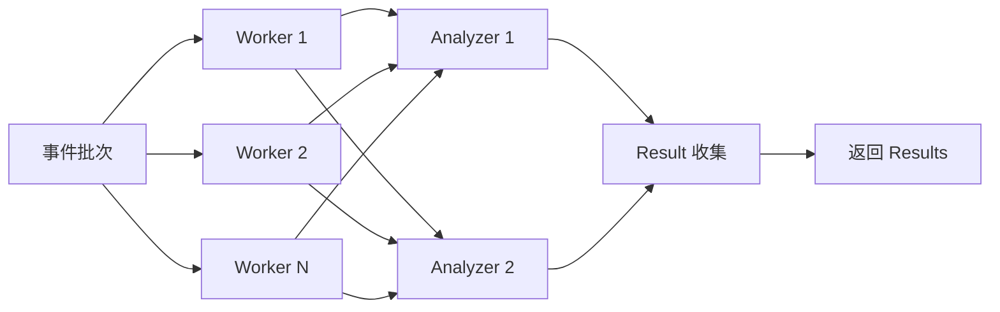
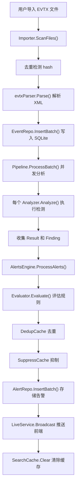

# 事件处理引擎 (engine)

事件处理引擎是 WinLog 的核心调度中枢，负责事件导入、并发处理管道、缓存管理和模块编排。

## 目录

- [文件结构](#文件结构)
- [核心数据结构](#核心数据结构)
- [引擎启动流程](#引擎启动流程)
- [导入器 Importer](#导入器-importer)
- [处理管道 Pipeline](#处理管道-pipeline)
- [搜索缓存 SearchCache](#搜索缓存-searchcache)
- [事件处理完整流程](#事件处理完整流程)

## 文件结构

| 文件 | 说明 |
|------|------|
| `engine.go` | Engine 结构体、生命周期管理、缓存初始化、模块编排 |
| `importer.go` | Importer 结构体、文件扫描、并发导入、去重、进度回调 |
| `pipeline.go` | Pipeline 结构体、Worker 池、批量处理、Analyzer 调度 |

## 核心数据结构

### Engine 结构体

```go
type Engine struct {
    db             *storage.DB
    config         *config.Config
    alertsEngine   *alerts.Engine
    rulesEngine    *rules.Engine
    liveService    *live.EventService
    searchCache    *SearchCache
    pipeline       *Pipeline
    importer       *Importer
    eventRepo      storage.EventRepository
    alertRepo      storage.AlertRepository
    mu             sync.RWMutex
    started        bool
}
```

### Pipeline 结构体

```go
type Pipeline struct {
    db        *storage.DB
    config    *config.Config
    analyzers []analyzers.Analyzer
    workers   int
    batchSize int
}
```

### Importer 结构体

```go
type Importer struct {
    db          *storage.DB
    eventRepo   storage.EventRepository
    alertRepo   storage.AlertRepository
    config      *config.Config
    rulesEngine *rules.Engine
    mu          sync.Mutex
    importing   bool
    progressCh  chan ImportProgress
}
```

## 引擎启动流程



### NewEngine 初始化

```go
func NewEngine(
    db *storage.DB,
    cfg *config.Config,
    alertsEngine *alerts.Engine,
    rulesEngine *rules.Engine,
    liveService *live.EventService,
) *Engine {
    engine := &Engine{
        db:           db,
        config:       cfg,
        alertsEngine: alertsEngine,
        rulesEngine:  rulesEngine,
        liveService:  liveService,
        searchCache:  NewSearchCache(cfg.Search.CacheSize),
    }

    engine.pipeline = NewPipeline(db, cfg, rulesEngine.GetAnalyzers())

    engine.importer = NewImporter(db, cfg, rulesEngine)
    engine.importer.SetProgressCallback(func(p ImportProgress) {
        engine.liveService.Broadcast("import_progress", p)
    })

    engine.eventRepo = storage.NewEventRepo(db)
    engine.alertRepo = storage.NewAlertRepo(db)
    return engine
}
```

### Start 启动

```go
func (e *Engine) Start() error {
    if e.started {
        return errors.New("engine already started")
    }

    // 启动告警引擎（开始持续评估）
    if err := e.alertsEngine.Start(); err != nil {
        return fmt.Errorf("failed to start alerts engine: %w", err)
    }

    // 启动规则引擎
    if err := e.rulesEngine.Start(); err != nil {
        return fmt.Errorf("failed to start rules engine: %w", err)
    }

    e.mu.Lock()
    e.started = true
    e.mu.Unlock()

    return nil
}
```

## 导入器 Importer

### 导入流程



### 并发导入

```go
func (imp *Importer) ImportFiles(filePaths []string) error {
    imp.mu.Lock()
    imp.importing = true
    imp.mu.Unlock()
    defer func() {
        imp.mu.Lock()
        imp.importing = false
        imp.mu.Unlock()
    }()

    var wg sync.WaitGroup
    sem := make(chan struct{}, 3) // 最多 3 个并发文件

    for _, path := range files {
        wg.Add(1)
        sem <- struct{}{}
        go func(fp string) {
            defer wg.Done()
            defer func() { <-sem }()
            // 导入单个文件的逻辑
            events, err := parser.Parse(fp)
            imp.eventRepo.InsertBatch(events)
            imp.rulesEngine.Evaluate(events)
        }(path)
    }
    wg.Wait()
}
```

### 重复检测

通过计算文件 SHA256 哈希并与 `import_log` 表比对，跳过重复导入：

```go
func (imp *Importer) calculateHash(filePath string) (string, error) {
    f, _ := os.Open(filePath)
    defer f.Close()
    h := sha256.New()
    io.Copy(h, f)
    return fmt.Sprintf("%x", h.Sum(nil)), nil
}
```

### 进度回调

导入过程通过 channel 实时推送进度：

```go
type ImportProgress struct {
    CurrentFile  string  `json:"current_file"`
    TotalFiles   int     `json:"total_files"`
    Processed    int     `json:"processed"`
    TotalEvents  int     `json:"total_events"`
    CurrentSize  int64   `json:"current_size"`
    TotalSize    int64   `json:"total_size"`
    Speed        float64 `json:"speed"`
    ETA          float64 `json:"eta"`
    IsImporting  bool    `json:"is_importing"`
}
```

## 处理管道 Pipeline

### 管道架构



### ProcessBatch 方法

```go
func (p *Pipeline) ProcessBatch(events []*types.Event) ([]*analyzers.Result, error) {
    if len(events) == 0 {
        return nil, nil
    }

    var wg sync.WaitGroup
    resultsCh := make(chan []*analyzers.Result, p.workers)

    for i := 0; i < p.workers; i++ {
        wg.Add(1)
        go func() {
            defer wg.Done()
            var allResults []*analyzers.Result
            for _, analyzer := range p.analyzers {
                result := analyzer.Analyze(events)
                if len(result.Findings) > 0 {
                    allResults = append(allResults, result)
                }
            }
            resultsCh <- allResults
        }()
    }

    go func() {
        wg.Wait()
        close(resultsCh)
    }()

    var allResults []*analyzers.Result
    for results := range resultsCh {
        allResults = append(allResults, results...)
    }
    return allResults, nil
}
```

### 配置参数

| 参数 | 默认值 | 说明 |
|------|--------|------|
| `pipeline.workers` | 4 | 并发 Worker 数 |
| `pipeline.batch_size` | 1000 | 每批处理事件数 |

## 搜索缓存 SearchCache

### 缓存结构

```go
type SearchCache struct {
    maxSize int
    items   map[string]*CacheItem
    order   *list.List
    mu      sync.RWMutex
}

type CacheItem struct {
    key       string
    events    []*types.Event
    total     int64
    createdAt time.Time
}
```

### LRU 淘汰策略

```go
func (c *SearchCache) Get(key string) ([]*types.Event, int64, bool) {
    c.mu.Lock()
    defer c.mu.Unlock()
    if item, ok := c.items[key]; ok {
        c.order.MoveToFront(item.element)
        return item.events, item.total, true
    }
    return nil, 0, false
}

func (c *SearchCache) Set(key string, events []*types.Event, total int64) {
    c.mu.Lock()
    defer c.mu.Unlock()
    // 超出容量时淘汰最旧项
    for len(c.items) >= c.maxSize {
        oldest := c.order.Back()
        if oldest != nil {
            item := oldest.Value.(*CacheItem)
            delete(c.items, item.key)
            c.order.Remove(oldest)
        }
    }
    // 插入新项
}
```

### 缓存失效

导入新事件后自动清除搜索缓存：

```go
func (e *Engine) invalidateSearchCache() {
    e.searchCache.Clear()
}
```

## 事件处理完整流程


