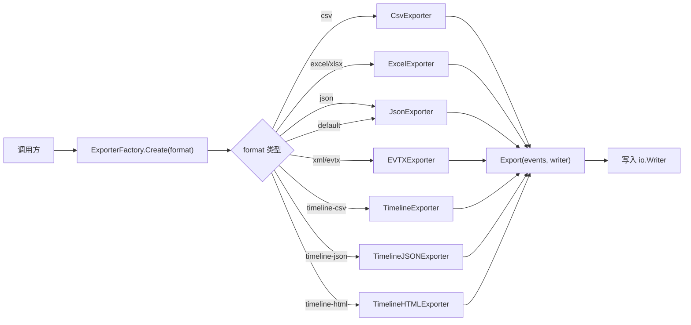

# 数据导出器模块 (Exporters)

## 概述

数据导出器模块将解析后的事件数据导出为多种格式,支持 JSON、CSV、Excel、EVTX 和时间线格式。模块采用工厂模式,通过 `ExporterFactory` 按需创建对应的导出器实例。

## 目录

- [核心接口](#核心接口)
- [ExporterFactory](#exporterfactory)
- [导出格式](#导出格式)
- [架构设计](#架构设计)

## 核心接口

```go
// internal/exporters/exporter.go
type Exporter interface {
    Export(events []*types.Event, writer io.Writer) error // 导出数据到写入器
    ContentType() string                                   // MIME 类型
    FileExtension() string                                 // 文件扩展名
}
```

### ExporterFactory

```go
type ExporterFactory struct{}

func (f *ExporterFactory) Create(format string) Exporter
```

工厂方法根据格式字符串创建对应的导出器:

| format | 导出器 | Content-Type | 扩展名 |
|--------|--------|-------------|--------|
| `csv` | `CsvExporter` | `text/csv` | `.csv` |
| `excel`, `xlsx` | `ExcelExporter` | `application/vnd.openxmlformats-officedocument.spreadsheetml.sheet` | `.xlsx` |
| `json` | `JsonExporter` | `application/json` | `.json` |
| `xml`, `evtx` | `EVTXExporter` | `application/xml` | `.evtx` |
| `timeline-csv` | `TimelineExporter` | `text/csv` | `.csv` |
| `timeline-json` | `TimelineJSONExporter` | `application/json` | `.json` |
| `timeline-html` | `TimelineHTMLExporter` | `text/html` | `.html` |
| 默认 | `JsonExporter` | `application/json` | `.json` |

## 导出格式

### JSON 导出器

```go
type JsonExporter struct {
    prettyPrint bool
}
```

- 支持格式化输出 (`prettyPrint`)
- 使用 `json.Encoder` 流式编码

### CSV 导出器

```go
type CsvExporter struct {
    delimiter rune
}
```

导出的 CSV 列:

| 列名 | 来源字段 |
|------|----------|
| ID | `event.ID` |
| Timestamp | `event.Timestamp` (RFC3339) |
| EventID | `event.EventID` |
| Level | `event.Level` |
| Source | `event.Source` |
| LogName | `event.LogName` |
| Computer | `event.Computer` |
| User | `event.User` |
| UserSID | `event.UserSID` |
| Message | `event.Message` |
| SessionID | `event.SessionID` |
| IPAddress | `event.IPAddress` |
| ImportTime | `event.ImportTime` (RFC3339) |

### Excel 导出器 (`excel.go`)

- 导出为 `.xlsx` 格式
- 使用 `github.com/xuri/excelize/v2` 库
- 包含表头样式和自动列宽

### EVTX 导出器 (`evtx.go`)

- 将事件导出回 EVTX 格式
- 用于事件数据的归档和交换

### 时间线导出器 (`timeline.go`)

提供三种时间线格式:

- `TimelineExporter` - CSV 格式时间线
- `TimelineJSONExporter` - JSON 格式时间线
- `TimelineHTMLExporter` - HTML 可视化时间线

### Alert 导出器 (`alert_exporter.go`)

- 专门用于导出告警数据
- 支持多种告警字段

## 架构设计



### 使用示例

```go
factory := &exporters.ExporterFactory{}
exp := factory.Create("csv")

file, _ := os.Create("output.csv")
defer file.Close()

err := exp.Export(events, file)
```
