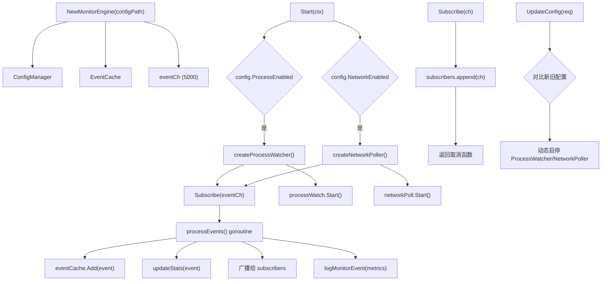

# 实时监控模块 (Monitor)

## 概述

实时监控模块提供 Windows 系统的进程和网络实时监控能力,通过订阅-发布模式将监控事件推送给消费者。模块支持动态配置、事件缓存和多订阅者管理。

## 目录

- [核心结构](#核心结构)
- [MonitorEngine](#monitorengine)
- [MonitorEvent](#monitorevent)
- [事件缓存 (EventCache)](#事件缓存)
- [配置管理 (ConfigManager)](#配置管理)
- [子模块](#子模块)
- [架构设计](#架构设计)

## 核心结构

```go
// internal/monitor/monitor.go (//go:build windows)
type MonitorEngine struct {
    mu           sync.RWMutex
    config       *ConfigManager
    eventCache   *EventCache
    subscribers  []chan *types.MonitorEvent
    ctx          context.Context
    cancel       context.CancelFunc
    processWatch interface { Start, Stop, Subscribe }
    networkPoll  interface { Start, Stop, Subscribe }
    isRunning    bool
    startTime    time.Time
    stats        *types.MonitorStats
    eventCh      chan *types.MonitorEvent  // 5000 容量
    metrics      *observability.MetricsLogger
    wg           sync.WaitGroup
}
```

## MonitorEngine

### 构造函数

```go
func NewMonitorEngine(configPath string) (*MonitorEngine, error)
```

- 创建 ConfigManager 和 EventCache (默认最大缓存)
- 初始化 5000 容量的事件通道

### 生命周期

#### Start

```go
func (e *MonitorEngine) Start(ctx context.Context) error
```

启动流程:

1. 创建 `context.WithCancel(ctx)`
2. 加载配置
3. 如果 `ProcessEnabled`: 创建 ProcessWatcher,订阅 eventCh,启动
4. 如果 `NetworkEnabled`: 创建 NetworkPoller,订阅 eventCh,启动
5. 启动 `processEvents()` goroutine 处理事件
6. 设置 `isRunning = true`

#### Stop

```go
func (e *MonitorEngine) Stop() error
```

关闭流程 (严格顺序):

1. 调用 `cancel()` 通知 goroutine 退出
2. `wg.Wait()` 等待 processEvents 完全退出
3. `close(e.eventCh)` 关闭事件通道
4. 停止 ProcessWatcher
5. 停止 NetworkPoller

### 事件处理

```go
func (e *MonitorEngine) processEvents() {
    for {
        select {
        case <-e.ctx.Done():
            return
        case event, ok := <-e.eventCh:
            if !ok { return }
            e.eventCache.Add(event)    // 添加到缓存
            e.updateStats(event)       // 更新统计
            
            // 广播给所有订阅者 (1 秒超时)
            for _, sub := range e.subscribers {
                select {
                case sub <- event:
                case <-time.After(1 * time.Second):
                    // 超时跳过
                }
            }
            e.logMonitorEvent(event)   // 记录到指标系统
        }
    }
}
```

### 配置热更新

```go
func (e *MonitorEngine) UpdateConfig(req *MonitorConfigRequest) error
```

支持运行时动态启用/禁用进程和网络监控:

- 启用进程监控: 创建新的 ProcessWatcher 并启动
- 禁用进程监控: 停止并清理 ProcessWatcher
- 启用网络监控: 创建新的 NetworkPoller 并启动
- 禁用网络监控: 停止并清理 NetworkPoller

### 订阅管理

```go
func (e *MonitorEngine) Subscribe(ch chan *types.MonitorEvent) func()
```

返回取消订阅函数,调用后自动从 subscribers 列表中移除并关闭 channel。

### 统计信息

```go
func (e *MonitorEngine) GetStats() *types.MonitorStats
func (e *MonitorEngine) GetEvents(filter *EventFilter) ([]*types.MonitorEvent, int64)
```

## MonitorEvent

```go
// internal/monitor/types/types.go
type EventType string

const (
    EventTypeProcess EventType = "process"
    EventTypeNetwork EventType = "network"
)

type Severity string

const (
    SeverityCritical Severity = "critical"
    SeverityHigh     Severity = "high"
    SeverityMedium   Severity = "medium"
    SeverityLow      Severity = "low"
    SeverityInfo     Severity = "info"
)

type MonitorEvent struct {
    ID        string                 `json:"id"`
    Type      EventType              `json:"type"`
    Timestamp time.Time              `json:"timestamp"`
    Severity  Severity               `json:"severity"`
    Data      map[string]interface{} `json:"data"`
}
```

### ProcessEventData

```go
type ProcessEventData struct {
    PID         uint32 `json:"pid"`
    PPID        uint32 `json:"ppid"`
    ProcessName string `json:"process_name"`
    Path        string `json:"path"`
    CommandLine string `json:"command_line"`
    User        string `json:"user"`
}
```

### NetworkEventData

```go
type NetworkEventData struct {
    Protocol    string `json:"protocol"`
    SourceIP    string `json:"source_ip"`
    SourcePort  uint16 `json:"source_port"`
    DestIP      string `json:"dest_ip"`
    DestPort    uint16 `json:"dest_port"`
    State       string `json:"state"`
    ProcessName string `json:"process_name"`
    PID         uint32 `json:"pid"`
}
```

### 检测指标

```go
var SuspiciousProcessIndicators = []string{
    "%TEMP%", "%TMP%", "%APPDATA%", "%LOCALAPPDATA%",
    "\\temp\\", "\\tmp\\", "\\downloads\\",
    ".ps1", ".vbs", ".js", ".exe",
    "mimikatz", "pwdump", "netcat", "psexec",
    "powershell.exe -enc", "cmd.exe /c",
}

var SuspiciousPorts = []uint16{4444, 5555, 6666, 6667, 31337}
var SuspiciousIPs = []string{"192.0.2.0/24", "198.51.100.0/24", "203.0.113.0/24"}
```

## 事件缓存

EventCache 用于缓存最近的事件,支持过滤查询:

- 内部使用滑动窗口存储最近事件
- 支持按类型、时间范围过滤
- 支持分页查询 (limit/offset)

## 配置管理

ConfigManager 管理监控配置:

- 从文件加载配置
- 支持 `MonitorConfigRequest` 部分更新
- 配置项: `ProcessEnabled`, `NetworkEnabled`, `PollInterval`

## 子模块

| 子模块 | 说明 |
|--------|------|
| `monitor/api/` | API 相关接口 |
| `monitor/poll/` | 网络轮询实现 |
| `monitor/wmi/` | WMI 查询实现 |
| `monitor/types/` | 类型定义 (MonitorEvent, Severity 等) |

## 架构设计


