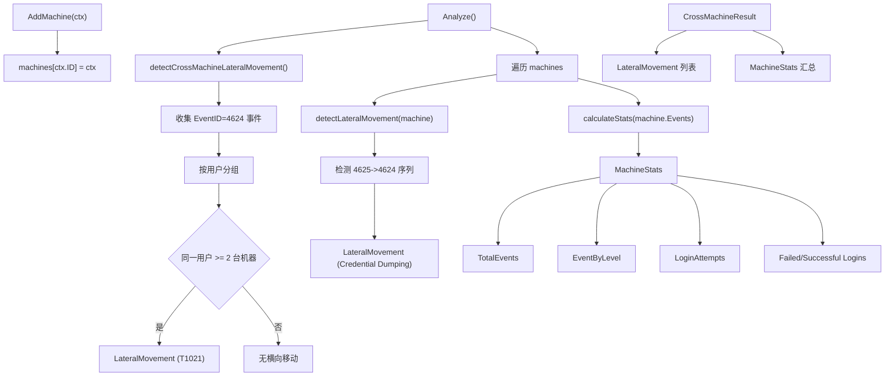

# 多机分析模块 (Multi)

## 概述

多机分析模块提供跨主机的安全事件关联分析,检测横向移动 (Lateral Movement) 和其他跨主机威胁。模块维护每台主机的上下文,通过用户登录行为识别可疑的跨主机访问。

## 目录

- [核心结构](#核心结构)
- [MultiMachineAnalyzer](#multimachineanalyzer)
- [横向移动检测](#横向移动检测)
- [统计信息](#统计信息)
- [架构设计](#架构设计)

## 核心结构

```go
// internal/multi/analyzer.go
type MultiMachineAnalyzer struct {
    db       *storage.DB
    machines map[string]*MultiMachineContext
    mu       sync.RWMutex
}
```

### MultiMachineContext

```go
type MultiMachineContext struct {
    ID        string         `json:"id"`
    Name      string         `json:"name"`
    IP        string         `json:"ip"`
    Role      string         `json:"role"`      // "DC", "Server", "Workstation"
    Events    []*types.Event `json:"events"`
    FirstSeen time.Time      `json:"first_seen"`
    LastSeen  time.Time      `json:"last_seen"`
}
```

### LateralMovement

```go
type LateralMovement struct {
    SourceMachine string         `json:"source_machine"`
    TargetMachine string         `json:"target_machine"`
    User          string         `json:"user"`
    Technique     string         `json:"technique"`
    Time          time.Time      `json:"time"`
    Evidence      []*types.Event `json:"evidence"`
}
```

### CrossMachineResult

```go
type CrossMachineResult struct {
    Machine         *MultiMachineContext `json:"machine"`
    LateralMovement []*LateralMovement   `json:"lateral_movement"`
    Statistics      *MachineStats        `json:"statistics"`
}
```

## MultiMachineAnalyzer

### 核心方法

| 方法 | 说明 |
|------|------|
| `NewMultiMachineAnalyzer(db)` | 创建分析器 |
| `AddMachine(ctx)` | 添加主机上下文 |
| `GetMachine(id)` | 获取指定主机 |
| `ListMachines()` | 列出所有主机 |
| `Analyze()` | 执行跨主机分析 |
| `DetectDC()` | 检测域控制器 |
| `DetectServers()` | 检测服务器 |
| `DetectWorkstations()` | 检测工作站 |

## 横向移动检测

### 跨主机横向移动 (detectCrossMachineLateralMovement)

检测逻辑:

1. 遍历所有主机的 EventID=4624 (登录成功) 事件
2. 按用户分组登录事件
3. 如果同一用户在 2 台或更多不同主机上登录,判定为横向移动

```go
func (a *MultiMachineAnalyzer) detectCrossMachineLateralMovement() []*LateralMovement {
    userLogins := make(map[string][]*UserLogin)
    
    // 收集所有主机的登录事件
    for _, machine := range a.machines {
        for _, event := range machine.Events {
            if event.EventID == 4624 {
                userLogins[user] = append(userLogins[user], &UserLogin{
                    Machine: machine.Name,
                    User:    user,
                    Time:    event.Timestamp,
                    Event:   event,
                })
            }
        }
    }
    
    // 检测跨主机登录
    for user, logins := range userLogins {
        machineSet := make(map[string]bool)
        for _, login := range logins {
            machineSet[login.Machine] = true
        }
        if len(machineSet) >= 2 {
            movements = append(movements, &LateralMovement{
                SourceMachine: logins[0].Machine,
                TargetMachine: logins[len(logins)-1].Machine,
                User:          user,
                Technique:     "T1021",  // Lateral Movement
                Evidence:      events,
            })
        }
    }
}
```

### 单机内横向移动 (detectLateralMovement)

检测同一主机上登录失败后立即登录成功的情况 (可能为凭据转储):

```go
func (a *MultiMachineAnalyzer) detectLateralMovement(machine *MultiMachineContext) []*LateralMovement {
    var prevEvent *types.Event
    for _, event := range machine.Events {
        if event.EventID == 4624 {
            if prevEvent != nil && prevEvent.EventID == 4625 {
                movements = append(movements, &LateralMovement{
                    SourceMachine: machine.Name,
                    TargetMachine: machine.Name,
                    Technique:     "Credential Dumping",
                    Evidence:      []*types.Event{prevEvent, event},
                })
            }
        }
        prevEvent = event
    }
}
```

## 统计信息

### MachineStats

```go
type MachineStats struct {
    TotalEvents      int64            `json:"total_events"`
    EventByLevel     map[string]int64 `json:"event_by_level"`
    TopEventIDs      map[int32]int64  `json:"top_event_ids"`
    LoginAttempts    int64            `json:"login_attempts"`
    FailedLogins     int64            `json:"failed_logins"`
    SuccessfulLogins int64            `json:"successful_logins"`
}
```

### calculateStats

统计每台机器的事件分布:

- 事件总数
- 按级别分布 (Critical/Error/Warning/Info/Verbose)
- 按 EventID 分布
- 登录尝试总数 (EventID 4624 + 4625)
- 成功登录数 (EventID 4624)
- 失败登录数 (EventID 4625)

### 主机角色检测

```go
func (a *MultiMachineAnalyzer) DetectDC() []*MultiMachineContext       // Role == "DC"
func (a *MultiMachineAnalyzer) DetectServers() []*MultiMachineContext  // Role == "Server"
func (a *MultiMachineAnalyzer) DetectWorkstations() []*MultiMachineContext  // Role == "Workstation"
```

## 架构设计


