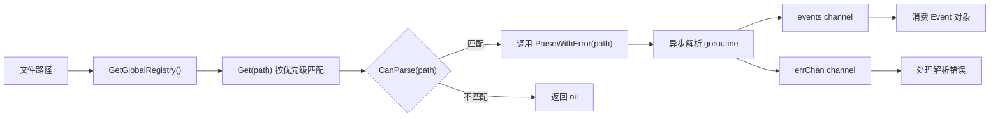

# 日志解析器模块 (Parsers)

## 概述

日志解析器模块负责将不同格式的 Windows 日志文件解析为统一的 `Event` 类型。模块采用插件化架构,通过 `Parser` 接口和 `ParserRegistry` 实现可扩展的解析器注册和匹配机制。

## 目录

- [核心接口](#核心接口)
- [ParserRegistry](#parserregistry)
- [子解析器](#子解析器)
- [工作流程](#工作流程)

## 核心接口

### Parser 接口

```go
// internal/parsers/parser.go
type ParseResult struct {
    Events  <-chan *types.Event
    ErrCh   <-chan error
    Error   error
}

type Parser interface {
    CanParse(path string) bool            // 判断是否能解析指定文件
    Parse(path string) <-chan *types.Event // 流式解析返回事件通道
    ParseWithError(path string) ParseResult // 带错误通道的解析
    ParseBatch(path string) ([]*types.Event, error) // 批量解析
    GetType() string                       // 返回解析器类型标识
    Priority() int                         // 优先级 (数值越高越优先)
}
```

### ParseResult

流式解析的结果容器,包含事件通道和错误通道,支持异步消费:

- `Events`: 事件通道,生产者逐个发送解析后的 `Event`
- `ErrCh`: 错误通道,解析过程中的异常
- `Error`: 同步错误 (用于 `ParseBatch`)

## ParserRegistry

### 数据结构

```go
type ParserRegistry struct {
    mu       sync.RWMutex
    parsers  map[string]Parser  // 按类型索引
    priority []Parser           // 按优先级排序的切片
}
```

### 核心方法

| 方法 | 说明 |
|------|------|
| `NewParserRegistry()` | 创建新的注册表实例 |
| `GetGlobalRegistry()` | 获取全局单例注册表 (sync.Once 懒加载) |
| `Register(p Parser)` | 注册解析器,自动重建优先级排序 |
| `Get(path string) Parser` | 根据文件路径匹配最合适的解析器 |
| `GetByType(parserType string) Parser` | 按类型获取解析器 |
| `List() []Parser` | 列出所有已注册解析器 |
| `ListTypes() []string` | 列出所有解析器类型 |

### 匹配机制

`Get(path)` 方法按优先级从高到低遍历所有解析器,调用 `CanParse(path)` 进行匹配,返回第一个匹配的解析器:

```go
func (r *ParserRegistry) Get(path string) Parser {
    r.mu.RLock()
    defer r.mu.RUnlock()
    for _, p := range r.priority {
        if p.CanParse(path) {
            return p
        }
    }
    return nil
}
```

### 优先级排序

注册解析器时调用 `rebuildPriority()`,按 `Priority()` 返回值降序排列:

```go
func (r *ParserRegistry) rebuildPriority() {
    r.priority = make([]Parser, 0, len(r.parsers))
    for _, p := range r.parsers {
        r.priority = append(r.priority, p)
    }
    sort.Slice(r.priority, func(i, j int) bool {
        return r.priority[i].Priority() > r.priority[j].Priority()
    })
}
```

## 子解析器

### 1. EVTX 解析器 (`parsers/evtx/`)

```go
type EvtxParser struct{}
```

| 属性 | 值 |
|------|-----|
| 文件扩展名 | `.evtx` |
| 优先级 | 90 |
| 类型标识 | `evtx` |
| 依赖库 | `github.com/0xrawsec/golang-evtx/evtx` |

- 使用 `golang-evtx` 库解析 Windows Event Log 二进制格式
- 通过 `init()` 自动注册到全局注册表

### 2. ETL 解析器 (`parsers/etl/`)

```go
type EtlParser struct{}
```

| 属性 | 值 |
|------|-----|
| 文件扩展名 | `.etl` |
| 优先级 | 80 |
| 类型标识 | `etl` |

- 解析 Windows Event Trace Log 格式
- 使用二进制解析和 JSON 转换

### 3. CSV 解析器 (`parsers/csv/`)

```go
type CsvParser struct {
    Delimiter string
    HasHeader bool
    Columns   []string
}
```

| 属性 | 值 |
|------|-----|
| 文件扩展名 | `.csv`, `.log`(内容嗅探), `.txt`(内容嗅探) |
| 优先级 | 50 |
| 类型标识 | `csv` |
| 默认分隔符 | `,` |

- 支持自定义分隔符
- 支持头部行识别
- 对 `.log`/`.txt` 文件进行内容嗅探确认是否为 CSV 格式

### 4. IIS 解析器 (`parsers/iis/`)

```go
type IISParser struct{}
```

| 属性 | 值 |
|------|-----|
| 文件匹配 | 文件名包含 `u_ex` 或路径包含 `W3SVC` |
| 优先级 | 60 |
| 类型标识 | `iis` |

- 解析 IIS W3C 扩展日志格式
- 处理 IIS 日志的字段头和注释行

### 5. Sysmon 解析器 (`parsers/sysmon/`)

```go
type SysmonParser struct{}
```

| 属性 | 值 |
|------|-----|
| 文件匹配 | 文件名包含 `sysmon` 或 `microsoft-windows-sysmon` |
| 优先级 | 70 |
| 类型标识 | `sysmon` |
| 缓冲区大小 | 1000 |

- 解析 Sysmon XML 格式日志
- 提取 Sysmon 特有的字段 (ProcessId, CommandLine, Hashes 等)

## 工作流程



### 注册流程

每个子解析器通过 `init()` 函数自动注册:

```go
func init() {
    parsers.GetGlobalRegistry().Register(NewEvtxParser())
}
```

### 解析流程

1. 调用 `GetGlobalRegistry().Get(filePath)` 获取匹配解析器
2. 调用 `ParseWithError(path)` 启动异步解析
3. 从 `Events` channel 消费 `*types.Event`
4. 从 `ErrCh` channel 接收错误

## 优先级排序

| 优先级 | 解析器 | 说明 |
|--------|--------|------|
| 90 | EVTX | Windows 事件日志二进制格式,最精确匹配 |
| 80 | ETL | 事件跟踪日志 |
| 70 | Sysmon | Sysmon 专用 XML 日志 |
| 60 | IIS | IIS W3C 日志 |
| 50 | CSV | 通用 CSV 格式,最低优先级 |
