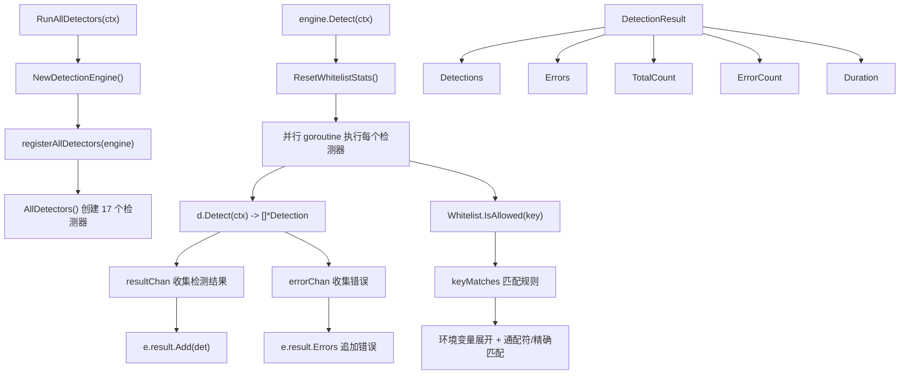

# 持久化检测模块 (Persistence)

## 概述

持久化检测模块扫描 Windows 系统中的 30+ 种持久化技术,检测恶意软件用于在系统重启后保持存活的机制。模块使用插件化架构,每个检测器对应一个 MITRE ATT&CK 技术。

## 目录

- [核心接口](#核心接口)
- [DetectionEngine](#detectionengine)
- [内置检测器](#内置检测器)
- [Whitelist](#whitelist)
- [技术覆盖](#技术覆盖)
- [架构设计](#架构设计)

## 核心接口

### Detector

```go
// internal/persistence/detector.go (//go:build windows)
type Detector interface {
    Name() string
    Detect(ctx context.Context) ([]*Detection, error)
    RequiresAdmin() bool
    GetTechnique() Technique
}
```

### ConfigurableDetector

支持配置的检测器:

```go
type ConfigurableDetector interface {
    Detector
    SetConfig(config *DetectorConfig) error
    GetConfig() *DetectorConfig
}
```

### DetectorConfig

```go
type DetectorConfig struct {
    Enabled               bool     `json:"enabled"`
    EventIDs              []int32  `json:"event_ids"`
    Paths                 []string `json:"paths,omitempty"`
    Patterns              []string `json:"patterns,omitempty"`
    Whitelist             []string `json:"whitelist,omitempty"`
    BuiltinWhitelist      []string `json:"builtin_whitelist,omitempty"`
    BuiltinDllWhitelist   []string `json:"builtin_dll_whitelist,omitempty"`
    BuiltinClsidsWhitelist []string `json:"builtin_clsids_whitelist,omitempty"`
}
```

## DetectionEngine

### 核心方法

| 方法 | 说明 |
|------|------|
| `NewDetectionEngine()` | 创建检测引擎 |
| `Register(d Detector)` | 注册单个检测器 |
| `RegisterAll(detectors)` | 批量注册检测器 |
| `Detect(ctx)` | 并行执行所有检测器 |
| `DetectCategory(ctx, category)` | 按类别检测 |
| `DetectTechnique(ctx, technique)` | 按技术检测 |
| `ListDetectors()` | 列出所有检测器信息 |
| `SetDetectorConfig(name, config)` | 设置检测器配置 |
| `GetDetectorConfig(name)` | 获取检测器配置 |
| `IsDetectorEnabled(name)` | 检查检测器是否启用 |
| `RequiresAdmin()` | 是否有检测器需要管理员权限 |
| `GetResult()` | 获取上次检测结果 |

### Detect 并行执行

使用 goroutine 并发执行所有检测器,通过 channel 收集结果:

```go
func (e *DetectionEngine) Detect(ctx context.Context) *DetectionResult {
    ResetWhitelistStats()
    e.result = NewDetectionResult()
    
    var wg sync.WaitGroup
    resultChan := make(chan *Detection, 100)
    errorChan := make(chan string, 10)
    
    for name, d := range detectors {
        wg.Add(1)
        go func(name string, d Detector) {
            defer func() {
                if r := recover(); r != nil {
                    errorChan <- fmt.Sprintf("%s: panic: %v", name, r)
                }
                wg.Done()
            }()
            detections, err := d.Detect(ctx)
            // 发送结果到 channel...
        }(name, d)
    }
    // 等待完成,收集结果...
}
```

### 便捷函数

| 函数 | 说明 |
|------|------|
| `RunAllDetectors(ctx)` | 创建引擎,注册所有检测器,执行检测 |
| `DetectByCategory(ctx, category)` | 按类别检测 |
| `DetectByTechnique(ctx, technique)` | 按技术检测 |
| `AllDetectors()` | 返回所有内置检测器实例 |

## 内置检测器

通过 `AllDetectors()` 注册的所有检测器:

| 检测器 | 对应技术 | 说明 |
|--------|---------|------|
| `RunKeyDetector` | T1547.001 | 注册表 Run 键检测 |
| `UserInitDetector` | T1547.001 | UserInit 键检测 |
| `StartupFolderDetector` | T1547.001 | 启动文件夹检测 |
| `AccessibilityDetector` | T1546.008 | 辅助功能劫持 (sethc.exe, utilman.exe) |
| `COMHijackDetector` | T1546.015 | COM 劫持 |
| `IFEODetector` | T1546.012 | 映像劫持 (IFEO) |
| `AppInitDetector` | T1546.010 | AppInit DLLs |
| `WMIPersistenceDetector` | T1546.003 | WMI 持久化 |
| `ServicePersistenceDetector` | T1543.003 | 恶意服务 |
| `LSAPersistenceDetector` | T1547.004 | LSA 安全包 |
| `WinsockDetector` | T1547.007 | Winsock LSP |
| `BHODetector` | T1546.005 | 浏览器帮助对象 |
| `PrintMonitorDetector` | T1547.008 | 打印监视器 |
| `BootExecuteDetector` | T1547.005 | 启动执行 |
| `ETWDetector` | T1546.014 | ETW 持久化 |
| `ScheduledTaskDetector` | T1053.005 | 计划任务 |
| `AppCertDllsDetector` | T1547.006 | AppCert DLLs |

## Whitelist

白名单系统用于过滤已知安全的系统程序和注册表项,减少误报。

### WhitelistType

```go
type WhitelistType int

const (
    WhitelistTypeRunKey WhitelistType = iota  // Run 键
    WhitelistTypeService                       // 服务
    WhitelistTypeBHO                           // BHO
    WhitelistTypePrintMonitor                  // 打印监视器
    WhitelistTypeWinsock                       // Winsock
    WhitelistTypeLSA                           // LSA
    WhitelistTypeBootExecute                   // 启动执行
    WhitelistTypeAppInit                       // AppInit DLLs
    WhitelistTypeAccessibility                 // 辅助功能
    WhitelistTypeCOM                           // COM
    WhitelistTypeWMI                           // WMI
    WhitelistTypeScheduledTask                 // 计划任务
    WhitelistTypeIFEO                          // IFEO
    WhitelistTypeETW                           // ETW
    WhitelistTypeAppCert                       // AppCert DLLs
)
```

### 核心方法

| 方法 | 说明 |
|------|------|
| `GlobalWhitelist.IsAllowed(key)` | 检查键是否在白名单中 |
| `GlobalWhitelist.IsAllowedByType(key, wtype)` | 按类型检查 |
| `GlobalWhitelist.Add(key, wtype, reason, source)` | 添加白名单项 |
| `GlobalWhitelist.LoadDefaults()` | 加载默认白名单 (懒加载) |

### 匹配规则

```go
func (w *Whitelist) keyMatches(input, pattern string) bool {
    // 环境变量展开
    inputExpanded := os.ExpandEnv(input)
    patternExpanded := os.ExpandEnv(pattern)
    
    // 通配符匹配 (* 后缀)
    if strings.Contains(pattern, "*") {
        prefix := strings.TrimSuffix(patternLower, "*")
        return strings.HasPrefix(inputLower, prefix)
    }
    // 精确匹配
    return inputLower == patternLower
}
```

### 内置白名单覆盖

| 类别 | 示例 |
|------|------|
| Run 键 | Windows Defender, SecurityHealth, IME, Adobe, Google*, Intel*, NVIDIA*, OneDrive, Teams... |
| 服务 | WinDefend, EventLog, RpcSs, lsass, spooler, BITS, W32Time, Dnscache, Hyper-V*... |
| BHO | Windows Update, Microsoft Office CLSIDs |
| 打印监视器 | Local Port, Standard TCP/IP Port, Microsoft Print to PDF |
| Winsock | mswsock.dll, wshtcpip.dll |
| LSA | msv1_0, kerberos, ntlmssp, wdigest, schannel |
| 启动执行 | sysmenu, userinit, wininit, smss, csrss, lsass |
| 辅助功能 | sethc.exe, utilman.exe, osk.exe, magnify.exe |
| 计划任务 | Microsoft\Windows\* 所有官方任务 |

### 统计信息

```go
type WhitelistStats struct {
    CheckCount   int64  // 检查次数
    MatchCount   int64  // 匹配次数
    TotalEntries int    // 白名单条目总数
}
```

通过 `GetWhitelistStats()` 和 `ResetWhitelistStats()` 管理。

## 技术覆盖

覆盖的 MITRE ATT&CK 技术:

| 战术 | 技术 | 检测器 |
|------|------|--------|
| Persistence | T1547.001 (Run Keys) | RunKeyDetector, UserInitDetector |
| Persistence | T1547.005 (Boot Execute) | BootExecuteDetector |
| Persistence | T1547.004 (LSA Providers) | LSAPersistenceDetector |
| Persistence | T1547.007 (Winsock LSP) | WinsockDetector |
| Persistence | T1543.003 (Services) | ServicePersistenceDetector |
| Persistence | T1053.005 (Scheduled Tasks) | ScheduledTaskDetector |
| Persistence | T1546.003 (WMI Event) | WMIPersistenceDetector |
| Persistence | T1546.015 (COM Hijack) | COMHijackDetector |
| Persistence | T1546.012 (IFEO) | IFEODetector |
| Persistence | T1546.010 (AppInit DLLs) | AppInitDetector |
| Persistence | T1546.008 (Accessibility) | AccessibilityDetector |
| Persistence | T1546.005 (BHO) | BHODetector |
| Persistence | T1547.008 (Print Monitor) | PrintMonitorDetector |
| Persistence | T1546.014 (ETW) | ETWDetector |
| Persistence | T1547.006 (AppCert DLLs) | AppCertDllsDetector |
| Persistence | T1547.001 (Startup Folder) | StartupFolderDetector |

## 架构设计


