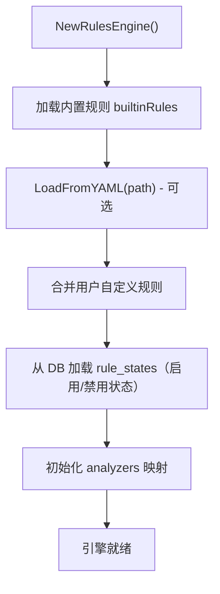

# 规则引擎 (rules)

规则引擎定义了安全检测规则的结构、加载、注册和评估逻辑，是告警系统的数据基础。

## 目录

- [文件结构](#文件结构)
- [核心数据结构](#核心数据结构)
- [规则结构详解](#规则结构详解)
- [内置规则注册](#内置规则注册)
- [规则加载流程](#规则加载流程)
- [规则评估机制](#规则评估机制)
- [规则状态管理](#规则状态管理)

## 文件结构

| 文件 | 说明 |
|------|------|
| `rule.go` | AlertRule、Filter、Condition 结构体定义 |
| `filter.go` | 过滤逻辑：Match()、条件匹配 |
| `loader.go` | 从 YAML 加载规则 |
| `engine.go` | RulesEngine：规则管理、评估、状态切换 |
| `builtin/definitions.go` | 内置规则定义 |
| `builtin/brute_force.go` | 暴力破解规则 |
| `builtin/login.go` | 登录异常规则 |
| `builtin/kerberos.go` | Kerberos 异常规则 |
| `builtin/powershell.go` | PowerShell 可疑规则 |
| `builtin/lateral_movement.go` | 横向移动规则 |
| `builtin/persistence.go` | 持久化规则 |
| `builtin/privilege_escalation.go` | 权限提升规则 |
| `builtin/data_exfiltration.go` | 数据外泄规则 |
| `builtin/domain_controller.go` | 域控安全规则 |

## 核心数据结构

### AlertRule 结构体

```go
type AlertRule struct {
    ID            string                 `yaml:"id"`
    Name          string                 `yaml:"name"`
    Title         string                 `yaml:"title"`
    Description   string                 `yaml:"description"`
    Severity      string                 `yaml:"severity"`
    Confidence    int                    `yaml:"confidence"`
    MITRETactic   string                 `yaml:"mitre_tactic"`
    MITRETechnique string               `yaml:"mitre_technique"`
    MITREMITRE   string                 `yaml:"mitre_mitre"`
    Threshold     int                    `yaml:"threshold"`
    TimeWindow    time.Duration          `yaml:"time_window"`
    Aggregation   string                 `yaml:"aggregation"`
    Explanation   string                 `yaml:"explanation"`
    Recommendation string              `yaml:"recommendation"`
    RealCase      string                 `yaml:"real_case"`
    Filters       []*Filter              `yaml:"filters,omitempty"`
    Conditions    []*Condition           `yaml:"conditions,omitempty"`
    Enabled       bool                   `yaml:"enabled"`
}
```

### Filter 结构体

```go
type Filter struct {
    Field    string   `yaml:"field"`
    Operator string   `yaml:"operator"`
    Value    string   `yaml:"value"`
    Values   []string `yaml:"values"`
}
```

### Condition 结构体

```go
type Condition struct {
    Field    string   `yaml:"field"`
    Operator string   `yaml:"operator"`
    Value    string   `yaml:"value"`
    Values   []string `yaml:"values"`
}
```

### RuleStats 结构体

```go
type RuleStats struct {
    Name         string    `json:"name"`
    Title        string    `json:"title"`
    Enabled      bool      `json:"enabled"`
    TriggeredCount int64   `json:"triggered_count"`
    LastTriggered *time.Time `json:"last_triggered"`
}
```

## 规则结构详解

### 严重级别

| 级别 | 说明 | 示例规则 |
|------|------|----------|
| `Critical` | 严重威胁，需要立即响应 | 域管权限获取、Kerberos Golden Ticket |
| `High` | 高风险，需要快速调查 | 暴力破解成功、横向移动 |
| `Medium` | 中等风险，值得关注 | 可疑 PowerShell 命令、异常登录 |
| `Low` | 低风险，信息性 | 密码策略变更、账号解锁 |
| `Info` | 纯信息记录 | 账号锁定、登录成功 |

### 聚合模式

| 模式 | 说明 |
|------|------|
| `count` | 统计匹配事件数量 |
| `unique_user` | 按用户去重计数 |
| `unique_computer` | 按计算机去重计数 |
| `unique_source` | 按源 IP 去重计数 |

### 过滤运算符

| 运算符 | 说明 | 示例 |
|--------|------|------|
| `equals` | 精确匹配 | `field: "level", operator: "equals", value: "Error"` |
| `contains` | 字符串包含 | `field: "message", operator: "contains", value: "failed"` |
| `in` | 多值匹配 | `field: "event_id", operator: "in", values: ["4625", "4771"]` |
| `regex` | 正则匹配 | `field: "message", operator: "regex", value: ".*anonymous.*"` |
| `gt` | 大于 | `field: "count", operator: "gt", value: "10"` |
| `lt` | 小于 | - |
| `gte` | 大于等于 | - |
| `lte` | 小于等于 | - |

## 内置规则注册

### 规则注册表

```go
var builtinRules = map[string]*AlertRule{}

func RegisterRule(rule *AlertRule) {
    builtinRules[rule.Name] = rule
}

func GetBuiltinRules() []*AlertRule {
    rules := make([]*AlertRule, 0, len(builtinRules))
    for _, rule := range builtinRules {
        rules = append(rules, rule)
    }
    return rules
}
```

### 各模块内置规则

| 文件 | 规则名称 | 监控事件 |
|------|----------|----------|
| `brute_force.go` | `brute_force_rdp` | 4625, 4771, 4776 |
| `brute_force.go` | `brute_force_ntlm` | 4625, 4771 |
| `login.go` | `suspicious_login_time` | 4624 |
| `login.go` | `login_after_hours` | 4624 |
| `kerberos.go` | `kerberoasting` | 4769 |
| `kerberos.go` | `as_rep_roasting` | 4768 |
| `kerberos.go` | `golden_ticket` | 4769 |
| `powershell.go` | `suspicious_powershell` | 4104 |
| `powershell.go` | `encoded_command` | 4104 |
| `lateral_movement.go` | `wmi_execution` | 5857, 5860, 5861 |
| `lateral_movement.go` | `psexec_execution` | 7036, 7045 |
| `persistence.go` | `scheduled_task_created` | 4698 |
| `persistence.go` | `registry_persistence` | 4657 |
| `privilege_escalation.go` | `token_manipulation` | 4674, 4672 |
| `privilege_escalation.go` | `uac_bypass` | 4674 |
| `data_exfiltration.go` | `large_file_copy` | 5145 |
| `data_exfiltration.go` | `usb_device` | 6416, 6417 |
| `domain_controller.go` | `dc_shadow_sync` | 4933, 4934 |
| `domain_controller.go` | `dcsync_attack` | 4662 |

## 规则加载流程



### RulesEngine 结构体

```go
type Engine struct {
    rules   map[string]*AlertRule
    analyzers map[string]analyzers.Analyzer
    db      *storage.DB
    mu      sync.RWMutex
}

func NewRulesEngine(db *storage.DB) *Engine {
    engine := &Engine{
        rules:     make(map[string]*AlertRule),
        analyzers: make(map[string]analyzers.Analyzer),
        db:        db,
    }
    engine.loadBuiltinRules()
    engine.loadRuleStates()
    return engine
}
```

### 从 YAML 加载

```go
func (e *Engine) LoadFromYAML(path string) error {
    data, err := os.ReadFile(path)
    if err != nil {
        return err
    }

    var rules []*AlertRule
    if err := yaml.Unmarshal(data, &rules); err != nil {
        return err
    }

    e.mu.Lock()
    defer e.mu.Unlock()
    for _, rule := range rules {
        e.rules[rule.Name] = rule
    }
    return nil
}
```

## 规则评估机制

### Evaluate 方法

```go
func (e *Engine) Evaluate(events []*types.Event) []*analyzers.Result {
    e.mu.RLock()
    defer e.mu.RUnlock()

    var results []*analyzers.Result

    for _, rule := range e.rules {
        if !rule.Enabled {
            continue
        }

        // 过滤事件
        matched := e.filterEvents(events, rule.Filters)
        if len(matched) == 0 {
            continue
        }

        // 检查条件
        if !e.checkConditions(matched, rule.Conditions) {
            continue
        }

        // 聚合统计
        count := e.aggregate(matched, rule.Aggregation)
        if count >= rule.Threshold {
            results = append(results, &analyzers.Result{
                RuleName: rule.Name,
                Findings: []*types.Finding{{
                    Count:  count,
                    Events: matched,
                }},
            })
        }
    }

    return results
}
```

## 规则状态管理

### 启用/禁用

```go
func (e *Engine) DisableRule(name string) error {
    e.mu.Lock()
    defer e.mu.Unlock()

    rule, exists := e.rules[name]
    if !exists {
        return fmt.Errorf("rule not found: %s", name)
    }

    rule.Enabled = false
    return e.saveRuleState(name, false)
}

func (e *Engine) EnableRule(name string) error {
    e.mu.Lock()
    defer e.mu.Unlock()

    rule, exists := e.rules[name]
    if !exists {
        return fmt.Errorf("rule not found: %s", name)
    }

    rule.Enabled = true
    return e.saveRuleState(name, true)
}
```

### 持久化

规则状态存储在 `rule_states` 表中：

```sql
CREATE TABLE rule_states (
    rule_name TEXT PRIMARY KEY,
    enabled   BOOLEAN NOT NULL DEFAULT 1
);
```
