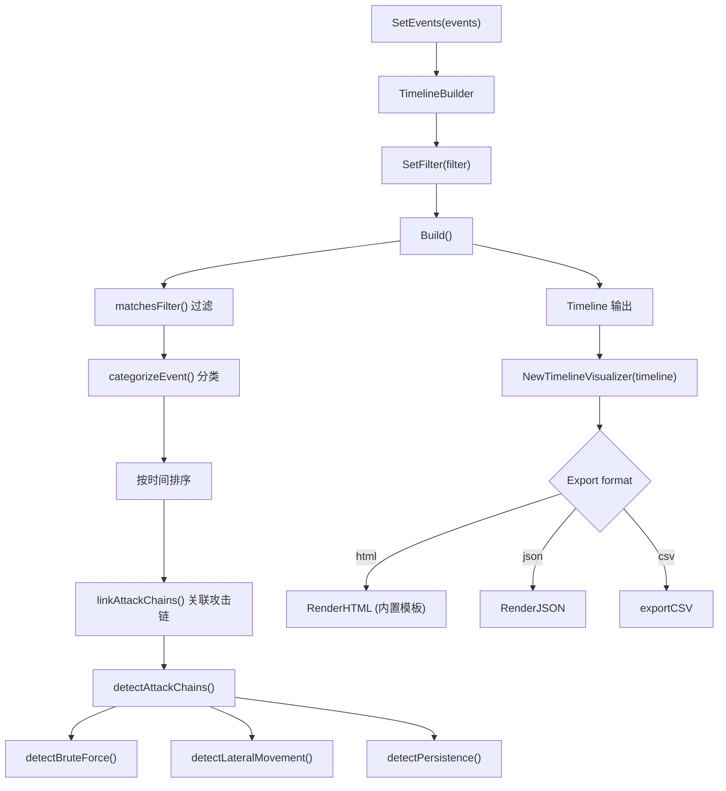

# 时间线分析模块 (Timeline)

## 概述

时间线分析模块将 Windows 事件日志按时间顺序组织,按事件类型分类,并自动检测攻击链 (暴力破解、横向移动、持久化机制)。模块提供 HTML/JSON/CSV 三种输出格式和交互式可视化能力。

## 目录

- [核心结构](#核心结构)
- [TimelineBuilder](#timelinebuilder)
- [事件分类](#事件分类)
- [攻击链检测](#攻击链检测)
- [TimelineVisualizer](#timelinevisualizer)
- [架构设计](#架构设计)

## 核心结构

### TimelineBuilder

```go
// internal/timeline/builder.go
type TimelineBuilder struct {
    events       []*types.Event
    filter       *TimelineFilter
    attackChains []*AttackChain
    categories   map[string][]*types.Event
}
```

### TimelineFilter

```go
type TimelineFilter struct {
    StartTime  time.Time
    EndTime    time.Time
    EventIDs   map[int32]bool
    Levels     map[types.EventLevel]bool
    LogNames   map[string]bool
    Sources    map[string]bool
    Computers  map[string]bool
    Users      map[string]bool
    Keywords   string
    MITREIDs   []string
    IncludeRaw bool
}
```

### TimelineEntry

时间线条目:

```go
type TimelineEntry struct {
    ID          int64     `json:"id"`
    Timestamp   time.Time `json:"timestamp"`
    EventID     int32     `json:"event_id"`
    Level       string    `json:"level"`
    Category    string    `json:"category"`
    Source      string    `json:"source"`
    LogName     string    `json:"log_name"`
    Computer    string    `json:"computer"`
    User        string    `json:"user,omitempty"`
    Message     string    `json:"message"`
    MITREAttack []string  `json:"mitre_attack,omitempty"`
    AttackChain string    `json:"attack_chain,omitempty"`
    RawXML      string    `json:"raw_xml,omitempty"`
}
```

### Timeline

完整时间线:

```go
type Timeline struct {
    Entries    []*TimelineEntry `json:"entries"`
    TotalCount int              `json:"total_count"`
    StartTime  time.Time        `json:"start_time"`
    EndTime    time.Time        `json:"end_time"`
    Duration   time.Duration    `json:"duration"`
}
```

## TimelineBuilder

### 核心方法

| 方法 | 说明 |
|------|------|
| `NewTimelineBuilder()` | 创建时间线构建器 |
| `SetEvents(events)` | 设置事件列表 |
| `SetFilter(filter)` | 设置过滤条件 |
| `Build()` | 构建时间线 (过滤、分类、排序、关联攻击链) |
| `GroupByComputer()` | 按计算机分组时间线 |
| `GroupByCategory()` | 按类别分组时间线 |
| `GetAttackChains()` | 获取检测到的攻击链 |

### Build 流程

1. 遍历事件,应用 `TimelineFilter` 过滤
2. 为每个事件生成 `TimelineEntry`,调用 `categorizeEvent()` 分类
3. 按时间戳排序
4. 调用 `linkAttackChains()` 关联攻击链,标记 `AttackChain` 和 `MITREAttack` 字段

### matchesFilter

支持多维度过滤:

- 时间范围 (StartTime/EndTime)
- EventID 白名单
- 级别 (Levels)
- 日志名称 (LogNames)
- 来源 (Sources)
- 计算机 (Computers)
- 用户 (Users)

## 事件分类

### 分类常量

```go
const (
    CategoryAuthentication Category = "Authentication"
    CategoryAuthorization  Category = "Authorization"
    CategoryProcess        Category = "Process"
    CategoryNetwork        Category = "Network"
    CategoryFile           Category = "File"
    CategoryRegistry       Category = "Registry"
    CategoryScheduledTask  Category = "Scheduled Task"
    CategoryService        Category = "Service"
    CategoryPowerShell     Category = "PowerShell"
    CategoryRemoteAccess   Category = "Remote Access"
    CategoryAccount        Category = "Account"
    CategoryUnknown        Category = "Unknown"
)
```

### EventID 到分类的映射

| 分类 | 关键 EventID |
|------|-------------|
| Authentication | 4624, 4625, 4634, 4647, 4648, 4670, 4768, 4769, 4776 |
| Authorization | 4672, 4673, 4674, 4702 |
| Process | 4688, 4689, 4696, 4697 |
| Network | 3, 4000, 4001, 4002, 5156, 5157, 5158, 5159 |
| File | 4656, 4658, 4663, 4664 |
| Registry | 4657, 4660 |
| Scheduled Task | 4698, 4699, 4700, 4701, 4702 |
| Service | 4697, 7000, 7001, 7002, 7009 |
| PowerShell | 400, 600, 800, 4100, 4103, 4104 |
| Remote Access | 4624, 4625, 4648, 4672 |
| Account | 4720, 4721, 4722, 4723, 4724, 4725, 4726, 4738, 4740, 4767, 4768, 4769 |

## 攻击链检测

### AttackChain

```go
type AttackChain struct {
    ID          string         `json:"id"`
    Name        string         `json:"name"`
    Description string         `json:"description"`
    Technique   string         `json:"technique"`
    Tactic      string         `json:"tactic"`
    Severity    string         `json:"severity"`
    Events      []*types.Event `json:"events"`
    StartTime   time.Time      `json:"start_time"`
    EndTime     time.Time      `json:"end_time"`
    Duration    time.Duration  `json:"duration"`
}
```

### AttackChainConfig

```go
type AttackChainConfig struct {
    BruteForceThreshold      int           // 默认 10
    LateralMovementThreshold int           // 默认 3
    PersistenceThreshold     int           // 默认 1
    TimeWindow               time.Duration // 默认 24h
}
```

### 检测方法

#### 1. 暴力破解 (T1110 - Credential Access)

- 检测条件: 时间窗口内 EventID=4625 (登录失败) >= BruteForceThreshold
- 严重性: high

#### 2. 横向移动 (T1021 - Lateral Movement)

- 检测条件: 时间窗口内 EventID=4624/4648 且 LogonType=3/10 (远程登录) >= LateralMovementThreshold
- 严重性: high

#### 3. 持久化机制 (T1053 - Persistence)

- 检测条件: EventID=4698 (创建计划任务) 或 4702 (计划任务修改) >= PersistenceThreshold
- 严重性: medium

## TimelineVisualizer

可视化时间线数据,支持 HTML/JSON/CSV 输出。

### 核心结构

```go
type TimelineVisualizer struct {
    timeline *Timeline
    config   *VisualizerConfig
}

type VisualizerConfig struct {
    Width           int
    Height          int
    TimeWindow      time.Duration
    ZoomLevel       float64
    ShowMITRELabels bool
    ShowThumbnails  bool
    Theme           string
}
```

### 输出格式

```go
type VisualizerOutput struct {
    HTML    string
    JSON    string
    Summary VisualizerSummary
}

type VisualizerSummary struct {
    TotalEntries   int            `json:"total_entries"`
    ByCategory     map[string]int `json:"by_category"`
    ByLevel        map[string]int `json:"by_level"`
    AttackChains   int            `json:"attack_chains"`
    TimeRangeHours float64        `json:"time_range_hours"`
    ZoomLevel      float64        `json:"zoom_level"`
}
```

### 核心方法

| 方法 | 说明 |
|------|------|
| `NewTimelineVisualizer(timeline)` | 创建可视化器 (默认 1200x400, dark 主题) |
| `RenderHTML(w)` | 渲染 HTML 交互式时间线 |
| `RenderJSON()` | 输出 JSON 格式 |
| `GenerateOutput()` | 生成包含 Summary 的完整输出 |
| `GetSummary()` | 获取统计摘要 |
| `FilterByTimeRange(start, end)` | 按时间范围过滤并返回新可视化器 |
| `FilterByCategory(category)` | 按类别过滤 |
| `FilterByLevel(level)` | 按级别过滤 |
| `Zoom(factor)` | 缩放 |
| `Export(format, w)` | 导出 (html/json/csv) |

### HTML 可视化

内置 HTML 模板 (`DefaultVisualizerConfig`) 包含:

- Canvas 绘制时间轴
- 按级别着色的事件点 (Critical/Error/Warning/Info/Verbose)
- 按类别着色的标签 (Authentication/Process/Network/Registry 等)
- 攻击链连线标记
- 控制面板 (缩放、时间窗口、类别过滤、MITRE 标签)
- 统计面板 (总数、按级别、按类别)
- 事件详情弹窗

## 架构设计


