# 用户实体行为分析模块 (UEBA)

## 概述

UEBA (User and Entity Behavior Analytics) 模块通过分析用户行为模式建立基线,检测异常行为,包括不可能的旅行、异常时间段活动、新登录地点和权限提升等威胁。

## 目录

- [核心组件](#核心组件)
- [Engine](#engine)
- [BaselineManager](#baselinemanager)
- [异常检测](#异常检测)
- [基线持久化](#基线持久化)
- [架构设计](#架构设计)

## 核心组件

```go
// internal/ueba/engine.go
type Engine struct {
    baseline *BaselineManager
    config   *EngineConfig
}

type EngineConfig struct {
    LearningWindow               time.Duration
    AlertThreshold               float64
    MinEventsForBaseline         int
    PrivilegeEscalationThreshold int  // 默认 5
}
```

## Engine

### 核心方法

| 方法 | 说明 |
|------|------|
| `NewEngine(cfg)` | 创建 UEBA 引擎 |
| `Learn(events)` | 从事件中学习,更新用户基线 |
| `DetectAnomalies(events)` | 检测所有类型异常 |
| `GetUserActivity()` | 获取所有用户基线 |
| `Clear()` | 清空所有基线 |

### 检测流程

```go
func (e *Engine) DetectAnomalies(events []*types.Event) []*AnomalyResult {
    results := make([]*AnomalyResult, 0)
    results = append(results, e.detectImpossibleTravel(events)...)
    results = append(results, e.detectAbnormalBehavior(events)...)
    results = append(results, e.detectUnusualHours(events)...)
    results = append(results, e.detectPrivilegeEscalation(events)...)
    return results
}
```

## AnomalyResult

异常检测结果:

```go
type AnomalyResult struct {
    Type        AnomalyType
    User        string
    Severity    string
    Score       float64
    Description string
    Details     map[string]interface{}
    EventIDs    []int64
}
```

### AnomalyType

```go
const (
    AnomalyTypeImpossibleTravel     AnomalyType = "impossible_travel"
    AnomalyTypeAbnormalHours        AnomalyType = "abnormal_hours"
    AnomalyTypeNewLocation          AnomalyType = "new_location"
    AnomalyTypeUnusualHours         AnomalyType = "unusual_hours"
    AnomalyTypePrivilegeEscalation  AnomalyType = "privilege_escalation"
)
```

## BaselineManager

```go
// internal/ueba/baseline.go
type BaselineManager struct {
    mu           sync.RWMutex
    userActivity map[string]*UserBaseline
    entityStats  map[string]*EntityStats
    window       time.Duration  // 默认 7 天
    maxAge       time.Duration  // 默认 30 天
    lastCleanup  time.Time
    cleanupMu    sync.Mutex
}
```

### UserBaseline

```go
type UserBaseline struct {
    User             string
    LoginCount       int
    TypicalHours     map[int]bool   // 活跃小时集合
    TypicalComputers map[string]int // 常用计算机及访问次数
    TypicalSources   map[string]int // 常用日志来源
    AvgEventsPerDay  float64
    LastUpdated      time.Time
}
```

### EntityStats

```go
type EntityStats struct {
    EntityType string    // "computer_source"
    EntityID   string    // "computer:source"
    EventCount int
    FirstSeen  time.Time
    LastSeen   time.Time
    RiskScore  float64
}
```

### 核心方法

| 方法 | 说明 |
|------|------|
| `NewBaselineManager()` | 创建基线管理器 |
| `Update(events)` | 更新用户基线和实体统计 |
| `updateUserBaseline(user, event)` | 更新单个用户基线 |
| `updateEntityStats(event)` | 更新实体统计 |
| `GetUserBaseline(user)` | 获取用户基线 |
| `GetUserActivity()` | 获取所有用户基线 |
| `GetEntityStats(entityID)` | 获取实体统计 |
| `Clear()` | 清空所有数据 |
| `SetWindow(window)` | 设置学习窗口 |
| `SetMaxAge(maxAge)` | 设置最大存活时间 |
| `cleanupExpired()` | 清理过期基线 (超过 maxAge) |

## 异常检测

### 1. 不可能的旅行 (detectImpossibleTravel)

- 检测条件: 同一用户在 24 小时内从不同 IP/计算机登录,且时间差不足以在物理上到达
- 距离计算: `calculateIPDistance()` - 区分内网/公网 IP
  - 相同 IP: 0 km
  - 两个内网 IP: 100 km
  - 两个公网 IP: 100 km
  - 内网到公网: 1000 km
- 速度阈值: 500 km/h (如果时间差 < 距离/500,则判定为不可能旅行)
- 严重性: high, Score: 90

### 2. 异常行为 (detectAbnormalBehavior)

检测两类异常:

#### 异常时间段 (AnomalyTypeAbnormalHours)
- 检测条件: 用户在非典型小时活动
- 严重性: medium, Score: 60

#### 新登录地点 (AnomalyTypeNewLocation)
- 检测条件: 用户从不常见的计算机登录
- 严重性: medium, Score: 50

### 3. 异常时间段 (detectUnusualHours)

- 检测条件: 用户在 0-5 点期间活动占总活动的 > 50%
- 严重性: low, Score: 40

### 4. 权限提升 (detectPrivilegeEscalation)

- 检测条件: 用户 EventID=4672 (特权分配) 事件超过阈值
- 默认阈值: 5 次
- 严重性: high, Score: 80

## 基线持久化

位于 `persistence.go`,支持 SQLite 基线存储。

### 数据表

```sql
ueba_baselines (
    user           TEXT,
    baseline_json  TEXT,     -- UserBaseline JSON
    schema_version INT,
    events_count   INT,
    learned_at     TIMESTAMP
)
```

### 核心方法

| 方法 | 说明 |
|------|------|
| `LoadBaselines(db)` | 从数据库加载所有基线到内存 |
| `SaveBaselines(db)` | 将所有基线持久化到数据库 (支持事务) |
| `FlushBaseline(user, db)` | 持久化单个用户基线 |

### 数据库接口抽象

使用接口而非具体类型,支持多种数据库后端:

```go
// 查询接口
interface{ Query(query string, args ...interface{}) (*sql.Rows, error) }

// 执行接口
interface{ Exec(query string, args ...interface{}) (sql.Result, error) }
```

## 架构设计

```mermaid
graph TD
    A["Learn(events)"] --> B["BaselineManager.Update(events)"]
    B --> C["updateUserBaseline 更新典型小时/计算机/来源"]
    B --> D["updateEntityStats 更新实体统计"]
    B --> E["cleanupExpired 清理过期数据"]
    
    F["DetectAnomalies(events)"] --> G["detectImpossibleTravel"]
    F --> H["detectAbnormalBehavior"]
    F --> I["detectUnusualHours"]
    F --> J["detectPrivilegeEscalation"]
    
    G --> K["计算 IP 距离与时间差"]
    H --> L["对比 UserBaseline.TypicalHours/TypicalComputers"]
    I --> M["统计 0-5 点活动占比"]
    J --> N["统计 EventID=4672 次数"]
    
    G --> O["AnomalyResult (Score 90, high)"]
    H --> P["AnomalyResult (Score 50-60, medium)"]
    I --> Q["AnomalyResult (Score 40, low)"]
    J --> R["AnomalyResult (Score 80, high)"]
    
    S["SaveBaselines(db)"] --> T["JSON 序列化 UserBaseline"]
    S --> U["INSERT OR REPLACE 到 ueba_baselines"]
    
    V["LoadBaselines(db)"] --> W["反序列化 JSON 到 UserBaseline"]
    W --> X["加载到 userActivity map"]
```


