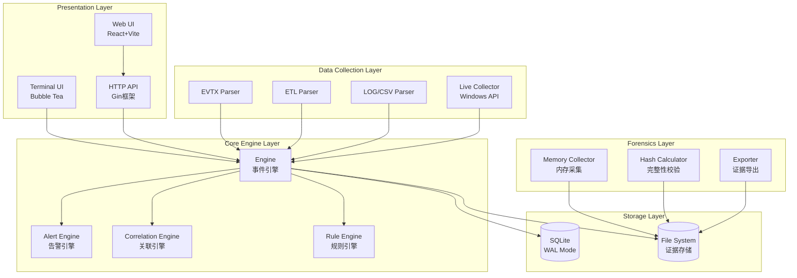
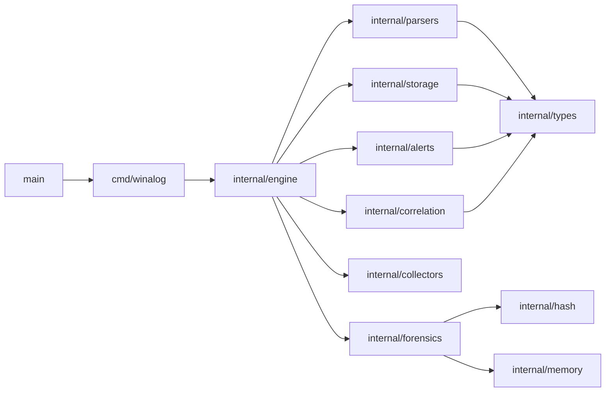

# WinLogAnalyzer Go 语言重构设计方案

**项目名称**: WinLogAnalyzer-Go  
**版本**: v2.4.0  
**日期**: 2026-04-13  
**状态**: 设计方案（完整覆盖 + TUI）

> **版本说明**: v2.4.0 修复了 v2.3.0 中的目录结构不完整、告警引擎缺失、API 设计不完整等问题。  

---

## 1. 产品定位与设计目标

### 1.1 产品定位

**WinLogAnalyzer-Go** 是一款面向 **Windows 单机环境的安全取证与日志分析应急工具**，使用 Go 语言重写，具备以下特性：

| 特性 | 说明 |
|------|------|
| 跨平台 | 编译为单个可执行文件，无 Python 运行时依赖 |
| 高性能 | Go 并发模型处理大文件日志 |
| 内存安全 | Go 天然内存安全，避免 Python 的 GC 问题 |
| 静态链接 | 便于分发给应急响应人员 |
| 取证合规 | 内置证据完整性校验 |

### 1.2 设计目标

1. **保持功能完整性**: 涵盖 Python 版本的所有功能
2. **解决架构问题**: 避免单文件过大、类型混乱、插件缺失
3. **增强取证能力**: 添加内存采集接口、证据链保护
4. **提升性能**: 利用 Go 并发处理大文件

### 1.3 性能目标

| 指标 | Python 版本 | Go 版本目标 |
|------|-------------|-------------|
| EVTX 解析速度 | ~50万条/分钟 | ~150万条/分钟 |
| 内存占用 (1GB EVTX) | ~800MB | ~200MB |
| 启动时间 | ~2秒 | ~100ms |
| 分发方式 | 需要 Python 环境 | 单二进制文件 |

---

## 2. 系统架构

### 2.1 整体架构图



### 2.2 模块依赖关系



### 2.3 并发模型

```
                    ┌─────────────────────────────────────┐
                    │           Event Pipeline            │
                    └─────────────────────────────────────┘
                                      │
        ┌───────────────────────────────┼───────────────────────────────┐
        │                               │                               │
        ▼                               ▼                               ▼
┌───────────────┐           ┌───────────────┐           ┌───────────────┐
│  EVTX Worker 1│           │  EVTX Worker 2│           │  EVTX Worker N│
│  (parse chunk)│           │  (parse chunk)│           │  (parse chunk)│
└───────┬───────┘           └───────┬───────┘           └───────┬───────┘
        │                             │                             │
        │         ┌───────────────────┼───────────────────┐         │
        │         │                   │                   │         │
        ▼         ▼                   ▼                   ▼         ▼
    Channel1   Channel2           Channel3           ChannelN   ...
        │         │                   │                   │
        └─────────┴───────────────────┴───────────────────┘
                            │
                            ▼
                    ┌───────────────┐
                    │   Aggregator  │
                    │ (batch insert)│
                    └───────┬───────┘
                            │
                            ▼
                    ┌───────────────┐
                    │    SQLite     │
                    │  (WAL mode)   │
                    └───────────────┘
```

---

## 3. 目录结构

### 3.1 Go 项目结构

```
winalog-go/
├── cmd/
│   └── winalog/
│       ├── main.go              # CLI 主入口
│       └── commands/            # CLI 子命令
│           ├── alert.go          # 告警管理
│           ├── analyze.go        # 分析命令
│           ├── collect.go        # 一键采集
│           ├── config.go         # 配置管理
│           ├── dashboard.go     # 仪表盘
│           ├── db_util.go       # 数据库工具
│           ├── import.go         # 日志导入
│           ├── persistence.go   # 取证持久化
│           ├── report.go        # 报告生成
│           ├── root.go          # 根命令
│           ├── search.go         # 搜索
│           ├── system.go        # 系统管理
│           ├── ueba.go          # UEBA分析
│           └── whitelist.go     # 白名单管理
│
├── internal/
│   ├── engine/                   # 核心引擎
│   │   ├── engine.go             # 分析引擎
│   │   ├── importer.go           # 导入器
│   │   ├── pipeline.go           # 事件管道
│   │   └── parsers_init.go      # 解析器初始化
│   │
│   ├── parsers/                  # 日志解析器
│   │   ├── parser.go             # 解析器接口
│   │   ├── evtx/                 # EVTX 解析
│   │   ├── etl/                  # ETL 解析
│   │   ├── iis/                  # IIS 解析
│   │   ├── csv/                  # CSV 解析
│   │   └── sysmon/               # Sysmon 解析
│   │
│   ├── storage/                  # 数据存储
│   │   ├── db.go                 # 数据库封装
│   │   ├── schema.go             # Schema 定义
│   │   ├── repository.go         # Repository 接口
│   │   ├── events.go             # 事件存储
│   │   ├── alerts.go             # 告警存储
│   │   ├── persistence.go        # 取证持久化
│   │   ├── rule_state.go        # 规则状态
│   │   └── system.go             # 系统存储
│   │
│   ├── alerts/                   # 告警引擎 (7 个模块)
│   │   ├── engine.go             # 告警引擎核心
│   │   ├── dedup.go              # 去重机制
│   │   ├── evaluator.go          # 规则评估
│   │   ├── stats.go              # 告警统计
│   │   ├── trend.go             # 告警趋势
│   │   ├── upgrade.go            # 告警升级
│   │   ├── suppress.go           # 告警抑制
│   │   └── policy_template.go   # 策略模板
│   │
│   ├── correlation/               # 关联引擎
│   │   ├── engine.go             # 关联引擎
│   │   ├── matcher.go            # 模式匹配
│   │   └── chain.go              # 事件链
│   │
│   ├── rules/                    # 规则系统 (统一)
│   │   ├── rule.go               # 统一规则接口
│   │   ├── custom_rules.go       # 自定义规则
│   │   ├── filter.go            # 过滤器
│   │   ├── loader.go             # 规则加载
│   │   ├── validator.go          # 规则校验
│   │   └── builtin/              # 内置规则
│   │       ├── registry.go       # 规则注册表
│   │       ├── definitions.go   # 规则定义
│   │       └── mitre.go         # MITRE ATT&CK 映射
│   │
│   ├── analyzers/                # 专用分析器
│   │   ├── analyzer.go          # 分析器接口
│   │   ├── brute_force.go       # 暴力破解检测
│   │   ├── login.go             # 登录分析
│   │   ├── kerberos.go          # Kerberos 分析
│   │   ├── powershell.go       # PowerShell 分析
│   │   ├── lateral_movement.go  # 横向移动
│   │   ├── persistence.go       # 持久化检测
│   │   ├── privilege_escalation.go # 权限提升
│   │   ├── data_exfiltration.go # 数据泄露
│   │   └── manager.go           # 分析器管理
│   │
│   ├── collectors/               # 采集模块
│   │   ├── collector.go          # 采集器接口
│   │   ├── live/                 # 实时采集
│   │   │   ├── collector.go     # 基础采集器
│   │   │   ├── evt_collector.go # Event Log 采集器
│   │   │   ├── bookmark.go     # 书签支持
│   │   │   ├── filtered.go     # 过滤采集
│   │   │   └── stats.go        # 采集统计
│   │   ├── one_click.go          # 一键采集
│   │   ├── system_info.go       # 系统信息
│   │   ├── process_info.go       # 进程信息
│   │   ├── network_info.go       # 网络连接
│   │   ├── registry_info.go     # 注册表
│   │   ├── dll_info.go          # DLL 模块
│   │   ├── user_info.go         # 用户账户
│   │   ├── persistence/           # 持久化检测
│   │   │   ├── prefetch.go     # Prefetch
│   │   │   ├── shimcache.go    # ShimCache
│   │   │   ├── amcache.go      # Amcache
│   │   │   ├── userassist.go   # UserAssist
│   │   │   └── usnjournal.go   # USN Journal
│   │   └── task_info.go          # 计划任务
│   │
│   ├── forensics/                # 取证模块
│   │   ├── timestamp.go          # 时间戳服务
│   │   ├── memory.go             # 内存采集
│   │   └── chain.go              # 证据链
│   │
│   ├── reports/                  # 报告生成
│   │   ├── generator.go          # 报告生成器
│   │   ├── service.go            # 报告服务
│   │   ├── api_adapter.go        # API 适配器
│   │   ├── html.go               # HTML 报告
│   │   ├── json.go               # JSON 报告
│   │   ├── security_stats.go     # 安全统计
│   │   └── template/              # 模板文件
│   │
│   ├── exporters/                 # 导出器
│   │   ├── exporter.go           # 导出接口
│   │   ├── json.go               # JSON 导出
│   │   ├── csv.go                # CSV 导出
│   │   ├── evtx.go              # EVTX 导出
│   │   ├── excel.go             # Excel 导出
│   │   └── timeline.go           # 时间线导出
│   │
│   ├── api/                      # HTTP API
│   │
│   ├── multi/                    # 多机分析
│   │
│   ├── timeline/                 # 时间线
│   │
│   ├── types/                    # 类型定义
│   │   ├── event.go              # 事件类型
│   │   ├── alert.go              # 告警类型
│   │   ├── rule.go               # 规则类型
│   │   ├── system.go             # 系统信息
│   │   ├── errors.go            # 错误类型
│   │   ├── result.go             # 结果类型
│   │   └── helpers.go           # 辅助函数
│   │
│   ├── config/                   # 配置
│   │   ├── config.go             # 配置结构
│   │   └── loader.go             # 配置加载
│   │
│   ├── utils/                    # 工具函数
│   │
│   ├── version/                  # 版本信息
│   │
│   └── ueba/                     # UEBA 模块
│
├── pkg/
│   ├── evtx/                     # EVTX 解析库 (独立包)
│   └── mitre/                    # MITRE ATT&CK
│
├── go.mod                        # Go 模块
├── go.sum
├── Makefile
└── README.md
```

---

## 4. 核心类型设计

### 4.1 统一类型系统 (解决 Python 中 4 个规则类混乱问题)

```go
// pkg/rules/rule.go

package rules

// Severity 严重级别枚举
type Severity string

const (
    SeverityCritical Severity = "critical"
    SeverityHigh     Severity = "high"
    SeverityMedium   Severity = "medium"
    SeverityLow      Severity = "low"
    SeverityInfo     Severity = "info"
)

// BaseRule 统一规则基类
type BaseRule struct {
    Name        string     `json:"name"`
    Description string     `json:"description"`
    Severity    Severity   `json:"severity"`
    MITREAttack []string   `json:"mitre_attack,omitempty"`
    Enabled     bool       `json:"enabled"`
    Tags        []string   `json:"tags,omitempty"`
}

// AlertRule 告警规则
type AlertRule struct {
    Name           string         `yaml:"name"`
    Description    string         `yaml:"description"`
    Enabled        bool           `yaml:"enabled"`
    Severity       Severity       `yaml:"severity"`
    Score          float64        `yaml:"score"`
    MitreAttack    string         `yaml:"mitre_attack,omitempty"`
    Priority       int            `yaml:"priority"` // 1-100，默认 50
    Weight         float64        `yaml:"weight"`  // 告警权重，默认 1.0
    Filter         *Filter        `yaml:"filter"`
    Conditions     *Conditions    `yaml:"conditions,omitempty"`
    Threshold      int            `yaml:"threshold,omitempty"`
    TimeWindow     time.Duration  `yaml:"time_window,omitempty"`
    AggregationKey string         `yaml:"aggregation_key,omitempty"`
    Message        string         `yaml:"message"`
    Tags           []string       `yaml:"tags,omitempty"`
}

// CorrelationRule 关联规则
type CorrelationRule struct {
    Name        string         `yaml:"name"`
    Description string         `yaml:"description"`
    Enabled     bool           `yaml:"enabled"`
    Severity    Severity       `yaml:"severity"`
    Patterns    []*Pattern     `yaml:"patterns"`
    TimeWindow  time.Duration  `yaml:"time_window"`
    Join        string         `yaml:"join"` // user, computer, ip
    MitreAttack string         `yaml:"mitre_attack,omitempty"`
    Tags        []string       `yaml:"tags,omitempty"`
}

// Pattern 关联模式
type Pattern struct {
    EventID    int32         `yaml:"event_id"`
    Conditions []*Condition  `yaml:"conditions,omitempty"`
    Join       string        `yaml:"join,omitempty"`
    TimeWindow time.Duration `yaml:"time_window,omitempty"`
    MinCount   int           `yaml:"min_count,omitempty"`
    MaxCount   int           `yaml:"max_count,omitempty"`
    Ordered    bool          `yaml:"ordered,omitempty"`
    Negate     bool          `yaml:"negate,omitempty"`
}

// Filter 过滤器
type Filter struct {
    EventIDs         []int32          `yaml:"event_ids,omitempty"`
    Levels           []int            `yaml:"levels,omitempty"`
    LogNames         []string         `yaml:"log_names,omitempty"`
    Sources          []string         `yaml:"sources,omitempty"`
    Computers        []string         `yaml:"computers,omitempty"`
    Keywords         string           `yaml:"keywords,omitempty"`
    KeywordMode      LogicalOp        `yaml:"keyword_mode,omitempty"`
    TimeRange        *TimeRange      `yaml:"time_range,omitempty"`
    LogonTypes       []int           `yaml:"logon_types,omitempty"`
    ExcludeUsers     []string        `yaml:"exclude_users,omitempty"`
    ExcludeComputers []string        `yaml:"exclude_computers,omitempty"`
    ExcludeDomains   []string        `yaml:"exclude_domains,omitempty"`
    MinFailureCount  int             `yaml:"min_failure_count,omitempty"`
    IpAddress        []string        `yaml:"ip_address,omitempty"`
    ProcessNames     []string        `yaml:"process_names,omitempty"`
}

// Conditions 条件组合
type Conditions struct {
    Any  []*Condition `yaml:"any,omitempty"`
    All  []*Condition `yaml:"all,omitempty"`
    None []*Condition `yaml:"none,omitempty"`
}

// Condition 条件
type Condition struct {
    Field    string `yaml:"field"`
    Operator string `yaml:"operator"`
    Value    string `yaml:"value"`
    Regex    bool   `yaml:"regex,omitempty"`
}

// LogicalOp 逻辑操作
type LogicalOp string

const (
    OpAnd LogicalOp = "AND"
    OpOr  LogicalOp = "OR"
)
```

### 4.2 事件模型

```go
// internal/types/event.go

package types

// EventLevel 事件级别
type EventLevel int

const (
    EventLevelCritical   EventLevel = 1
    EventLevelError     EventLevel = 2
    EventLevelWarning   EventLevel = 3
    EventLevelInfo      EventLevel = 4
    EventLevelVerbose   EventLevel = 5
)

// Event 事件
type Event struct {
    ID         int64      `json:"id" db:"id"`
    Timestamp  time.Time  `json:"timestamp" db:"timestamp"`
    EventID    int32      `json:"event_id" db:"event_id"`
    Level      EventLevel `json:"level" db:"level"`
    Source     string     `json:"source" db:"source"`
    LogName    string     `json:"log_name" db:"log_name"`
    Computer   string     `json:"computer" db:"computer"`
    User       *string    `json:"user,omitempty" db:"user"`
    UserSID    *string    `json:"user_sid,omitempty" db:"user_sid"`
    Message    string     `json:"message" db:"message"`
    RawXML     *string    `json:"raw_xml,omitempty" db:"raw_xml"`
    SessionID  *string    `json:"session_id,omitempty" db:"session_id"`
    IPAddress  *string    `json:"ip_address,omitempty" db:"ip_address"`
    ImportTime time.Time  `json:"import_time" db:"import_time"`
}

// ToMap 转换为 map (用于数据库)
func (e *Event) ToMap() map[string]interface{} {
    return map[string]interface{}{
        "timestamp":  e.Timestamp,
        "event_id":   e.EventID,
        "level":      e.Level,
        "source":     e.Source,
        "log_name":   e.LogName,
        "computer":   e.Computer,
        "user":       e.User,
        "user_sid":   e.UserSID,
        "message":    e.Message,
        "raw_xml":    e.RawXML,
        "session_id": e.SessionID,
        "ip_address": e.IPAddress,
        "import_time": e.ImportTime,
    }
}
```

### 4.3 告警模型

```go
// internal/types/alert.go

package types

// Alert 告警
type Alert struct {
    ID            int64      `json:"id" db:"id"`
    RuleName      string     `json:"rule_name" db:"rule_name"`
    Severity      Severity   `json:"severity" db:"severity"`
    Message       string     `json:"message" db:"message"`
    EventIDs      []int32    `json:"event_ids" db:"event_ids"`  // JSON 数组，SQLite 存储为 TEXT
    FirstSeen     time.Time  `json:"first_seen" db:"first_seen"`
    LastSeen      time.Time  `json:"last_seen" db:"last_seen"`
    Count         int        `json:"count" db:"count"`
    MITREAttack   []string   `json:"mitre_attack,omitempty" db:"mitre_attack"`
    Resolved      bool       `json:"resolved" db:"resolved"`
    ResolvedTime  *time.Time `json:"resolved_time,omitempty" db:"resolved_time"`
    Notes         string     `json:"notes,omitempty" db:"notes"`
    FalsePositive bool       `json:"false_positive" db:"false_positive"`
    LogName       string     `json:"log_name" db:"log_name"`
    RuleScore     float64    `json:"rule_score" db:"rule_score"`
}

// CorrelationResult 关联结果
type CorrelationResult struct {
    ID          string     `json:"id"`
    RuleName    string     `json:"rule_name"`
    Description string     `json:"description"`
    Severity    Severity   `json:"severity"`
    Events      []*Event   `json:"events"`
    StartTime   time.Time  `json:"start_time"`
    EndTime     time.Time  `json:"end_time"`
    MITREAttack []string   `json:"mitre_attack,omitempty"`
}

// AlertStats 告警统计
type AlertStats struct {
    Total        int64            `json:"total"`
    BySeverity   map[string]int64 `json:"by_severity"`
    ByStatus     map[string]int64 `json:"by_status"`
    ByRule       []*RuleCount     `json:"by_rule"`
    Trend        []*TrendPoint    `json:"trend"`
    AvgPerDay    float64          `json:"avg_per_day"`
    RuleScoreAvg float64          `json:"rule_score_avg"`
}

// RuleCount 规则统计
type RuleCount struct {
    RuleName   string  `json:"rule_name"`
    Count      int64   `json:"count"`
    Percentage float64 `json:"percentage"`
}

// TrendPoint 趋势点
type TrendPoint struct {
    Date  string `json:"date"`
    Count int64  `json:"count"`
}

// AlertUpgradeRule 告警升级规则
type AlertUpgradeRule struct {
    ID          int64     `json:"id"`
    Name        string    `json:"name"`
    Condition   string    `json:"condition"`   // "time_passed" | "count_threshold"
    Threshold   int       `json:"threshold"`
    NewSeverity Severity  `json:"new_severity"`
    Notify      bool      `json:"notify"`
    Enabled     bool      `json:"enabled"`
}

// SuppressRule 告警抑制规则
type SuppressRule struct {
    ID         int64       `json:"id"`
    Name       string      `json:"name"`
    Conditions []Condition `json:"conditions"`
    Duration   time.Duration `json:"duration"`
    Scope      string      `json:"scope"`  // "rule" | "source" | "global"
    Enabled    bool        `json:"enabled"`
    ExpiresAt  time.Time   `json:"expires_at,omitempty"`
    CreatedAt  time.Time   `json:"created_at"`
}

// Condition 抑制条件
type Condition struct {
    Field    string      `json:"field"`
    Operator string      `json:"operator"`  // "equals" | "contains" | "regex"
    Value    interface{} `json:"value"`
}
```

---

## 5. 核心模块设计

### 5.1 解析器管道 (解决 Python 流式解析的 GC 问题)

```go
// internal/engine/pipeline.go

package engine

// EventPipeline 事件处理管道
type EventPipeline struct {
    parsers   []parsers.Parser
    workers   int
    batchSize int
    bufferSize int
}

// NewEventPipeline 创建事件管道
func NewEventPipeline(workers, batchSize, bufferSize int) *EventPipeline {
    return &EventPipeline{
        parsers:   make([]parsers.Parser, 0),
        workers:   workers,
        batchSize: batchSize,
        bufferSize: bufferSize,
    }
}

// RegisterParser 注册解析器
func (p *EventPipeline) RegisterParser(parser parsers.Parser) {
    p.parsers = append(p.parsers, parser)
}

// Run 运行管道
func (p *EventPipeline) Run(ctx context.Context, paths []string) <-chan []*types.Event {
    eventChan := make(chan []*types.Event, p.bufferSize)
    
    go func() {
        defer close(eventChan)
        
        // 使用 worker pool 处理文件
        var wg sync.WaitGroup
        pathChan := make(chan string, len(paths))
        
        for _, path := range paths {
            pathChan <- path
        }
        close(pathChan)
        
        for i := 0; i < p.workers; i++ {
            wg.Add(1)
            go func(workerID int) {
                defer wg.Done()
                p.worker(ctx, workerID, pathChan, eventChan)
            }(i)
        }
        
        wg.Wait()
    }()
    
    return eventChan
}

// worker 处理文件
func (p *EventPipeline) worker(ctx context.Context, id int, paths <-chan string, out chan<- []*types.Event) {
    for path := range paths {
        select {
        case <-ctx.Done():
            return
        default:
        }
        
        batch := make([]*types.Event, 0, p.batchSize)
        
        for event := range p.parseFile(path) {
            batch = append(batch, event)
            if len(batch) >= p.batchSize {
                out <- batch
                batch = make([]*types.Event, 0, p.batchSize)
            }
        }
        
        if len(batch) > 0 {
            out <- batch
        }
    }
}

// parseFile 解析单个文件
func (p *EventPipeline) parseFile(path string) <-chan *types.Event {
    eventChan := make(chan *types.Event, 1000)
    
    go func() {
        defer close(eventChan)
        
        for _, parser := range p.parsers {
            if parser.CanParse(path) {
                for event := range parser.Parse(path) {
                    eventChan <- event
                }
                return
            }
        }
        
        // 无可用解析器
        log.Printf("No parser available for: %s", path)
    }()
    
    return eventChan
}
```

### 5.2 告警引擎 (解决 Python 去重机制问题)

```go
// internal/alerts/engine.go

package alerts

// Engine 告警引擎
type Engine struct {
    rules          []*rules.AlertRule
    dedupCache     *DedupCache
    upgradeRules   []*AlertUpgradeRule
    suppressRules  []*SuppressRule
    stats          *AlertStats
    mu             sync.RWMutex
}

// DedupCache 线程安全去重缓存 (解决 Python GIL 问题)
type DedupCache struct {
    data map[string]time.Time
    mu   sync.RWMutex
    ttl  time.Duration
}

// NewEngine 创建告警引擎
func NewEngine() *Engine {
    return &Engine{
        dedupCache:    NewDedupCache(time.Minute * 5),
        upgradeRules:  make([]*AlertUpgradeRule, 0),
        suppressRules: make([]*SuppressRule, 0),
    }
}

// Evaluate 评估事件
func (e *Engine) Evaluate(event *types.Event) []*types.Alert {
    e.mu.RLock()
    defer e.mu.RUnlock()
    
    var alerts []*types.Alert
    
    for _, rule := range e.rules {
        if !rule.Enabled {
            continue
        }
        
        // 检查是否被抑制
        if e.isSuppressed(rule.Name, event) {
            continue
        }
        
        if e.matches(rule, event) {
            key := e.generateKey(rule, event)
            
            if e.dedupCache.IsDuplicate(key) {
                continue
            }
            
            e.dedupCache.Mark(key)
            alerts = append(alerts, e.createAlert(rule, event))
        }
    }
    
    return alerts
}

// EvaluateBatch 批量评估 (利用 Go 并发)
func (e *Engine) EvaluateBatch(events []*types.Event) []*types.Alert {
    alerts := make([]*types.Alert, 0)
    
    // 使用 worker pool 并行评估
    eventChan := make(chan *types.Event, len(events))
    alertChan := make(chan *types.Alert, len(events))
    
    for _, event := range events {
        eventChan <- event
    }
    close(eventChan)
    
    var wg sync.WaitGroup
    for i := 0; i < runtime.NumCPU(); i++ {
        wg.Add(1)
        go func() {
            defer wg.Done()
            for event := range eventChan {
                for _, alert := range e.Evaluate(event) {
                    alertChan <- alert
                }
            }
        }()
    }
    
    go func() {
        wg.Wait()
        close(alertChan)
    }()
    
    for alert := range alertChan {
        alerts = append(alerts, alert)
    }
    
    return alerts
}

// isSuppressed 检查告警是否被抑制
func (e *Engine) isSuppressed(ruleName string, event *types.Event) bool {
    now := time.Now()
    
    for _, rule := range e.suppressRules {
        if !rule.Enabled {
            continue
        }
        
        // 检查过期
        if !rule.ExpiresAt.IsZero() && now.After(rule.ExpiresAt) {
            continue
        }
        
        // 检查是否匹配抑制条件
        if e.matchesConditions(ruleName, event, rule.Conditions) {
            return true
        }
    }
    return false
}

// matchesConditions 检查是否匹配抑制条件
func (e *Engine) matchesConditions(ruleName string, event *types.Event, conditions []Condition) bool {
    for _, cond := range conditions {
        var fieldValue string
        switch cond.Field {
        case "rule_name":
            fieldValue = ruleName
        case "source":
            fieldValue = event.Source
        case "computer":
            fieldValue = event.Computer
        case "user":
            if event.User != nil {
                fieldValue = *event.User
            }
        default:
            continue
        }
        
        switch cond.Operator {
        case "equals":
            if fieldValue != cond.Value.(string) {
                return false
            }
        case "contains":
            if !strings.Contains(fieldValue, cond.Value.(string)) {
                return false
            }
        case "regex":
            matched, _ := regexp.MatchString(cond.Value.(string), fieldValue)
            if !matched {
                return false
            }
        }
    }
    return true
}

// IsDuplicate 检查是否重复
func (c *DedupCache) IsDuplicate(key string) bool {
    c.mu.RLock()
    defer c.mu.RUnlock()
    _, exists := c.data[key]
    return exists
}

// Mark 标记已触发
func (c *DedupCache) Mark(key string) {
    c.mu.Lock()
    defer c.mu.Unlock()
    c.data[key] = time.Now()
    c.cleanupExpired()
}

// cleanupExpired 清理过期条目
func (c *DedupCache) cleanupExpired() {
    cutoff := time.Now().Add(-c.ttl)
    for key, t := range c.data {
        if t.Before(cutoff) {
            delete(c.data, key)
        }
    }
}

// CalculateStats 计算告警统计
func (e *Engine) CalculateStats() (*AlertStats, error) {
    // 实现统计计算逻辑
    return &AlertStats{}, nil
}

// CheckUpgrade 检查告警升级
func (e *Engine) CheckUpgrade(alert *types.Alert) {
    for _, rule := range e.upgradeRules {
        if !rule.Enabled {
            continue
        }
        
        switch rule.Condition {
        case "time_passed":
            hours := time.Since(alert.FirstSeen).Hours()
            if hours >= float64(rule.Threshold) {
                e.upgradeAlert(alert, rule)
            }
        case "count_threshold":
            count := e.getAlertCount(alert.RuleName)
            if count >= rule.Threshold {
                e.upgradeAlert(alert, rule)
            }
        }
    }
}

// upgradeAlert 升级告警
func (e *Engine) upgradeAlert(alert *types.Alert, rule *AlertUpgradeRule) error {
    // 实现升级逻辑
    return nil
}
```

### 5.2.1 规则评估 (evaluator.go)

```go
// internal/alerts/evaluator.go

package alerts

// matches 检查事件是否匹配规则
func (e *Engine) matches(rule *rules.AlertRule, event *types.Event) bool {
    // 检查事件 ID
    if !contains(rule.EventIDs, event.EventID) {
        return false
    }
    
    // 检查过滤器
    for _, filter := range rule.Filters {
        if !e.matchFilter(event, filter) {
            return false
        }
    }
    
    // 检查阈值
    if rule.Threshold > 1 {
        return e.checkThreshold(rule, e.getAggregationKey(event, rule.GroupBy))
    }
    
    return true
}

// matchFilter 检查过滤器
func (e *Engine) matchFilter(event *types.Event, filter rules.Filter) bool {
    var fieldValue string
    switch filter.Field {
    case "user":
        if event.User != nil {
            fieldValue = *event.User
        }
    case "computer":
        fieldValue = event.Computer
    case "source":
        fieldValue = event.Source
    case "message":
        fieldValue = event.Message
    default:
        return true
    }
    
    switch filter.Operator {
    case "equals":
        return fieldValue == filter.Value.(string)
    case "contains":
        return strings.Contains(fieldValue, filter.Value.(string))
    case "regex":
        matched, _ := regexp.MatchString(filter.Value.(string), fieldValue)
        return matched
    }
    return true
}

// checkThreshold 检查阈值
func (e *Engine) checkThreshold(rule *rules.AlertRule, key string) bool {
    e.mu.Lock()
    defer e.mu.Unlock()
    
    count := e.thresholdCounts[key]
    e.thresholdCounts[key] = count + 1
    
    // 检查时间窗口
    if rule.TimeWindow > 0 {
        cutoff := time.Now().Add(-rule.TimeWindow)
        if lastTime, exists := e.thresholdTimes[key]; exists {
            if lastTime.Before(cutoff) {
                e.thresholdCounts[key] = 1
                e.thresholdTimes[key] = time.Now()
                return false
            }
        }
        e.thresholdTimes[key] = time.Now()
    }
    
    return count+1 >= rule.Threshold
}

// getAggregationKey 获取聚合 key
func (e *Engine) getAggregationKey(event *types.Event, groupBy string) string {
    switch groupBy {
    case "user":
        if event.User != nil {
            return *event.User
        }
    case "computer":
        return event.Computer
    case "ip":
        if event.IPAddress != nil {
            return *event.IPAddress
        }
    }
    return event.Computer
}
```

### 5.2.2 告警统计 (stats.go)

```go
// internal/alerts/stats.go

package alerts

// CalculateStats 计算告警统计
func (e *Engine) CalculateStats() (*AlertStats, error) {
    stats := &AlertStats{
        BySeverity: make(map[string]int64),
        ByStatus:   make(map[string]int64),
        ByRule:      make([]*RuleCount, 0),
    }
    
    // 查询数据库统计
    // ... 省略数据库查询细节
    
    stats.Total = total
    stats.AvgPerDay = float64(total) / days
    stats.RuleScoreAvg = ruleScoreAvg
    
    return stats, nil
}

// GetTopRules 获取 Top Rules
func (e *Engine) GetTopRules(limit int) ([]*RuleCount, error) {
    // SQL: SELECT rule_name, COUNT(*) as count FROM alerts GROUP BY rule_name ORDER BY count DESC LIMIT ?
    return topRules, nil
}
```

### 5.2.3 告警趋势 (trend.go)

```go
// internal/alerts/trend.go

package alerts

// AlertTrend 告警趋势
type AlertTrend struct {
    Daily       []*TrendPoint `json:"daily"`
    Weekly      []*TrendPoint `json:"weekly"`
    ByHour      []*TrendPoint `json:"by_hour"`
    ByDayOfWeek []*TrendPoint `json:"by_day_of_week"`
}

// CalculateTrend 计算趋势
func (e *Engine) CalculateTrend(days int) (*AlertTrend, error) {
    trend := &AlertTrend{}
    
    // 每日趋势
    // SQL: SELECT DATE(first_seen) as date, COUNT(*) as count FROM alerts WHERE first_seen >= date('now', '-? days') GROUP BY DATE(first_seen)
    
    // 每周趋势
    // SQL: SELECT strftime('%Y-W%W', first_seen) as week, COUNT(*) as count FROM alerts GROUP BY week
    
    // 每小时分布
    // SQL: SELECT strftime('%H', first_seen) as hour, COUNT(*) as count FROM alerts GROUP BY hour
    
    // 每周分布
    // SQL: SELECT strftime('%w', first_seen) as dow, COUNT(*) as count FROM alerts GROUP BY dow
    
    return trend, nil
}
```

### 5.2.4 告警升级 (upgrade.go)

```go
// internal/alerts/upgrade.go

package alerts

// AddUpgradeRule 添加升级规则
func (e *Engine) AddUpgradeRule(rule *AlertUpgradeRule) error {
    e.mu.Lock()
    defer e.mu.Unlock()
    
    rule.ID = int64(len(e.upgradeRules) + 1)
    e.upgradeRules = append(e.upgradeRules, rule)
    return nil
}

// RemoveUpgradeRule 移除升级规则
func (e *Engine) RemoveUpgradeRule(id int64) error {
    e.mu.Lock()
    defer e.mu.Unlock()
    
    for i, rule := range e.upgradeRules {
        if rule.ID == id {
            e.upgradeRules = append(e.upgradeRules[:i], e.upgradeRules[i+1:]...)
            return nil
        }
    }
    return fmt.Errorf("upgrade rule not found")
}

// GetUpgradeRules 获取所有升级规则
func (e *Engine) GetUpgradeRules() []*AlertUpgradeRule {
    e.mu.RLock()
    defer e.mu.RUnlock()
    return e.upgradeRules
}
```

### 5.2.5 告警抑制 (suppress.go)

```go
// internal/alerts/suppress.go

package alerts

// AddSuppressRule 添加抑制规则
func (e *Engine) AddSuppressRule(rule *SuppressRule) error {
    e.mu.Lock()
    defer e.mu.Unlock()
    
    rule.ID = int64(len(e.suppressRules) + 1)
    rule.CreatedAt = time.Now()
    
    if rule.Duration > 0 {
        rule.ExpiresAt = time.Now().Add(rule.Duration)
    }
    
    e.suppressRules = append(e.suppressRules, rule)
    return nil
}

// RemoveSuppressRule 移除抑制规则
func (e *Engine) RemoveSuppressRule(id int64) error {
    e.mu.Lock()
    defer e.mu.Unlock()
    
    for i, rule := range e.suppressRules {
        if rule.ID == id {
            e.suppressRules = append(e.suppressRules[:i], e.suppressRules[i+1:]...)
            return nil
        }
    }
    return fmt.Errorf("suppress rule not found")
}

// GetSuppressRules 获取所有抑制规则
func (e *Engine) GetSuppressRules() []*SuppressRule {
    e.mu.RLock()
    defer e.mu.RUnlock()
    return e.suppressRules
}
```

### 5.3 关联引擎

```go
// internal/correlation/engine.go

package correlation

// Engine 关联分析引擎
type Engine struct {
    mu      sync.RWMutex
    events  map[int64]*types.Event
    index   *EventIndex
    matcher *Matcher
    chain   *ChainBuilder
    maxAge  time.Duration
}

type EventIndex struct {
    mu              sync.RWMutex
    eventRepo       *storage.EventRepo
    eventsCache     map[int64]*types.Event
    byID            map[int64]time.Time
    byTime          []indexEntry
    byEID           map[int32][]int64
    maxAge          time.Duration
    lastCleanup     time.Time
    cleanupInterval time.Duration
}

type indexEntry struct {
    ID        int64
    Timestamp time.Time
}

// NewEngine 创建关联引擎
func NewEngine(maxAge time.Duration) *Engine {
    return &Engine{
        events:  make(map[int64]*types.Event),
        index:   NewEventIndex(maxAge),
        matcher: NewMatcher(),
        chain:   NewChainBuilder(),
        maxAge:  maxAge,
    }
}

func NewEngineWithEventRepo(eventRepo *storage.EventRepo, maxAge time.Duration) *Engine {
    return &Engine{
        events:  make(map[int64]*types.Event),
        index:   NewEventIndex(maxAge),
        matcher: NewMatcher(),
        chain:   NewChainBuilderWithEventRepo(eventRepo),
        maxAge:  maxAge,
    }
}

// Analyze 执行关联分析
func (e *Engine) Analyze(ctx context.Context, rules []*rules.CorrelationRule) ([]*types.CorrelationResult, error) {
    e.mu.RLock()
    defer e.mu.RUnlock()

    results := make([]*types.CorrelationResult, 0)

    for _, rule := range rules {
        if !rule.Enabled {
            continue
        }

        ruleResults := e.analyzeRule(rule)
        results = append(results, ruleResults...)
    }

    return results, nil
}

// analyzeRule 分析单条规则
func (e *Engine) analyzeRule(rule *rules.CorrelationRule) []*types.CorrelationResult {
    allResults := make([]*types.CorrelationResult, 0)
    patterns := rule.Patterns
    if len(patterns) < 2 {
        return allResults
    }

    seenChains := make(map[string]bool)

    for i, pattern := range patterns {
        if i == len(patterns)-1 {
            break
        }

        events := e.index.GetByEventID(pattern.EventID)
        if events == nil {
            continue
        }

        if pattern.TimeWindow > 0 {
            events = e.filterByTimeWindow(events, pattern.TimeWindow)
        }

        if pattern.MinCount > 0 && len(events) < pattern.MinCount {
            continue
        }

        if pattern.MaxCount > 0 && len(events) > pattern.MaxCount {
            events = events[:pattern.MaxCount]
        }

        for idx := 0; idx < len(events); idx++ {
            baseEvent := events[idx]
            if baseEvent == nil {
                continue
            }

            nextPattern := patterns[i+1]
            nextEvents := e.findRelatedEventsWithRule(baseEvent, nextPattern, rule)

            if len(nextEvents) > 0 {
                for _, nextEvent := range nextEvents {
                    if !e.matcher.CheckOrderedSequence([]*types.Event{baseEvent, nextEvent}, nextPattern) {
                        continue
                    }
                    chainKey := fmt.Sprintf("%d:%d", baseEvent.ID, nextEvent.ID)
                    if seenChains[chainKey] {
                        continue
                    }
                    seenChains[chainKey] = true
                    result := e.chain.Build(baseEvent, []*types.Event{nextEvent}, rule)
                    if result != nil {
                        allResults = append(allResults, result)
                    }
                    break
                }
            }
        }
    }

    return allResults
}

// findRelatedEventsWithRule 查找关联事件
func (e *Engine) findRelatedEventsWithRule(base *types.Event, pattern *rules.Pattern, rule *rules.CorrelationRule) []*types.Event {
    join := pattern.Join
    if join == "" {
        join = rule.Join
    }

    events := e.index.GetByEventID(pattern.EventID)
    if events == nil {
        return nil
    }

    switch join {
    case "user":
        filtered := make([]*types.Event, 0)
        for _, evt := range events {
            userMatch := false
            if evt.User != nil && base.User != nil {
                userMatch = *evt.User == *base.User
            } else if evt.UserSID != nil && base.UserSID != nil {
                userMatch = *evt.UserSID == *base.UserSID
            }
            if userMatch {
                filtered = append(filtered, evt)
            }
        }
        return filtered

    case "computer":
        filtered := make([]*types.Event, 0)
        for _, evt := range events {
            if evt.Computer == base.Computer {
                filtered = append(filtered, evt)
            }
        }
        if len(filtered) > 0 {
            return filtered
        }
        return events

    case "ip":
        filtered := make([]*types.Event, 0)
        for _, evt := range events {
            if evt.IPAddress != nil && base.IPAddress != nil && *evt.IPAddress == *base.IPAddress {
                filtered = append(filtered, evt)
            }
        }
        if len(filtered) > 0 {
            return filtered
        }
        return events

    default:
        return events
    }
}

// NewEngine 创建关联引擎
func NewEngine() *Engine {
    return &Engine{
        eventIndex: make(map[int32][]*types.Event),
        timeIndex:  make(map[int64][]*types.Event),
    }
}

// SetEvents 设置事件并建立索引
func (e *Engine) SetEvents(events []*types.Event) {
    e.mu.Lock()
    defer e.mu.Unlock()
    
    // 清空索引
    e.eventIndex = make(map[int32][]*types.Event)
    e.timeIndex = make(map[int64][]*types.Event)
    
    // 建立索引
    for _, event := range events {
        // 按 event_id 索引
        e.eventIndex[event.EventID] = append(e.eventIndex[event.EventID], event)
    }
}

// Analyze 执行关联分析
func (e *Engine) Analyze(ctx context.Context, timeWindow time.Duration) []*types.CorrelationResult {
    e.mu.RLock()
    defer e.mu.RUnlock()
    
    results := make([]*types.CorrelationResult, 0)
    
    for _, rule := range e.rules {
        if !rule.Enabled {
            continue
        }
        
        chains := e.findChains(rule, timeWindow)
        for _, chain := range chains {
            results = append(results, e.chainToResult(rule, chain))
        }
    }
    
    return results
}

// findChains 查找事件链
func (e *Engine) findChains(rule *rules.CorrelationRule, timeWindow time.Duration) [][]*types.Event {
    chains := make([][]*types.Event, 0)
    
    if len(rule.Conditions) < 2 {
        return chains
    }
    
    // 回溯查找事件链
    var backtrack func(idx int, events []*types.Event, chain []*types.Event)
    backtrack = func(idx int, events []*types.Event, chain []*types.Event) {
        if idx >= len(rule.Conditions) {
            if len(chain) >= 2 {
                chains = append(chains, append([]*types.Event{}, chain...))
            }
            return
        }
        
        condition := rule.Conditions[idx]
        matching := e.findMatchingEvents(condition, events)
        
        for _, event := range matching {
            // 检查 join_field
            if !e.matchesJoinField(rule, chain, event) {
                continue
            }
            
            chain = append(chain, event)
            backtrack(idx+1, events, chain)
            chain = chain[:len(chain)-1]
        }
    }
    
    // 从第一个条件开始查找
    firstCondition := rule.Conditions[0]
    firstEvents := e.findMatchingEvents(firstCondition, nil)
    
    for _, event := range firstEvents {
        backtrack(1, nil, []*types.Event{event})
    }
    
    return chains
}
```

### 5.4 持久化检测模块

```go
// internal/persistence/types.go

package persistence

// Technique MITRE ATT&CK Technique ID
type Technique string

const (
    TechniqueT1546001 Technique = "T1546.001"  // Accessibility Features
    TechniqueT1546003 Technique = "T1546.003"  // WMI Event Subscription
    TechniqueT1546010 Technique = "T1546.010"  // AppInit_DLLs
    TechniqueT1546012 Technique = "T1546.012"  // IFEO
    TechniqueT1546015 Technique = "T1546.015"  // COM Hijacking
    TechniqueT1053    Technique = "T1053"      // Scheduled Task
    TechniqueT1543003 Technique = "T1543.003"  // Windows Service
)

// Detection 持久化检测结果
type Detection struct {
    ID                string
    Time              time.Time
    Technique         Technique
    Category          string  // Registry/ScheduledTask/Service/WMI/COM
    Severity          Severity // critical/high/medium/low/info
    Title             string
    Description       string
    Evidence          Evidence
    MITRERef          []string
    RecommendedAction string
    FalsePositiveRisk string
}

// Evidence 证据信息
type Evidence struct {
    Type     EvidenceType // registry/file/wmi/service/task/com
    Path     string
    Key      string
    Value    string
    Expected string
}
```

**检测器接口**:

```go
// Detector 持久化检测器接口
type Detector interface {
    Name() string
    Detect(ctx context.Context) ([]*Detection, error)
    RequiresAdmin() bool
    GetTechnique() Technique
}
```

**内置检测器**:

| 检测器 | 文件 | 描述 |
|--------|------|------|
| RunKeyDetector | registry.go | 检测 Run/RunOnce 键 |
| UserInitDetector | registry.go | 检测 Winlogon UserInit |
| StartupFolderDetector | registry.go | 检测启动文件夹 |
| AccessibilityDetector | accessibility.go | 检测辅助功能后门 (T1546.001) |
| COMHijackDetector | com.go | 检测 COM 对象劫持 (T1546.015) |
| IFEODetector | ifeo.go | 检测 IFEO 劫持 (T1546.012) |
| AppInitDetector | appinit.go | 检测 AppInit_DLLs (T1546.010) |
| WMIPersistenceDetector | wmi.go | 检测 WMI 持久化订阅 (T1546.003) |
| ServicePersistenceDetector | service.go | 检测 Windows 服务持久化 (T1543.003) |

**使用示例**:

```go
// 创建检测引擎
engine := persistence.NewDetectionEngine()
engine.Register(persistence.NewRunKeyDetector())
engine.Register(persistence.NewAccessibilityDetector())

// 执行检测
result := engine.Detect(context.Background())

for _, det := range result.Detections {
    fmt.Printf("[%s] %s: %s\n", det.Severity, det.Technique, det.Title)
}
```

---

## 6. CLI 设计

### 6.1 命令结构

```
winalog [全局选项] <命令> [子命令] [参数]

全局选项:
  --config <path>     配置文件路径
  --db <path>         数据库路径
  --verbose, -vv      详细输出
  --json              JSON 输出格式

命令:
  import              导入日志文件
  search              搜索事件
  collect             一键采集
  analyze             执行分析
  alert               告警管理
  correlate           关联分析
  report              生成报告
  timeline            时间线分析
  gui                 启动 GUI
  serve               启动 HTTP API
  forensics           取证功能
```

### 6.2 主要命令实现

```go
// cmd/winalog/commands/import.go

package commands

import (
    "github.com/spf13/cobra"
    "winalog-go/internal/engine"
)

var importCmd = &cobra.Command{
    Use:   "import [flags] <path>",
    Short: "导入 EVTX/ETL/LOG 文件",
    Args:  cobra.ExactArgs(1),
    RunE:  runImport,
}

var importFlags struct {
    logName     string
    incremental bool
    workers     int
    batchSize   int
    skipPatterns string
}

func init() {
    importCmd.Flags().StringVar(&importFlags.logName, "log-name", "", "日志名称")
    importCmd.Flags().BoolVar(&importFlags.incremental, "incremental", true, "增量导入")
    importCmd.Flags().IntVar(&importFlags.workers, "workers", 4, "并行工作数")
    importCmd.Flags().IntVar(&importFlags.batchSize, "batch-size", 10000, "批处理大小")
    importCmd.Flags().StringVar(&importFlags.skipPatterns, "skip-patterns", "", "跳过模式")
}

func runImport(cmd *cobra.Command, args []string) error {
    ctx := context.Background()
    
    // 创建引擎
    eng := engine.New(&engine.Config{
        DBPath:    viper.GetString("db.path"),
        Workers:   importFlags.workers,
        BatchSize: importFlags.batchSize,
    })
    
    // 执行导入
    result, err := eng.Import(ctx, &engine.ImportRequest{
        Path:          args[0],
        LogName:       importFlags.logName,
        Incremental:    importFlags.incremental,
        SkipPatterns:  splitPatterns(importFlags.skipPatterns),
    })
    if err != nil {
        return err
    }
    
    // 输出结果
    printImportResult(result)
    return nil
}
```

---

## 7. HTTP API 设计

### 7.1 API 端点

```go
// internal/api/routes.go

package api

func SetupRoutes(r *gin.Engine, eng *engine.Engine) {
    // 事件
    r.GET("/api/events", listEvents(eng))
    r.GET("/api/events/:id", getEvent(eng))
    r.POST("/api/events/search", searchEvents(eng))
    r.POST("/api/events/export", exportEvents(eng))  // 支持过滤条件导出
    
    // 导入
    r.POST("/api/import", importLogs(eng))
    
    // 告警
    r.GET("/api/alerts", listAlerts(eng))
    r.GET("/api/alerts/stats", getAlertStats(eng))
    r.GET("/api/alerts/trend", getAlertTrend(eng))
    r.GET("/api/alerts/:id", getAlert(eng))
    r.POST("/api/alerts/:id/resolve", resolveAlert(eng))
    r.POST("/api/alerts/:id/false-positive", markFalsePositive(eng))
    r.DELETE("/api/alerts/:id", deleteAlert(eng))
    r.POST("/api/alerts/batch", batchAlertAction(eng))
    
    // 升级规则
    r.GET("/api/alerts/upgrade/rules", listUpgradeRules(eng))
    r.POST("/api/alerts/upgrade/rules", createUpgradeRule(eng))
    r.DELETE("/api/alerts/upgrade/rules/:id", deleteUpgradeRule(eng))
    
    // 抑制规则
    r.GET("/api/alerts/suppress/rules", listSuppressRules(eng))
    r.POST("/api/alerts/suppress/rules", createSuppressRule(eng))
    r.DELETE("/api/alerts/suppress/rules/:id", deleteSuppressRule(eng))
    
    // 关联
    r.POST("/api/correlate", runCorrelation(eng))
    
    // 报告
    r.POST("/api/reports/generate", generateReport(eng))
    
    // 取证
    r.POST("/api/forensics/collect", forensicsCollect(eng))
    r.GET("/api/forensics/verify/:hash", verifyHash(eng))
    
    // 实时监控
    r.GET("/api/live/events", streamEventsSSE(eng))
    r.GET("/api/live/stats", getLiveStats(eng))
    
    // 系统
    r.GET("/api/health", healthCheck())
    r.GET("/api/stats", getStats(eng))
}
```

### 7.2 API Handler 详细设计

```go
// internal/api/handlers.go

package api

// ErrorResponse 错误响应
type ErrorResponse struct {
    Error   string            `json:"error"`
    Code    ErrorCode         `json:"code,omitempty"`
    Details map[string]any     `json:"details,omitempty"`
}

// SuccessResponse 成功响应
type SuccessResponse struct {
    Message string      `json:"message"`
    Data    interface{} `json:"data,omitempty"`
}

// PaginationRequest 分页请求
type PaginationRequest struct {
    Page     int `form:"page,default=1" binding:"min=1"`
    PageSize int `form:"page_size,default=100" binding:"min=1,max=10000"`
}

// SearchRequest 搜索请求
type SearchRequest struct {
    Keywords    string   `form:"keywords"`
    KeywordMode string   `form:"keyword_mode"`  // "AND" | "OR"
    Regex       bool     `form:"regex"`
    EventIDs    []int32  `form:"event_ids"`
    Levels      []int    `form:"levels"`
    LogNames    []string `form:"log_names"`
    Sources     []string `form:"sources"`
    Users       []string `form:"users"`
    Computers   []string `form:"computers"`
    StartTime   string   `form:"start_time"`
    EndTime     string   `form:"end_time"`
    Page        int      `form:"page,default=1"`
    PageSize    int      `form:"page_size,default=100"`
    SortBy      string   `form:"sort_by,default=timestamp"`
    SortOrder   string   `form:"sort_order,default=desc"`
    Highlight   bool     `form:"highlight"`
}

// SearchResponse 搜索响应
type SearchResponse struct {
    Events     []*EventWithHighlight `json:"events"`
    Total      int64                `json:"total"`
    Page       int                  `json:"page"`
    PageSize   int                  `json:"page_size"`
    TotalPages int                  `json:"total_pages"`
    QueryTime  int64               `json:"query_time_ms"`
    SearchID   string               `json:"search_id,omitempty"`
}

// ExportRequest 导出请求
type ExportRequest struct {
    Format     string   `json:"format"`  // "json" | "csv" | "excel"
    Filters    ExportFilters `json:"filters"`
}

type ExportFilters struct {
    EventIDs    []int32   `json:"event_ids"`    // 事件ID列表
    Levels      []int     `json:"levels"`       // 级别过滤
    LogNames    []string  `json:"log_names"`    // 日志名称
    Sources     []string  `json:"sources"`      // 来源
    Computers   []string  `json:"computers"`    // 计算机名
    Users       []string  `json:"users"`        // 用户
    StartTime   string    `json:"start_time"`   // 开始时间 (RFC3339)
    EndTime     string    `json:"end_time"`     // 结束时间 (RFC3339)
    Keywords    string    `json:"keywords"`     // 关键字搜索
    Limit       int       `json:"limit"`        // 导出上限 (默认10000)
}

// ExportResponse 导出响应
type ExportResponse struct {
    Success     bool     `json:"success"`
    Total       int      `json:"total"`
    DownloadURL string   `json:"download_url,omitempty"`  // 异步导出时返回下载URL
}

// EventWithHighlight 带高亮的事件
type EventWithHighlight struct {
    *types.Event
    Highlight *HighlightResult `json:"highlight,omitempty"`
}

// HighlightResult 高亮结果
type HighlightResult struct {
    Message  []HighlightField `json:"message,omitempty"`
    User     []HighlightField `json:"user,omitempty"`
    Computer []HighlightField `json:"computer,omitempty"`
}

// HighlightField 高亮字段
type HighlightField struct {
    Field string `json:"field"`
    Text  string `json:"text"`
    Spans []Span `json:"spans"`
}

// Span 高亮片段
type Span struct {
    Start int    `json:"start"`
    End   int    `json:"end"`
    Match string `json:"match"`
}

// ExportHandler 导出处理器
type ExportHandler struct {
    db *storage.DB
}

// ExportEvents 导出事件 (支持过滤条件)
// POST /api/events/export
// 支持格式: JSON, CSV, Excel
// 过滤条件: 事件ID列表、级别、时间范围、计算机、用户等
func (h *ExportHandler) ExportEvents(c *gin.Context) {
    var req ExportRequest
    if err := c.ShouldBindJSON(&req); err != nil {
        c.JSON(400, ErrorResponse{Error: err.Error()})
        return
    }

    // 设置默认值
    if req.Format == "" {
        req.Format = "json"
    }
    if req.Filters.Limit <= 0 || req.Filters.Limit > 100000 {
        req.Filters.Limit = 10000
    }

    // 构建过滤条件
    filter := &storage.EventFilter{
        Limit:     req.Filters.Limit,
        EventIDs:  req.Filters.EventIDs,
        Levels:    req.Filters.Levels,
        LogNames:  req.Filters.LogNames,
        Computers: req.Filters.Computers,
    }

    // 时间范围解析
    if req.Filters.StartTime != "" {
        if t, err := time.Parse(time.RFC3339, req.Filters.StartTime); err == nil {
            filter.StartTime = &t
        }
    }
    if req.Filters.EndTime != "" {
        if t, err := time.Parse(time.RFC3339, req.Filters.EndTime); err == nil {
            filter.EndTime = &t
        }
    }

    // 查询事件
    events, _, err := h.db.ListEvents(filter)
    if err != nil {
        c.JSON(500, ErrorResponse{Error: err.Error()})
        return
    }

    // 根据格式导出
    switch req.Format {
    case "csv":
        c.Header("Content-Type", "text/csv")
        c.Header("Content-Disposition", "attachment; filename=events_export.csv")
        exporter := exporters.NewCsvExporter()
        exporter.Export(events, c.Writer)
    case "excel", "xlsx":
        c.Header("Content-Type", "application/vnd.openxmlformats-officedocument.spreadsheetml.sheet")
        c.Header("Content-Disposition", "attachment; filename=events_export.xlsx")
        exporter := exporters.NewExcelExporter()
        exporter.Export(events, c.Writer)
    default:
        c.JSON(200, gin.H{
            "events": events,
            "total":  len(events),
        })
    }
}

// AlertHandler 告警处理器
type AlertHandler struct {
    engine *alerts.Engine
}

// ListAlerts 获取告警列表
// GET /api/alerts?page=1&page_size=100&severity=high&resolved=false
func (h *AlertHandler) ListAlerts(c *gin.Context) {
    var req struct {
        PaginationRequest
        Severity string `form:"severity"`
        Resolved *bool  `form:"resolved"`
    }
    
    if err := c.ShouldBindQuery(&req); err != nil {
        c.JSON(400, ErrorResponse{Error: err.Error()})
        return
    }
    
    alerts, total, err := h.engine.ListAlerts(req.Page, req.PageSize, req.Severity, req.Resolved)
    if err != nil {
        c.JSON(500, ErrorResponse{Error: err.Error()})
        return
    }
    
    totalPages := int(total) / req.PageSize
    if int(total)%req.PageSize > 0 {
        totalPages++
    }
    
    c.JSON(200, ListAlertsResponse{
        Alerts:    alerts,
        Total:     total,
        Page:      req.Page,
        PageSize:  req.PageSize,
        TotalPages: totalPages,
    })
}

// ListAlertsResponse 告警列表响应
type ListAlertsResponse struct {
    Alerts    []*types.Alert `json:"alerts"`
    Total     int64          `json:"total"`
    Page      int            `json:"page"`
    PageSize  int            `json:"page_size"`
    TotalPages int           `json:"total_pages"`
}

// GetAlertStats 获取告警统计
// GET /api/alerts/stats
func (h *AlertHandler) GetAlertStats(c *gin.Context) {
    stats, err := h.engine.CalculateStats()
    if err != nil {
        c.JSON(500, ErrorResponse{Error: err.Error()})
        return
    }
    c.JSON(200, stats)
}

// GetAlertTrend 获取告警趋势
// GET /api/alerts/trend?days=7
func (h *AlertHandler) GetAlertTrend(c *gin.Context) {
    days, _ := strconv.Atoi(c.DefaultQuery("days", "7"))
    
    trend, err := h.engine.CalculateTrend(days)
    if err != nil {
        c.JSON(500, ErrorResponse{Error: err.Error()})
        return
    }
    c.JSON(200, trend)
}

// ResolveAlert 解决告警
// POST /api/alerts/:id/resolve
type ResolveAlertRequest struct {
    Notes string `json:"notes"`
}
func (h *AlertHandler) ResolveAlert(c *gin.Context) {
    id, err := strconv.ParseInt(c.Param("id"), 10, 64)
    if err != nil {
        c.JSON(400, ErrorResponse{Error: "invalid alert id"})
        return
    }
    
    var req ResolveAlertRequest
    if err := c.ShouldBindJSON(&req); err != nil {
        c.JSON(400, ErrorResponse{Error: err.Error()})
        return
    }
    
    if err := h.engine.ResolveAlert(id, req.Notes); err != nil {
        if err == alerts.ErrAlertNotFound {
            c.JSON(404, ErrorResponse{Error: err.Error(), Code: ErrCodeAlertNotFound})
            return
        }
        if err == alerts.ErrAlreadyResolved {
            c.JSON(400, ErrorResponse{Error: err.Error(), Code: ErrCodeAlertAlreadyResolved})
            return
        }
        c.JSON(500, ErrorResponse{Error: err.Error()})
        return
    }
    
    c.JSON(200, SuccessResponse{Message: "Alert resolved"})
}

// MarkFalsePositive 标记误报
// POST /api/alerts/:id/false-positive
type MarkFalsePositiveRequest struct {
    Reason string `json:"reason"`
}
func (h *AlertHandler) MarkFalsePositive(c *gin.Context) {
    id, err := strconv.ParseInt(c.Param("id"), 10, 64)
    if err != nil {
        c.JSON(400, ErrorResponse{Error: "invalid alert id"})
        return
    }
    
    var req MarkFalsePositiveRequest
    if err := c.ShouldBindJSON(&req); err != nil {
        c.JSON(400, ErrorResponse{Error: err.Error()})
        return
    }
    
    if err := h.engine.MarkFalsePositive(id, req.Reason); err != nil {
        c.JSON(500, ErrorResponse{Error: err.Error()})
        return
    }
    
    c.JSON(200, SuccessResponse{Message: "Alert marked as false positive"})
}
```

### 7.3 实时监控 Handler (handlers_live.go)

```go
// internal/api/handlers_live.go

package api

// LiveEventMessage 实时事件消息
type LiveEventMessage struct {
    Type string      `json:"type"`  // "event" | "stats" | "error" | "status"
    Data interface{} `json:"data"`
}

// LiveHandler 实时监控处理器
type LiveHandler struct {
    collector *live.Collector
}

// StreamEventsSSE 事件流 (SSE)
// GET /api/live/events
func (h *LiveHandler) StreamEventsSSE(c *gin.Context) {
    // 设置 SSE headers
    c.Header("Content-Type", "text/event-stream")
    c.Header("Cache-Control", "no-cache")
    c.Header("Connection", "keep-alive")
    c.Header("X-Accel-Buffering", "no")
    
    // 获取事件通道
    eventChan := h.collector.Subscribe()
    statsChan := h.collector.StatsChannel()
    
    // 使用 ticker 定期发送 stats
    ticker := time.NewTicker(1 * time.Second)
    defer ticker.Stop()
    
    clientGone := c.Request.Context().Done()
    
    for {
        select {
        case event := <-eventChan:
            c.SSEvent("event", LiveEventMessage{
                Type: "event",
                Data: event,
            })
            c.Writer.Flush()
        case stats := <-statsChan:
            c.SSEvent("stats", LiveEventMessage{
                Type: "stats",
                Data: stats,
            })
            c.Writer.Flush()
        case <-ticker.C:
            // 定期心跳
            c.SSEvent("ping", "")
            c.Writer.Flush()
        case <-clientGone:
            h.collector.Unsubscribe(eventChan)
            return
        }
    }
}

// GetLiveStats 获取实时统计
// GET /api/live/stats
func (h *LiveHandler) GetLiveStats(c *gin.Context) {
    stats := h.collector.GetStats()
    c.JSON(200, stats)
}
```

---

## 8. 前端界面设计 (TUI + Web UI)

### 8.1 双前端策略

WinLogAnalyzer-Go 采用 **TUI + Web UI** 双前端策略，兼顾不同使用场景：

| 优先级 | 界面 | 技术 | 适用场景 |
|--------|------|------|----------|
| **P0** | TUI | Bubble Tea | 快速启动、服务器/远程、维护模式 |
| **P1** | Web UI | React + Vite | 团队协作、图表展示、报告生成 |

### 8.2 TUI 设计 (P0 - 必做)

#### 8.2.1 技术选型

| 组件 | 技术 | 说明 |
|------|------|------|
| TUI 框架 | Bubble Tea | Elm 架构，18k+ stars |
| 组件库 | bubbles + lipgloss | charmbracelet 生态 |
| 键位映射 | vi 风格 | j/k 上下，h/l 左右 |

#### 8.2.2 目录结构

```
internal/tui/
├── main.go                 # TUI 主入口
├── model.go                # 全局模型
├── views/                  # 视图
│   ├── dashboard.go       # 仪表盘视图
│   ├── events.go          # 事件列表视图
│   ├── alerts.go          # 告警视图
│   ├── timeline.go        # 时间线视图
│   ├── search.go          # 搜索视图
│   ├── collect.go         # 采集视图
│   └── help.go           # 帮助视图
├── components/             # 组件
│   ├── table.go          # 表格组件
│   ├── progress.go       # 进度条
│   ├── spinner.go        # 加载动画
│   ├── breadcrumb.go     # 面包屑
│   └── statusbar.go      # 状态栏
├── styles/               # 样式
│   └── theme.go         # 主题定义
└── keys.go              # 键位映射
```

#### 8.2.3 核心模型

```go
// internal/tui/model.go

package tui

import (
    "github.com/charmbracelet/bubbletea"
    "winalog-go/internal/engine"
)

type Model struct {
    // 引擎引用
    engine *engine.Engine
    
    // 视图状态
    currentView ViewType
    events     []Event
    alerts     []Alert
    
    // 交互状态
    selectedIdx   int
    searchQuery  string
    filterOpts   FilterOptions
    
    // 窗口尺寸
    width  int
    height int
    
    // 全局消息
    err     error
    loading bool
}

type ViewType int

const (
    ViewDashboard ViewType = iota
    ViewEvents
    ViewAlerts
    ViewTimeline
    ViewSearch
    ViewCollect
    ViewHelp
)

// Update 处理消息
func (m Model) Update(msg tea.Msg) (tea.Model, tea.Cmd) {
    switch msg := msg.(type) {
    case tea.KeyMsg:
        return m.handleKey(msg)
    case tea.WindowSizeMsg:
        m.width = msg.Width
        m.height = msg.Height
    }
    return m, nil
}

// View 渲染界面
func (m Model) View() string {
    switch m.currentView {
    case ViewDashboard:
        return m.renderDashboard()
    case ViewEvents:
        return m.renderEvents()
    case ViewAlerts:
        return m.renderAlerts()
    // ...
    }
}
```

#### 8.2.4 主视图渲染

```go
// internal/tui/views/dashboard.go

package views

import (
    "fmt"
    "github.com/charmbracelet/lipgloss"
)

var (
    titleStyle = lipgloss.NewStyle().
        Bold(true).
        Foreground(lipgloss.Color("86")).
        Background(lipgloss.Color("235"))
    
    statStyle = lipgloss.NewStyle().
        Foreground(lipgloss.Color("247")).
        Padding(0, 2)
    
    alertStyle = lipgloss.NewStyle().
        Foreground(lipgloss.Color("196"))
)

func (m Model) renderDashboard() string {
    s := titleStyle.Render(" WinLogAnalyzer ") + "\n\n"
    
    // 统计信息
    stats := m.engine.GetStats()
    s += statStyle.Render(fmt.Sprintf("  Events: %d  ", stats.TotalEvents))
    s += statStyle.Render(fmt.Sprintf("  Alerts: %d  ", stats.AlertCount))
    s += statStyle.Render(fmt.Sprintf("  Session: %s  ", stats.SessionID)) + "\n\n"
    
    // 最近告警
    if len(m.alerts) > 0 {
        s += alertStyle.Render(" Recent Alerts ") + "\n"
        for i, alert := range m.alerts[:5] {
            s += fmt.Sprintf("  %d. [%s] %s\n", i+1, alert.Severity, alert.Message)
        }
    }
    
    // 底部提示
    s += "\n" + helpStyle.Render(" ↑↓ Navigate | Enter Select | / Search | q Quit ")
    
    return s
}
```

#### 8.2.5 事件列表视图

```go
// internal/tui/views/events.go

func (m Model) renderEvents() string {
    s := titleStyle.Render(" Events ") + "\n\n"
    
    // 表头
    header := fmt.Sprintf(" %-3s %-20s %-6s %-10s %s\n",
        "NO", "TIMESTAMP", "ID", "LEVEL", "MESSAGE")
    s += headerStyle.Render(header)
    s += dividerStyle.Render("─") + "\n"
    
    // 事件列表
    for i, event := range m.events {
        if i >= m.height-10 {
            break
        }
        
        prefix := "  "
        if i == m.selectedIdx {
            prefix = selectedStyle.Render(" >")
        }
        
        levelColor := levelColor(event.Level)
        s += fmt.Sprintf("%s%-3d %s %-6d %s %s\n",
            prefix,
            i+1,
            event.Timestamp.Format("2006-01-02 15:04:05"),
            event.EventID,
            levelColor.Render(event.Level.String()),
            truncate(event.Message, m.width-50),
        )
    }
    
    // 底部状态栏
    s += "\n" + statusBar.Render(
        fmt.Sprintf(" Total: %d | Selected: %d ", len(m.events), m.selectedIdx+1),
    )
    
    return s
}

func levelColor(level EventLevel) lipgloss.Style {
    switch level {
    case EventLevelCritical:
        return lipgloss.NewStyle().Foreground(lipgloss.Color("196"))
    case EventLevelError:
        return lipgloss.NewStyle().Foreground(lipgloss.Color("202"))
    case EventLevelWarning:
        return lipgloss.NewStyle().Foreground(lipgloss.Color("214"))
    default:
        return lipgloss.NewStyle().Foreground(lipgloss.Color("244"))
    }
}
```

#### 8.2.6 交互与键位

```go
// internal/tui/keys.go

var keyMap = KeyMap{
    // 全局
    {Key: "q", Description: "退出"},
    {Key: "?", Description: "帮助"},
    {Key: "/", Description: "搜索"},
    {Key: "esc", Description: "返回"},
    
    // 导航
    {Key: "j", Description: "下移"},
    {Key: "k", Description: "上移"},
    {Key: "g", Description: "跳转到顶部"},
    {Key: "G", Description: "跳转到底部"},
    {Key: "h", Description: "左移/返回"},
    {Key: "l", Description: "右移/进入"},
    
    // 操作
    {Key: "enter", Description: "选择/查看详情"},
    {Key: "r", Description: "刷新"},
    {Key: "i", Description: "导入"},
    {Key: "e", Description: "导出"},
    {Key: "d", Description: "标记/删除"},
}

func (m Model) handleKey(msg tea.KeyMsg) (tea.Model, tea.Cmd) {
    switch msg.String() {
    case "q", "ctrl+c":
        return m, tea.Quit
    case "j":
        if m.selectedIdx < len(m.events)-1 {
            m.selectedIdx++
        }
    case "k":
        if m.selectedIdx > 0 {
            m.selectedIdx--
        }
    case "g":
        m.selectedIdx = 0
    case "G":
        m.selectedIdx = len(m.events) - 1
    case "/":
        m.currentView = ViewSearch
    case "enter":
        return m, m.showEventDetail()
    }
    return m, nil
}
```

#### 8.2.7 TUI 界面布局

```
┌────────────────────────────────────────────────────────────────┐
│  WinLogAnalyzer v2.0                                           │
├────────────────────────────────────────────────────────────────┤
│                                                                │
│  Events: 123,456    Alerts: 89    Session: live_1234567890   │
│                                                                │
│  ┌──────────────────────────────────────────────────────────┐  │
│  │ #   TIMESTAMP            ID    LEVEL    MESSAGE           │  │
│  │ ─────────────────────────────────────────────────────────│  │
│  │   1  2024-01-15 10:23:45  4624  INFO     Login Success   │  │
│  │ >  2  2024-01-15 10:23:46  4672  WARN     Special Priv   │  │
│  │   3  2024-01-15 10:23:47  4688  INFO     Process Create  │  │
│  │   4  2024-01-15 10:23:48  4697  WARN     Service Create  │  │
│  │   5  2024-01-15 10:23:49  4625  ERROR    Login Failed    │  │
│  └──────────────────────────────────────────────────────────┘  │
│                                                                │
│  [CRITICAL] Suspicious login from 192.168.1.100              │
│                                                                │
├────────────────────────────────────────────────────────────────┤
│ ↑↓ Navigate | Enter Select | / Search | i Import | q Quit   │
└────────────────────────────────────────────────────────────────┘
```

### 8.3 Web UI 设计 (P1)

#### 8.3.1 技术选型

| 组件 | 技术 | 说明 |
|------|------|------|
| 前端框架 | React 18+ | 组件化、Hooks |
| 构建工具 | Vite | 快速 HMR |
| 语言 | TypeScript | 类型安全 |
| UI 组件 | Tailwind CSS | 工具类 CSS |
| 图表 | Recharts | React 原生 |
| HTTP | Axios | 请求拦截 |
| 状态 | Zustand | 轻量状态管理 |

#### 8.3.2 目录结构

```
internal/gui/
├── index.html              # 入口 HTML
├── package.json            # 前端依赖
├── vite.config.ts         # Vite 配置
├── tailwind.config.js     # Tailwind 配置
├── tsconfig.json          # TypeScript 配置
└── src/
    ├── main.tsx           # 入口
    ├── App.tsx            # 主应用
    ├── api/               # API 调用
    │   ├── client.ts     # Axios 实例
    │   ├── events.ts     # 事件 API
    │   ├── alerts.ts     # 告警 API
    │   └── system.ts     # 系统 API
    ├── components/        # 通用组件
    │   ├── Layout.tsx    # 布局
    │   ├── Table.tsx     # 数据表格
    │   ├── Badge.tsx     # 标签
    │   ├── Chart.tsx     # 图表
    │   └── Modal.tsx    # 弹窗
    ├── pages/             # 页面
    │   ├── Dashboard.tsx # 仪表盘
    │   ├── Events.tsx    # 事件列表
    │   ├── Alerts.tsx    # 告警列表
    │   ├── Timeline.tsx  # 时间线
    │   ├── Reports.tsx   # 报告
    │   ├── Forensics.tsx # 取证
    │   └── Settings.tsx  # 设置
    ├── hooks/             # 自定义 Hooks
    │   ├── useEvents.ts  # 事件数据
    │   ├── useAlerts.ts  # 告警数据
    │   └── useAPI.ts     # API 封装
    ├── stores/            # 状态管理
    │   └── appStore.ts   # 全局状态
    └── styles/           # 样式
        └── index.css     # 全局样式
```

#### 8.3.3 组件设计

```tsx
// internal/gui/src/pages/Events.tsx

import { useEvents } from '../hooks/useEvents';
import { Table, Badge, Pagination } from '../components';

export const Events: React.FC = () => {
  const { events, loading, pagination, filters, setFilters } = useEvents();
  
  const columns = [
    { 
      key: 'timestamp', 
      header: 'Time',
      render: (e: Event) => formatDateTime(e.timestamp) 
    },
    { 
      key: 'event_id', 
      header: 'Event ID',
      render: (e: Event) => <Badge variant="outline">{e.event_id}</Badge>
    },
    { 
      key: 'level', 
      header: 'Level',
      render: (e: Event) => <LevelBadge level={e.level} />
    },
    { 
      key: 'source', 
      header: 'Source' 
    },
    { 
      key: 'message', 
      header: 'Message',
      render: (e: Event) => (
        <div className="max-w-md truncate" title={e.message}>
          {e.message}
        </div>
      )
    },
    {
      key: 'actions',
      header: '',
      render: (e: Event) => (
        <Button size="sm" onClick={() => openDetail(e)}>
          Detail
        </Button>
      )
    }
  ];
  
  return (
    <Layout title="Events">
      <div className="space-y-4">
        {/* 过滤器 */}
        <EventFilters 
          filters={filters} 
          onChange={setFilters} 
        />
        
        {/* 数据表格 */}
        <Table
          data={events}
          columns={columns}
          loading={loading}
          selectable
          onSelect={(e) => setSelected(e)}
        />
        
        {/* 分页 */}
        <Pagination
          page={pagination.page}
          pageSize={pagination.pageSize}
          total={pagination.total}
          onChange={setPage}
        />
      </div>
    </Layout>
  );
};
```

#### 8.3.4 页面布局

```
┌──────────────────────────────────────────────────────────────────────────┐
│  🛡️ WinLogAnalyzer                                    [User] [Settings] │
├──────────┬───────────────────────────────────────────────────────────────┤
│          │                                                               │
│ Dashboard│  Dashboard                                            2024-01 │
│          │  ─────────────────────────────────────────────────────────── │
│ Events   │                                                               │
│  > List  │  ┌─────────────┐ ┌─────────────┐ ┌─────────────┐           │
│  > Search│  │   Events    │ │   Alerts    │ │   Critical   │           │
│          │  │   123,456   │ │     89      │ │      12     │           │
│ Alerts   │  └─────────────┘ └─────────────┘ └─────────────┘           │
│  > List  │                                                               │
│  > Rules │  Event Distribution                    Recent Alerts         │
│          │  ┌────────────────────────────┐  ┌───────────────────────┐  │
│ Timeline │  │  ████████████████████     │  │ [!] Suspicious Login  │  │
│          │  │  ████████                │  │ [!] Brute Force       │  │
│ Reports  │  │  ████████████████        │  │ [!!] Golden Ticket    │  │
│          │  │                            │  │                       │  │
│ Forensics│  │  Security  System  App    │  └───────────────────────┘  │
│          │  └────────────────────────────┘                             │
│ Settings │                                                               │
│          │                                                               │
└──────────┴───────────────────────────────────────────────────────────────┘
```

### 8.4 启动方式

```go
// cmd/winalog/commands/tui.go

var tuiCmd = &cobra.Command{
    Use:   "tui",
    Short: "启动终端界面 (Bubble Tea)",
    RunE:  runTUI,
}

func runTUI(cmd *cobra.Command, args []string) error {
    // 初始化引擎
    eng := engine.New(&engine.Config{
        DBPath: viper.GetString("db.path"),
    })
    
    // 创建 TUI 模型
    model := tui.NewModel(eng)
    
    // 运行 TUI
    p := tea.NewProgram(model)
    if err := p.Start(); err != nil {
        return fmt.Errorf("TUI error: %w", err)
    }
    
    return nil
}

// cmd/winalog/commands/serve.go

var serveCmd = &cobra.Command{
    Use:   "serve",
    Short: "启动 Web UI 和 HTTP API",
    RunE:  runServe,
}

var serveFlags struct {
    port int
    open bool
}

func init() {
    serveCmd.Flags().IntVar(&serveFlags.port, "port", 8080, "API 端口")
    serveCmd.Flags().BoolVar(&serveFlags.open, "open", true, "自动打开浏览器")
}

func runServe(cmd *cobra.Command, args []string) error {
    ctx := context.Background()
    
    // 启动 HTTP API
    go api.StartServer(serveFlags.port)
    
    // 等待服务就绪
    time.Sleep(500 * time.Millisecond)
    
    // 打开浏览器
    if serveFlags.open {
        url := fmt.Sprintf("http://localhost:%d", serveFlags.port)
        exec.Command("open", url).Run()
    }
    
    // 阻塞主线程
    <-ctx.Done()
    return nil
}
```

### 8.5 启动命令

| 命令 | 功能 | 启动速度 | 适用场景 |
|------|------|----------|----------|
| `winalog tui` | 终端界面 | <50ms | 服务器、远程、维护 |
| `winalog serve` | Web UI | 2-3s | 团队协作、图形展示 |

### 8.6 技术指标对比

| 指标 | TUI (Bubble Tea) | Web UI (React) |
|------|-------------------|----------------|
| 启动时间 | <50ms | 2-3s |
| 内存占用 | 5-20MB | 100-300MB |
| 依赖 | 零 | Node.js (构建时) |
| 离线支持 | ✅ | ❌ |
| 远程访问 | SSH | HTTP |
| 图表支持 | ❌ ASCII | ✅ Chart.js |

---

## 9. 取证模块设计 (新增)

### 9.1 证据完整性校验

```go
// internal/forensics/hash.go

package forensics

import (
    "crypto/sha256"
    "encoding/hex"
    "io"
    "os"
)

// HashResult 哈希计算结果
type HashResult struct {
    FilePath string `json:"file_path"`
    SHA256   string `json:"sha256"`
    MD5      string `json:"md5,omitempty"`
    Size     int64  `json:"size"`
}

// CalculateFileHash 计算文件哈希
func CalculateFileHash(path string) (*HashResult, error) {
    file, err := os.Open(path)
    if err != nil {
        return nil, err
    }
    defer file.Close()
    
    sha256Hash := sha256.New()
    md5Hash := md5.New()
    
    writer := io.MultiWriter(sha256Hash, md5Hash)
    
    if _, err := io.Copy(writer, file); err != nil {
        return nil, err
    }
    
    info, err := file.Stat()
    if err != nil {
        return nil, err
    }
    
    return &HashResult{
        FilePath: path,
        SHA256:   hex.EncodeToString(sha256Hash.Sum(nil)),
        MD5:      hex.EncodeToString(md5Hash.Sum(nil)),
        Size:     info.Size(),
    }, nil
}

// EvidenceManifest 证据清单
type EvidenceManifest struct {
    CollectedAt   time.Time     `json:"collected_at"`
    Collector     string        `json:"collector"`
    MachineName   string        `json:"machine_name"`
    MachineID     string        `json:"machine_id"`
    Files         []HashResult  `json:"files"`
    DigitalSignature *Signature `json:"digital_signature,omitempty"`
}
```

### 9.2 证据链保护

```go
// internal/forensics/chain.go

package forensics

// EvidenceChain 证据链
type EvidenceChain struct {
    ID           string          `json:"id"`
    Timestamp    time.Time       `json:"timestamp"`
    Operator     string          `json:"operator"`
    Action       string          `json:"action"`
    InputHash    string          `json:"input_hash"`
    OutputHash   string          `json:"output_hash"`
    PreviousHash string          `json:"previous_hash"`  // 区块链式结构
}

// AddToChain 添加证据到链
func (c *EvidenceChain) AddToChain(action, inputHash string) *EvidenceChain {
    return &EvidenceChain{
        ID:           uuid.New().String(),
        Timestamp:    time.Now(),
        Action:       action,
        InputHash:    inputHash,
        OutputHash:   calculateChainHash(action, inputHash, c.PreviousHash),
        PreviousHash: c.OutputHash,  // 指向前一个 hash
    }
}
```

---

## 10. 规则系统设计 (解决 Python 4 类混乱问题)

### 10.1 统一规则接口

```go
// internal/rules/rule.go

package rules

// RuleType 规则类型
type RuleType string

const (
    RuleTypeAlert        RuleType = "alert"
    RuleTypeCorrelation  RuleType = "correlation"
)

// Rule 统一规则接口
type Rule interface {
    GetName() string
    GetDescription() string
    GetSeverity() Severity
    GetMITREAttack() []string
    IsEnabled() bool
    GetType() RuleType
}

// AlertRule 告警规则
type AlertRule struct {
    BaseRule
    EventIDs       []int32
    Filters       []Filter
    ConditionOp   LogicalOp
    GroupBy       string
    Threshold     int
    TimeWindow    time.Duration
    RuleScore     float64
}

func (r *AlertRule) GetType() RuleType { return RuleTypeAlert }

// CorrelationRule 关联规则
type CorrelationRule struct {
    BaseRule
    TimeWindow  time.Duration
    Conditions  []Condition
    JoinField   string
}

func (r *CorrelationRule) GetType() RuleType { return RuleTypeCorrelation }
```

### 10.2 规则加载器

```go
// internal/rules/loader.go

package rules

// Loader 规则加载器
type Loader struct {
    ruleDirs []string
}

// LoadAlertRules 加载告警规则
func (l *Loader) LoadAlertRules(path string) ([]*AlertRule, error) {
    data, err := os.ReadFile(path)
    if err != nil {
        return nil, err
    }
    
    var config struct {
        Rules []struct {
            Name        string   `yaml:"name"`
            Description string   `yaml:"description"`
            Severity    string   `yaml:"severity"`
            MITREAttack []string `yaml:"mitre_attack"`
            TimeWindow  int      `yaml:"time_window"`
            Condition   struct {
                EventIDs    []int32   `yaml:"event_ids"`
                LogSource   string    `yaml:"log_source"`
                Filters     []Filter  `yaml:"filters"`
                Aggregation string    `yaml:"aggregation"`
                Threshold   int       `yaml:"threshold"`
            } `yaml:"condition"`
        } `yaml:"rules"`
    }
    
    if err := yaml.Unmarshal(data, &config); err != nil {
        return nil, err
    }
    
    rules := make([]*AlertRule, 0, len(config.Rules))
    for _, r := range config.Rules {
        rules = append(rules, &AlertRule{
            BaseRule: BaseRule{
                Name:        r.Name,
                Description: r.Description,
                Severity:    Severity(r.Severity),
                MITREAttack: r.MITREAttack,
                Enabled:     true,
            },
            EventIDs:  r.Condition.EventIDs,
            Filters:   r.Condition.Filters,
            Threshold: r.Condition.Threshold,
            TimeWindow: time.Duration(r.TimeWindow) * time.Second,
        })
    }
    
    return rules, nil
}
```

---

## 11. 数据库设计

### 10.1 Schema

```sql
-- events 表
CREATE TABLE IF NOT EXISTS events (
    id INTEGER PRIMARY KEY AUTOINCREMENT,
    timestamp DATETIME NOT NULL,
    event_id INTEGER NOT NULL,
    level INTEGER NOT NULL,
    source TEXT,
    log_name TEXT NOT NULL,
    computer TEXT,
    user TEXT,
    user_sid TEXT,
    message TEXT,
    raw_xml TEXT,
    session_id TEXT,
    ip_address TEXT,
    import_time DATETIME DEFAULT CURRENT_TIMESTAMP
);

CREATE INDEX IF NOT EXISTS idx_events_timestamp ON events(timestamp);
CREATE INDEX IF NOT EXISTS idx_events_event_id ON events(event_id);
CREATE INDEX IF NOT EXISTS idx_events_log_name ON events(log_name);
CREATE INDEX IF NOT EXISTS idx_events_user ON events(user);
CREATE INDEX IF NOT EXISTS idx_events_level ON events(level);
CREATE INDEX IF NOT EXISTS idx_events_computer ON events(computer);

-- alerts 表
CREATE TABLE IF NOT EXISTS alerts (
    id INTEGER PRIMARY KEY AUTOINCREMENT,
    rule_name TEXT NOT NULL,
    severity TEXT NOT NULL,
    message TEXT NOT NULL,
    event_ids TEXT NOT NULL,
    first_seen DATETIME NOT NULL,
    last_seen DATETIME NOT NULL,
    count INTEGER DEFAULT 1,
    mitre_attack TEXT,
    resolved INTEGER DEFAULT 0,
    resolved_time DATETIME,
    notes TEXT,
    log_name TEXT DEFAULT '',
    rule_score REAL DEFAULT 0.0
);

-- import_log 表 (用于增量导入)
CREATE TABLE IF NOT EXISTS import_log (
    id INTEGER PRIMARY KEY AUTOINCREMENT,
    log_name TEXT NOT NULL,
    file_path TEXT NOT NULL,
    first_event_time DATETIME,
    last_event_time DATETIME,
    event_count INTEGER DEFAULT 0,
    imported_at DATETIME DEFAULT CURRENT_TIMESTAMP,
    file_hash TEXT,
    UNIQUE(log_name, file_path)
);

-- evidence_chain 表 (取证)
CREATE TABLE IF NOT EXISTS evidence_chain (
    id TEXT PRIMARY KEY,
    timestamp DATETIME NOT NULL,
    operator TEXT,
    action TEXT NOT NULL,
    input_hash TEXT,
    output_hash TEXT NOT NULL,
    previous_hash TEXT
);

-- evidence_file 表 (证据文件清单)
CREATE TABLE IF NOT EXISTS evidence_file (
    id INTEGER PRIMARY KEY AUTOINCREMENT,
    chain_id TEXT NOT NULL,
    file_path TEXT NOT NULL,
    file_hash TEXT NOT NULL,
    file_size INTEGER,
    collected_at DATETIME DEFAULT CURRENT_TIMESTAMP,
    FOREIGN KEY (chain_id) REFERENCES evidence_chain(id)
);
```

### 10.2 Go 数据库封装

```go
// internal/storage/db.go

package storage

// DB 数据库封装
type DB struct {
    conn   *sql.DB
    path   string
    writeMu sync.Mutex  // 替代 Python 的 threading.Lock
}

// NewDB 创建数据库连接
func NewDB(path string) (*DB, error) {
    conn, err := sql.Open("sqlite", path+"?_journal_mode=WAL&_busy_timeout=5000")
    if err != nil {
        return nil, err
    }
    
    conn.SetMaxOpenConns(1)  // SQLite 限制
    
    db := &DB{conn: conn, path: path}
    if err := db.initSchema(); err != nil {
        return nil, err
    }
    
    return db, nil
}

// InsertEvents 批量插入事件
func (db *DB) InsertEvents(events []*types.Event) (int, error) {
    db.writeMu.Lock()
    defer db.writeMu.Unlock()
    
    tx, err := db.conn.Begin()
    if err != nil {
        return 0, err
    }
    
    stmt, err := tx.Prepare(`
        INSERT INTO events (timestamp, event_id, level, source, log_name, 
            computer, user, user_sid, message, raw_xml, session_id, ip_address, import_time)
        VALUES (?, ?, ?, ?, ?, ?, ?, ?, ?, ?, ?, ?, ?)
    `)
    if err != nil {
        return 0, err
    }
    defer stmt.Close()
    
    count := 0
    for _, e := range events {
        _, err := stmt.Exec(
            e.Timestamp, e.EventID, e.Level, e.Source, e.LogName,
            e.Computer, e.User, e.UserSID, e.Message, e.RawXML,
            e.SessionID, e.IPAddress, e.ImportTime,
        )
        if err == nil {
            count++
        }
    }
    
    if err := tx.Commit(); err != nil {
        return 0, err
    }
    
    return count, nil
}
```

---

## 12. 配置文件设计

```yaml
# config.yaml

# 数据库配置
database:
  path: "~/.winalog/winalog.db"
  wal_mode: true
  auto_vacuum: true
  busy_timeout: 5000
  max_open_conns: 1  # SQLite 限制

# 导入配置
import:
  workers: 4
  batch_size: 10000
  timeout: 300
  skip_patterns:
    - "Diagnostics"
    - "Debug"

# 搜索配置
search:
  max_results: 100000
  timeout: 30
  highlight_max_length: 200

# 告警配置
alerts:
  enabled: true
  dedup_window: 5m
  stats_retention: 720h  # 30 天
  upgrade_rules:
    - name: "auto_upgrade_high"
      condition: "time_passed"
      threshold: 24  # 24 小时
      new_severity: "critical"
      enabled: false
  suppress_rules:
    - name: "suppress_test"
      conditions:
        - field: computer
          operator: equals
          value: "TEST-PC"
      duration: 1h
      scope: "rule"
      enabled: false

# 关联分析配置
correlation:
  time_window: 5m
  max_chain_depth: 10
  max_chains_per_bucket: 100

# 报告配置
report:
  template_dir: "./templates"
  output_dir: "./reports"
  default_format: "html"

# 取证配置
forensics:
  hash_algorithm: "sha256"
  evidence_dir: "~/.winalog/evidence"
  sign_reports: true
  timestamp_server: "http://timestamp.digicert.com"

# API 配置
api:
  host: "127.0.0.1"
  port: 8080
  enable_cors: false
  read_timeout: 30
  write_timeout: 30

# TUI 配置
tui:
  theme: "dark"
  refresh_interval: 1s

# 日志配置
log:
  level: "info"
  file: "~/.winalog/winalog.log"
  max_size: 100
  max_backups: 30
  max_age: 30
  compress: true
```

### 11.1 配置结构体

```go
// internal/config/config.go

package config

type Config struct {
    Database   DatabaseConfig    `yaml:"database"`
    Import     ImportConfig      `yaml:"import"`
    Search     SearchConfig      `yaml:"search"`
    Alerts     AlertsConfig      `yaml:"alerts"`
    Correlation CorrelationConfig `yaml:"correlation"`
    Report     ReportConfig      `yaml:"report"`
    Forensics  ForensicsConfig   `yaml:"forensics"`
    API        APIConfig         `yaml:"api"`
    TUI        TUIConfig         `yaml:"tui"`
    Log        LogConfig         `yaml:"log"`
}

type DatabaseConfig struct {
    Path         string `yaml:"path"`
    WALMode      bool   `yaml:"wal_mode"`
    AutoVacuum   bool   `yaml:"auto_vacuum"`
    BusyTimeout  int    `yaml:"busy_timeout"`
    MaxOpenConns int    `yaml:"max_open_conns"`
}

type ImportConfig struct {
    Workers      int      `yaml:"workers"`
    BatchSize    int      `yaml:"batch_size"`
    Timeout      int      `yaml:"timeout"`
    SkipPatterns []string `yaml:"skip_patterns"`
}

type SearchConfig struct {
    MaxResults         int `yaml:"max_results"`
    Timeout            int `yaml:"timeout"`
    HighlightMaxLength int `yaml:"highlight_max_length"`
}

type AlertsConfig struct {
    Enabled        bool                   `yaml:"enabled"`
    DedupWindow    time.Duration         `yaml:"dedup_window"`
    StatsRetention time.Duration         `yaml:"stats_retention"`
    UpgradeRules   []*AlertUpgradeRule   `yaml:"upgrade_rules"`
    SuppressRules  []*SuppressRuleConfig  `yaml:"suppress_rules"`
}

type AlertUpgradeRule struct {
    Name        string   `yaml:"name"`
    Condition   string   `yaml:"condition"`
    Threshold   int      `yaml:"threshold"`
    NewSeverity string   `yaml:"new_severity"`
    Enabled     bool     `yaml:"enabled"`
}

type SuppressRuleConfig struct {
    Name       string                 `yaml:"name"`
    Conditions []ConditionConfig      `yaml:"conditions"`
    Duration   time.Duration          `yaml:"duration"`
    Scope      string                 `yaml:"scope"`
    Enabled    bool                   `yaml:"enabled"`
}

type ConditionConfig struct {
    Field    string `yaml:"field"`
    Operator string `yaml:"operator"`
    Value    string `yaml:"value"`
}

type APIConfig struct {
    Host         string `yaml:"host"`
    Port         int    `yaml:"port"`
    EnableCORS   bool   `yaml:"enable_cors"`
    ReadTimeout  int    `yaml:"read_timeout"`
    WriteTimeout int    `yaml:"write_timeout"`
}

type TUIConfig struct {
    Theme           string        `yaml:"theme"`
    RefreshInterval time.Duration `yaml:"refresh_interval"`
}

type LogConfig struct {
    Level      string `yaml:"level"`
    File       string `yaml:"file"`
    MaxSize    int    `yaml:"max_size"`
    MaxBackups int    `yaml:"max_backups"`
    MaxAge     int    `yaml:"max_age"`
    Compress   bool   `yaml:"compress"`
}
```

---

## 13. 错误处理设计

### 13.1 统一错误类型

```go
// internal/types/errors.go

package types

// ErrorCode 错误代码
type ErrorCode string

const (
    // 通用错误
    ErrCodeSuccess         ErrorCode = "SUCCESS"
    ErrCodeInternalError   ErrorCode = "INTERNAL_ERROR"
    ErrCodeInvalidParam    ErrorCode = "INVALID_PARAM"
    ErrCodeNotFound        ErrorCode = "NOT_FOUND"
    ErrCodeUnauthorized    ErrorCode = "UNAUTHORIZED"
    
    // 导入相关
    ErrCodeParseFailed     ErrorCode = "PARSE_FAILED"
    ErrCodeImportFailed    ErrorCode = "IMPORT_FAILED"
    ErrCodeFileNotFound    ErrorCode = "FILE_NOT_FOUND"
    ErrCodeFileLocked      ErrorCode = "FILE_LOCKED"
    ErrCodeInvalidFormat   ErrorCode = "INVALID_FORMAT"
    
    // 数据库相关
    ErrCodeDBError         ErrorCode = "DB_ERROR"
    ErrCodeDBReadOnly      ErrorCode = "DB_READ_ONLY"
    
    // 规则相关
    ErrCodeRuleInvalid     ErrorCode = "RULE_INVALID"
    ErrCodeRuleNotFound    ErrorCode = "RULE_NOT_FOUND"
    ErrCodeRuleDisabled    ErrorCode = "RULE_DISABLED"
    
    // 搜索相关
    ErrCodeSearchFailed    ErrorCode = "SEARCH_FAILED"
    ErrCodeInvalidQuery    ErrorCode = "INVALID_QUERY"
    ErrCodeResultTooLarge  ErrorCode = "RESULT_TOO_LARGE"
    
    // 告警相关
    ErrCodeAlertNotFound       ErrorCode = "ALERT_NOT_FOUND"
    ErrCodeAlertAlreadyResolved ErrorCode = "ALREADY_RESOLVED"
    
    // 取证相关
    ErrCodeHashMismatch       ErrorCode = "HASH_MISMATCH"
    ErrCodeSignatureInvalid   ErrorCode = "SIGNATURE_INVALID"
)

// AppError 应用错误
type AppError struct {
    Code    ErrorCode `json:"code"`
    Message string    `json:"message"`
    Cause   error     `json:"cause,omitempty"`
    Details map[string]interface{} `json:"details,omitempty"`
}

func (e *AppError) Error() string {
    if e.Cause != nil {
        return fmt.Sprintf("%s: %s: %v", e.Code, e.Message, e.Cause)
    }
    return fmt.Sprintf("%s: %s", e.Code, e.Message)
}

// NewParseError 创建解析错误
func NewParseError(msg string, cause error) *AppError {
    return &AppError{
        Code:    ErrCodeParseFailed,
        Message: msg,
        Cause:   cause,
    }
}

// NewNotFoundError 创建未找到错误
func NewNotFoundError(resource string) *AppError {
    return &AppError{
        Code:    ErrCodeNotFound,
        Message: fmt.Sprintf("%s not found", resource),
    }
}
```

---

## 14. 测试策略

### 14.1 单元测试

```go
// internal/alerts/engine_test.go

package alerts

import (
    "testing"
    "winalog-go/internal/types"
)

func TestAlertEngine_Evaluate(t *testing.T) {
    engine := NewEngine()
    engine.LoadRules([]*rules.AlertRule{
        {
            BaseRule: rules.BaseRule{
                Name:        "test-rule",
                Severity:    rules.SeverityHigh,
                Enabled:     true,
            },
            EventIDs: []int32{4625},
            Threshold: 5,
            TimeWindow: time.Minute * 5,
        },
    })
    
    // 创建测试事件
    event := &types.Event{
        EventID: 4625,
        Level:   types.EventLevelInfo,
        Computer: "TEST-PC",
    }
    
    alerts := engine.Evaluate(event)
    if len(alerts) != 1 {
        t.Errorf("Expected 1 alert, got %d", len(alerts))
    }
}

func TestAlertEngine_Dedup(t *testing.T) {
    cache := NewDedupCache()
    
    key := "test:4625:admin:TEST-PC"
    
    // 第一次不应重复
    if cache.IsDuplicate(key) {
        t.Error("Expected not duplicate on first check")
    }
    
    cache.Mark(key)
    
    // 第二次应重复
    if !cache.IsDuplicate(key) {
        t.Error("Expected duplicate after mark")
    }
}
```

### 14.2 集成测试

```go
// internal/engine/pipeline_test.go

package engine

import (
    "context"
    "testing"
)

func TestPipeline_Import(t *testing.T) {
    if testing.Short() {
        t.Skip("Skipping integration test")
    }
    
    pipeline := NewEventPipeline(2, 1000, 100)
    
    ctx := context.Background()
    results := pipeline.Run(ctx, []string{"testdata/Security.evtx"})
    
    count := 0
    for batch := range results {
        count += len(batch)
    }
    
    if count == 0 {
        t.Error("Expected events to be imported")
    }
}
```

---

## 15. 构建与部署

### 15.1 Makefile

```makefile
.PHONY: build test lint clean run

# 构建
build:
	go build -ldflags="-s -w" -o winalog ./cmd/winalog

# 测试
test:
	go test -v -race -cover ./...

# Lint
lint:
	golangci-lint run ./...
	go vet ./...

# 清理
clean:
	rm -f winalog
	rm -rf coverage.out

# 运行
run:
	go run ./cmd/winalog

# 前端构建
web-build:
	cd web && npm install && npm run build

# 完整构建 (包含前端)
full-build: web-build build

# Docker
docker-build:
	docker build -t winalog-go:latest .
```

### 15.2 Dockerfile

```dockerfile
FROM golang:1.22-alpine AS builder

WORKDIR /build

# 安装 Go 依赖
COPY go.mod go.sum ./
RUN go mod download

# 复制源码
COPY . .

# 构建
RUN CGO_ENABLED=0 GOOS=windows go build -ldflags="-s -w" -o winalog.exe ./cmd/winalog

# 运行镜像
FROM scratch

COPY --from=builder /build/winalog.exe /winalog.exe
COPY --from=builder /build/rules /rules

ENTRYPOINT ["/winalog.exe"]
```

---

## 16. 移植对照表 (Python → Go)

| Python 模块 | Go 包 | 说明 |
|------------|-------|------|
| `core/analyzer.py` | `internal/engine` | 核心引擎 |
| `parsers/evtx_parser.py` | `internal/parsers/evtx` | EVTX 解析 |
| `storage/database.py` | `internal/storage` | SQLite 存储 |
| `alerts/engine.py` | `internal/alerts` | 告警引擎 |
| `correlation/engine.py` | `internal/correlation` | 关联引擎 |
| `rules/builtin.py` (60+规则) | `internal/rules/builtin` | **完整迁移** |
| `collectors/live_collector.py` | `internal/collectors/live` | **完整实现** |
| `collectors/persistence.py` | `internal/collectors/persistence` | **完整实现** |
| `collectors/one_click.py` | `internal/collectors` | 一键采集 |
| `analyzers/brute_force.py` | `internal/analyzers/brute_force.go` | **完整实现** |
| `reports/comprehensive_report.py` | `internal/reports` | **增强** |
| `global_timeline.py` | `internal/timeline` | 时间线 |
| `multi_machine/analyzer.py` | `internal/multi` | 简化版 |
| `cli/status.py` | `cmd/commands/status.go` | **新增** |
| `cli/verify_cmd.py` | `cmd/commands/verify.go` | **新增** |
| - | `internal/forensics` | **新增**: 取证模块 |
| - | `internal/analyzers` | **新增**: 专用分析器 |

### 16.1 go.mod 依赖 (Pure Go)

```go
module winalog-go

go 1.22

require (
    // CLI
    github.com/spf13/cobra v1.8.0
    github.com/spf13/viper v1.18.2
    
    // HTTP
    github.com/gin-gonic/gin v1.9.1
    
    // TUI (Bubble Tea)
    github.com/charmbracelet/bubbletea v1.0.0
    github.com/charmbracelet/bubbles v0.17.0
    github.com/charmbracelet/lipgloss v0.9.0
    
    // Database (Pure Go - 无 CGO)
    modernc.org/sqlite v1.28.0
    
    // Logging
    go.uber.org/zap v1.26.0
    github.com/natefinch/lumberjack v2.9.0
    
    // YAML
    gopkg.in/yaml.v3 v3.0.1
    
    // Utils
    github.com/google/uuid v1.5.0
    github.com/mattn/go-runewidth v0.0.15
    github.com/olekukonko/tablewriter v0.0.5
    
    // Windows API
    golang.org/x/sys v0.15.0
    golang.org/x/term v0.15.0
)
```

**关键决策**:
- `modernc.org/sqlite`: 真正的纯 Go 单二进制
- `charmbracelet/bubbletea`: 现代化 TUI 框架，Elm 架构

---

## 17. 关键技术决策

### 17.1 框架选择

| 组件 | 选择 | 原因 |
|------|------|------|
| CLI 框架 | Cobra | 事实标准，完整 flag 支持 |
| TUI 框架 | Bubble Tea | 现代化 TUI，Elm 架构，18k+ stars |
| HTTP 框架 | Gin | 性能最优，Middleware 完善 |
| 数据库 | modernc.org/sqlite | **Pure Go**，无需 CGO，真正的单文件部署 |
| 配置 | Viper | YAML/TOML 支持，环境变量绑定 |
| 日志 | Zap + Lumberjack | 高性能，结构化日志，日志轮转 |

### 17.2 前端策略 (TUI + Web UI)

| 优先级 | 界面 | 技术 | 适用场景 |
|--------|------|------|----------|
| **P0** | TUI | Bubble Tea | 快速启动、服务器/远程、离线环境 |
| **P1** | Web UI | React + Vite | 团队协作、图表展示、报告生成 |

### 17.3 性能优化

1. **批量插入**: 10000 条/批，减少事务开销
2. **WAL 模式**: SQLite 并发读
3. **Worker Pool**: 并行解析多文件
4. **流式处理**: 生成器模式，避免内存峰值

### 17.4 安全措施

1. **SQL 参数化**: 防止 SQL 注入
2. **路径遍历检查**: `filepath.Clean` + `..` 检测
3. **命令注入防护**: 不使用 `exec.Command` 执行用户输入
4. **数字签名**: 报告防篡改

---

## 18. 后续规划

| 阶段 | 功能 | 优先级 |
|------|------|--------|
| Phase 1 | **TUI** + 核心解析 + 告警 + 关联 | **P0** |
| Phase 2 | CLI + 报告生成 | P0 |
| Phase 3 | HTTP API + **Web UI** | P1 |
| Phase 4 | 取证模块 (Hash/Signature) | P1 |
| Phase 5 | 内存采集接口 | P2 |
| Phase 6 | 插件系统 | P2 |

---

## 19. 附录

### 19.1 术语表

| 术语 | 说明 |
|------|------|
| EVTX | Windows 事件日志文件格式 |
| MITRE ATT&CK | 攻击战术技术矩阵 |
| TTP | Tactics, Techniques, and Procedures |
| DFIR | Digital Forensics and Incident Response |
| IOC | Indicators of Compromise |

### 19.2 参考资料

- [Go 1.22 Documentation](https://go.dev/doc/)
- [Cobra CLI Framework](https://cobra.dev/)
- [Gin Web Framework](https://gin-gonic.com/)
- [go-sqlite3](https://github.com/mattn/go-sqlite3)
- [MITRE ATT&CK](https://attack.mitre.org/)
